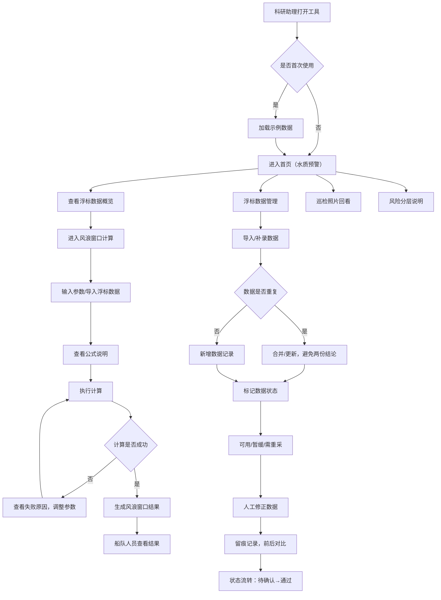

## 1. 产品概述

船员换班风浪窗口是一款面向海洋科研场景的专业数据管理与计算工具。科研助理通过本工具整理浮标数据、计算船员换班的风浪窗口期、管理巡检照片记录；船队人员可查看计算结果，安全高效地安排换班计划。

- **核心价值**：将分散的浮标数据、巡检记录和风浪计算整合为统一工作平台，提升科研数据管理效率，保障船员换班安全
- **目标用户**：海洋科研助理（数据管理与计算）、船队调度人员（结果查看）

## 2. 核心功能

### 2.1 用户角色

| 角色 | 登录方式 | 核心权限 |
|------|----------|----------|
| 科研助理 | 本地账号 | 浮标数据录入/导入、人工修正、风浪计算、巡检照片管理、全部功能 |
| 船队人员 | 只读访问 | 查看风浪窗口结果、风险分层说明 |

### 2.2 功能模块

1. **首页/水质预警**：日常入口，快速查看最新浮标数据概览与风浪窗口状态
2. **风浪窗口计算工具**：核心计算模块，含公式说明、参数输入、结果展示、失败原因
3. **浮标数据管理**：数据列表、状态标记（可用/暂缓/需重采）、导入/补录
4. **人工修正留痕**：修正记录、前后对比、状态流转（待确认→通过）
5. **巡检照片库**：照片分类查看、问题追溯、时间轴浏览
6. **风险分层说明**：月底/课前查看，风险等级解释与数据依据

### 2.3 页面详情

| 页面名称 | 模块名称 | 功能描述 |
|----------|----------|----------|
| 首页（水质预警） | 数据概览卡片 | 最新浮标数据摘要、当前风浪窗口状态、快捷入口 |
| 首页（水质预警） | 示例数据引导 | 首次打开展示示例数据，一键加载体验 |
| 风浪窗口计算 | 参数输入区 | 风速、浪高、周期、能见度等参数输入 |
| 风浪窗口计算 | 公式说明面板 | 计算公式、单位、适用范围、失败条件说明 |
| 风浪窗口计算 | 结果展示区 | 窗口期起止时间、安全等级、建议说明 |
| 浮标数据列表 | 数据表格 | 浮标数据列表，支持筛选、搜索、分页 |
| 浮标数据列表 | 状态标签 | 可用（绿）/暂缓（黄）/需重采（红）三色标记 |
| 浮标数据列表 | 导入/补录 | 文件导入、数据去重校验、补录合并 |
| 数据修正记录 | 修正列表 | 人工修正记录，含修正人、时间、原因 |
| 数据修正记录 | 前后对比 | 修正前后数值对比展示 |
| 数据修正记录 | 状态流转 | 待确认→通过，操作留痕 |
| 巡检照片 | 时间轴 | 按时间排序的照片浏览 |
| 巡检照片 | 分类筛选 | 按站点、类型、问题标记筛选 |
| 风险分层说明 | 等级说明 | 各风险等级定义与判定标准 |
| 风险分层说明 | 数据依据 | 风险计算所依据的数据来源说明 |

## 3. 核心流程

## 4. 用户界面设计

### 4.1 设计风格

- **主色调**：深海蓝（#0A2540）作为主色，搭配青绿色（#00D4AA）作为强调色，体现海洋科研的专业感
- **辅助色**：状态色——绿色（#10B981）可用、黄色（#F59E0B）暂缓、红色（#EF4444）需重采
- **背景**：渐变深蓝底色，轻微噪点纹理，营造深海数据氛围
- **卡片风格**：半透明玻璃拟态卡片，圆角12px，细边框
- **字体**：标题使用现代无衬线字体（Space Grotesk），正文使用可读性强的系统字体
- **图标**：线性图标，与海洋/数据主题契合

### 4.2 页面设计概述

| 页面名称 | 模块名称 | UI元素 |
|----------|----------|--------|
| 首页 | 顶部导航 | 深色导航栏、logo、功能菜单、用户信息 |
| 首页 | 数据概览 | 三列数据卡片，分别展示最新风速、浪高、窗口期状态 |
| 首页 | 快捷入口 | 四个功能入口卡片，带图标和说明文字 |
| 风浪计算页 | 左侧参数面板 | 表单输入、滑块、下拉选择 |
| 风浪计算页 | 右侧说明面板 | 可折叠的公式说明卡片 |
| 风浪计算页 | 底部结果区 | 时间轴形式展示窗口期，安全等级徽章 |
| 浮标数据页 | 顶部操作栏 | 搜索框、筛选器、导入按钮 |
| 浮标数据页 | 数据表格 | 斑马纹表格，状态标签，操作列 |
| 修正记录页 | 时间轴列表 | 修正记录卡片，前后数据对比 |
| 照片库页 | 网格/时间轴 | 照片缩略图网格，点击放大查看 |

### 4.3 响应式

- 桌面端优先设计（1280px以上）
- 平板端（768-1279px）：卡片自适应排列，表格横向滚动
- 移动端（<768px）：单列布局，底部导航，简化表格展示

### 4.4 交互动效

- 页面加载：元素渐入+轻微上移动画，错落延迟
- 卡片悬停：阴影加深+轻微上浮，背景透明度变化
- 数据更新：数字跳动动画，状态标签颜色渐变过渡
- 计算结果：时间轴从左到右逐渐填充的动效
- 折叠面板：平滑高度过渡，箭头旋转指示
