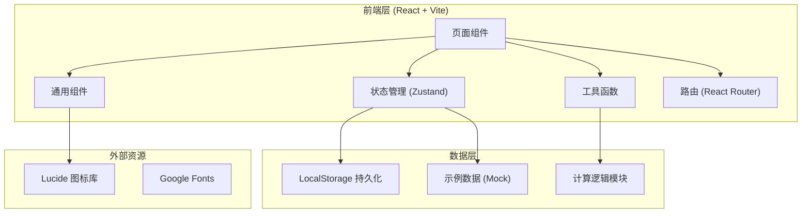
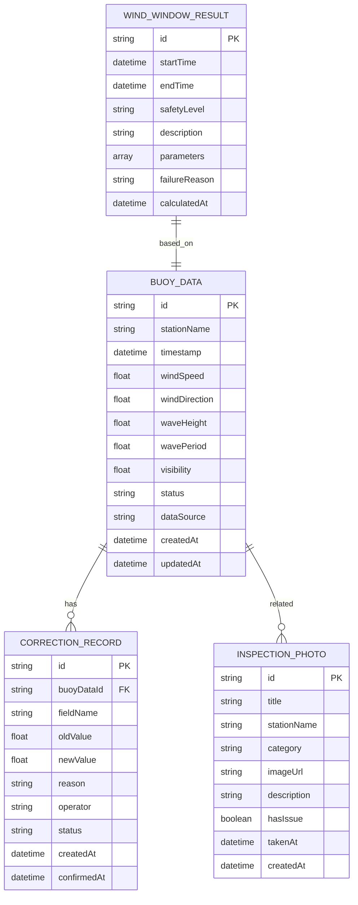

## 1. 架构设计



## 2. 技术描述

- **前端框架**: React@18 + TypeScript
- **构建工具**: Vite@5
- **样式方案**: TailwindCSS@3
- **状态管理**: Zustand
- **路由管理**: React Router DOM@6
- **图标库**: Lucide React
- **数据持久化**: LocalStorage
- **数据来源**: 内置示例数据（Mock），支持本地导入

## 3. 路由定义

| 路由路径 | 页面名称 | 用途说明 |
|----------|----------|----------|
| `/` | 首页（水质预警） | 日常入口，数据概览与快捷入口 |
| `/calculator` | 风浪窗口计算 | 核心计算工具页 |
| `/buoy-data` | 浮标数据管理 | 数据列表与状态管理 |
| `/corrections` | 修正记录 | 人工修正留痕与对比 |
| `/photos` | 巡检照片 | 照片回看与问题追溯 |
| `/risk-levels` | 风险分层说明 | 风险等级解释与数据依据 |

## 4. 数据模型

### 4.1 数据模型定义



### 4.2 数据状态枚举

- **浮标数据状态**:
  - `available`: 可用（绿色）
  - `pending`: 暂缓（黄色）
  - `recollect`: 需重采（红色）

- **修正记录状态**:
  - `pending`: 待确认
  - `approved`: 已通过

- **安全等级**:
  - `safe`: 安全
  - `caution`: 注意
  - `danger`: 危险

## 5. 核心计算逻辑

### 5.1 风浪窗口计算公式

安全窗口期判定基于以下条件同时满足：
- 风速 ≤ 阈值（默认 10.8 m/s，6级风）
- 浪高 ≤ 阈值（默认 1.5 m）
- 能见度 ≥ 阈值（默认 1000 m）

综合安全指数：
```
安全指数 = 1 - (0.4 × 风速/风速阈值 + 0.4 × 浪高/浪高阈值 + 0.2 × 能见度阈值/能见度)
```

安全等级划分：
- 安全: 安全指数 ≤ 0.6
- 注意: 0.6 < 安全指数 ≤ 0.8
- 危险: 安全指数 > 0.8

### 5.2 适用范围

- 适用海域：近海（水深 < 200m）
- 适用季节：全年（不同季节阈值可调整）
- 适用船型：普通交通艇、工作船
- 不适用情况：台风过境、大雾红色预警、海冰期

## 6. 项目结构

```
src/
├── components/           # 通用组件
│   ├── Layout/          # 布局组件
│   ├── StatusBadge/     # 状态标签组件
│   ├── DataCard/        # 数据卡片组件
│   └── Modal/           # 弹窗组件
├── pages/               # 页面组件
│   ├── Home/            # 首页
│   ├── Calculator/      # 风浪计算页
│   ├── BuoyData/        # 浮标数据页
│   ├── Corrections/     # 修正记录页
│   ├── Photos/          # 巡检照片页
│   └── RiskLevels/      # 风险分层页
├── store/               # 状态管理
│   └── useAppStore.ts
├── utils/               # 工具函数
│   ├── calculator.ts    # 计算逻辑
│   ├── storage.ts       # 本地存储
│   └── formatters.ts    # 格式化函数
├── data/                # 示例数据
│   └── mockData.ts
├── types/               # 类型定义
│   └── index.ts
├── App.tsx
├── main.tsx
└── index.css
```

## 7. 关键技术决策

1. **纯前端架构**：使用 LocalStorage 持久化数据，无需后端服务，便于科研助理本地使用
2. **Zustand 状态管理**：轻量级状态管理，支持数据在多页面间共享
3. **数据去重策略**：导入时根据站点+时间戳判断重复，支持覆盖或跳过
4. **修正留痕机制**：所有人工修改记录在 corrections 表中，与原数据关联，可追溯
5. **首次启动体验**：检测 localStorage 为空时自动加载示例数据，并展示引导提示
