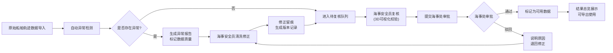
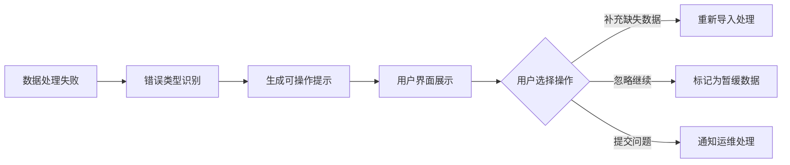

## 1. 产品概述

海洋碳汇样地账本是服务于海事管理部门的专业数据核查与可视化平台，解决船舶轨迹数据质量、水质监测预警及人工复核留痕等核心问题，确保海洋碳汇核算数据的准确性与可追溯性。

- **核心目标**：通过3D可视化、智能数据清洗、多级复核机制，提升海洋碳汇样地数据的可靠性和审计能力
- **目标用户**：海事安全员（数据复核、人工修正）、海事处（结果审批、数据使用）
- **解决痛点**：轨迹数据缺失/异常发现滞后、人工修改无留痕、错误信息模糊、数据状态不透明

## 2. 核心功能

### 2.1 用户角色

| 角色 | 登录方式 | 核心权限 |
|------|----------|----------|
| 海事安全员 | 系统账号登录 | 3D可视化浏览、轨迹清洗操作、水质预警处理、人工修正数据、提交复核申请、查看历史追溯 |
| 海事处审批员 | 系统账号登录 | 查看复核任务、数据状态分类浏览、审批通过/驳回、导出可用数据、查看完整审计轨迹 |

### 2.2 功能模块

1. **3D船舶轨迹可视化页**：Three.js交互式场景、轨迹旋转浏览、剖面切割、多维度筛选、对象详情联动
2. **轨迹清洗工作台**：异常数据检测（深度为负、轨迹断页等）、自动清洗规则、手动修正、清洗留痕
3. **水质预警中心**：监测指标展示、阈值告警、预警处理、关联数据追溯
4. **复核审批流**：待确认列表、人工修正对比、通过/驳回操作、状态流转记录
5. **历史回溯页**：版本对比、修改溯源、结论回查来源材料
6. **结果总览页**：数据状态分类（可用/暂缓/重采）、海事处视角展示、可操作错误提示

### 2.3 页面详情

| 页面名称 | 模块名称 | 功能描述 |
|----------|----------|----------|
| 3D轨迹可视化 | 主场景控制 | 鼠标拖拽旋转、滚轮缩放、视角重置、全屏切换 |
| 3D轨迹可视化 | 剖面切割工具 | X/Y/Z轴剖切平面、可拖动剖切、剖切截面高亮 |
| 3D轨迹可视化 | 筛选面板 | 按船舶ID、时间范围、深度区间、数据质量筛选 |
| 3D轨迹可视化 | 对象详情面板 | 点击轨迹点显示坐标、深度、时间、数据来源、质量状态 |
| 轨迹清洗工作台 | 异常检测引擎 | 自动识别深度为负、轨迹断页、坐标漂移等问题 |
| 轨迹清洗工作台 | 清洗操作区 | 自动修复、手动编辑、批量处理、预览效果 |
| 水质预警中心 | 指标仪表盘 | 水温、盐度、pH、溶解氧等指标实时展示 |
| 水质预警中心 | 告警列表 | 阈值越界告警、分级展示、处理状态跟踪 |
| 复核审批流 | 待办列表 | 待确认任务、修正前后对比、操作留痕 |
| 复核审批流 | 审批操作 | 通过/驳回、审批意见、状态流转 |
| 历史回溯页 | 版本对比 | 同一数据点多版本对比、差异高亮 |
| 历史回溯页 | 溯源链路 | 结论→中间计算→原始数据完整链路追溯 |
| 结果总览页 | 状态概览 | 数据状态三色分类（绿可用/黄暂缓/红重采） |
| 结果总览页 | 错误处理 | 处理失败时显示缺失哪份船舶轨迹等可操作信息 |

## 3. 核心流程

### 3.1 数据处理与复核流程

### 3.2 错误处理流程

## 4. 用户界面设计

### 4.1 设计风格

- **主色调**：深海蓝 `#0A2463`（专业、可信）、海洋青 `#3E92CC`（科技感）
- **辅助色**：数据可用绿 `#2ECC71`、暂缓黄 `#F39C12`、重采红 `#E74C3C`
- **字体**：标题使用「思源宋体」（庄重专业），正文使用「JetBrains Mono」（数据展示清晰）
- **布局**：左侧导航 + 主内容区 + 右侧详情面板的三栏式专业工作台布局
- **图标**：使用线性图标，配合数据状态色标，保持海事专业系统的严谨感
- **背景**：深海渐变背景 +  subtle 网格纹理，营造海洋数据氛围

### 4.2 页面设计概述

| 页面名称 | 模块名称 | UI元素 |
|----------|----------|--------|
| 3D轨迹可视化 | 主场景 | 全屏Three.js画布、海底地形、彩色轨迹线、悬浮工具栏 |
| 3D轨迹可视化 | 筛选面板 | 折叠式侧边栏、滑块控件、多选下拉、时间选择器 |
| 轨迹清洗工作台 | 异常列表 | 卡片式布局、异常类型标签、严重程度指示器、一键修复按钮 |
| 水质预警中心 | 仪表盘 | 环形进度条、阈值警戒线、实时数值、趋势小图 |
| 复核审批流 | 对比视图 | 左右分栏对比、差异高亮连线、修正时间轴、审批意见输入框 |
| 结果总览页 | 状态概览 | 三色卡片矩阵、数量统计、可操作错误提示框、导出按钮 |

### 4.3 响应式设计

- **桌面端优先**：1920px及以上为最优体验，支持多面板自由拖拽布局
- **平板适配**：1024-1920px，面板可折叠，3D场景自适应
- **移动端**：768-1024px，简化为列表视图，3D场景降级为2D示意图
- **触控优化**：支持双指缩放旋转，重要操作按钮尺寸≥44px

### 4.4 3D场景设计

- **环境**：深海蓝雾效环境，HDRI使用温和的海洋天光，营造沉浸感但不干扰数据展示
- **光照**：主光源从上方45°照射，补光从两侧，轨迹线使用自发光材质确保可见
- **相机**：默认正交投影，支持透视切换，初始视角俯视45°，可自由环绕
- **交互**：鼠标左键旋转、右键平移、滚轮缩放，双击轨迹点居中放大
- **动画**：轨迹线按时间顺序绘制动画，剖切平面移动时平滑过渡
- **后处理**：轻微Bloom效果突出选中对象，FXAA抗锯齿，确保文字清晰
- **性能**：使用BufferGeometry，轨迹点数量控制在10万以内，LOD策略优化

## 5. 数据状态标识规范

| 状态 | 颜色 | 含义 | 海事处可见性 |
|------|------|------|-------------|
| 可用 | 绿色 `#2ECC71` | 数据完整、复核通过、可直接使用 | ✅ 直接使用 |
| 暂缓 | 黄色 `#F39C12` | 数据存在瑕疵但不影响核心结论，需安全员确认 | ⚠️ 需复核 |
| 重采 | 红色 `#E74C3C` | 数据严重缺失或错误，需重新采集 | ❌ 不可用 |
| 待复核 | 蓝色 `#3E92CC` | 已修正待审批 | ⏳ 处理中 |
