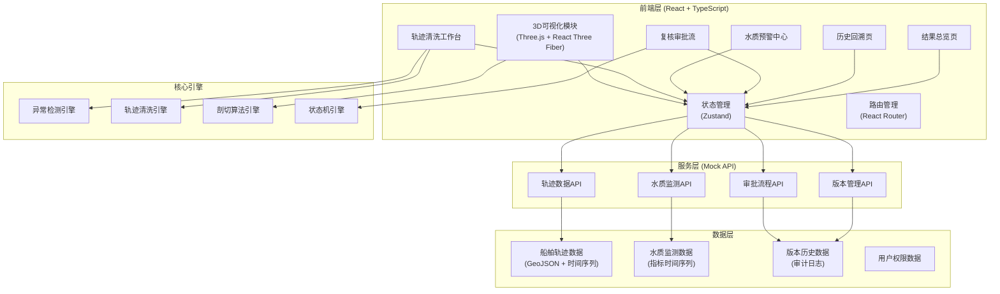
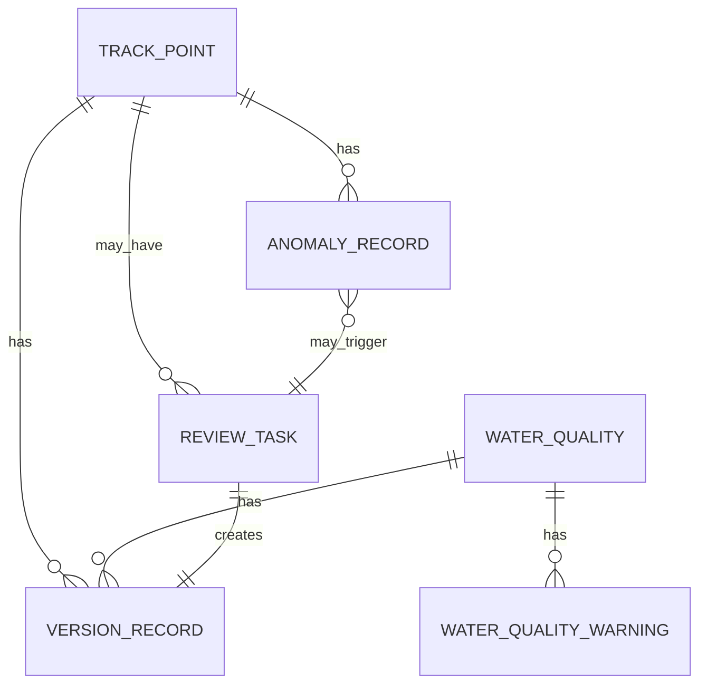
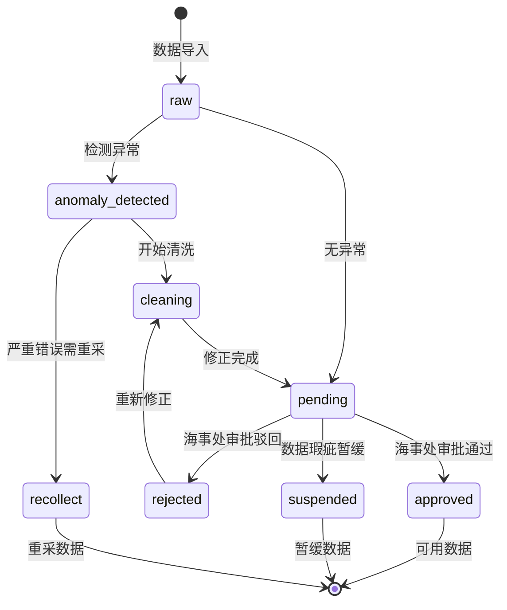

## 1. 架构设计



## 2. 技术描述

- **前端框架**：React@18 + TypeScript@5 + Vite@5
- **3D可视化**：three@0.160 + @react-three/fiber@8 + @react-three/drei@9 + @react-three/postprocessing@2
- **状态管理**：Zustand@4（轻量、支持时间旅行调试）
- **路由管理**：react-router-dom@6
- **样式方案**：tailwindcss@3.4 + PostCSS
- **UI组件**：自定义组件库（基于海事专业系统设计规范）
- **图表库**：recharts@2（水质趋势图）
- **日期处理**：dayjs@1
- **数据模拟**：MSW@2（Mock Service Worker）+ 精心构造的测试数据
- **代码规范**：ESLint + Prettier + TypeScript严格模式

## 3. 路由定义

| 路由路径 | 页面名称 | 访问权限 |
|----------|----------|----------|
| `/` | 结果总览页（首页） | 所有登录用户 |
| `/visualization` | 3D船舶轨迹可视化 | 海事安全员、海事处 |
| `/cleaning` | 轨迹清洗工作台 | 海事安全员 |
| `/warning` | 水质预警中心 | 海事安全员、海事处 |
| `/review` | 复核审批列表 | 海事安全员、海事处 |
| `/review/:id` | 复核详情/审批页 | 海事安全员、海事处 |
| `/history` | 历史回溯页 | 所有登录用户 |
| `/history/:id` | 版本对比详情 | 所有登录用户 |
| `/login` | 登录页 | 公开 |

## 4. 核心数据模型

### 4.1 TypeScript 类型定义

```typescript
// 船舶轨迹点
interface TrackPoint {
  id: string;
  shipId: string;
  timestamp: number;
  longitude: number;
  latitude: number;
  depth: number;
  speed: number;
  heading: number;
  dataQuality: DataQuality;
  source: string;
  version: number;
  createdAt: number;
  updatedAt: number;
}

// 数据质量状态
type DataQuality = 'raw' | 'cleaned' | 'pending' | 'approved' | 'rejected' | 'suspended' | 'recollect';

// 异常类型
type AnomalyType = 'negative_depth' | 'missing_page' | 'coordinate_drift' | 'speed_abnormal' | 'time_gap';

// 异常记录
interface AnomalyRecord {
  id: string;
  trackPointId: string;
  type: AnomalyType;
  severity: 'low' | 'medium' | 'high' | 'critical';
  description: string;
  detectedAt: number;
  resolved: boolean;
  resolvedAt?: number;
  resolvedBy?: string;
  resolution?: string;
}

// 水质监测数据
interface WaterQualityData {
  id: string;
  timestamp: number;
  location: { lat: number; lng: number };
  temperature: number;
  salinity: number;
  ph: number;
  dissolvedOxygen: number;
  turbidity: number;
  chlorophyll: number;
  warnings: WaterQualityWarning[];
}

// 水质预警
interface WaterQualityWarning {
  id: string;
  metric: keyof Omit<WaterQualityData, 'id' | 'timestamp' | 'location' | 'warnings'>;
  value: number;
  threshold: number;
  level: 'warning' | 'alert' | 'critical';
  message: string;
  resolved: boolean;
}

// 版本记录
interface VersionRecord {
  id: string;
  entityType: 'track' | 'water_quality';
  entityId: string;
  version: number;
  previousVersion?: number;
  changes: VersionChange[];
  operator: string;
  operationType: 'create' | 'update' | 'delete' | 'approve' | 'reject';
  remark: string;
  timestamp: number;
}

interface VersionChange {
  field: string;
  oldValue: any;
  newValue: any;
}

// 审批任务
interface ReviewTask {
  id: string;
  type: 'track_cleaning' | 'warning_confirmation';
  entityId: string;
  status: 'pending' | 'approved' | 'rejected';
  submitter: string;
  submittedAt: number;
  reviewer?: string;
  reviewedAt?: number;
  reviewRemark?: string;
  dataSnapshot: any;
}
```

### 4.2 数据实体关系



## 5. 核心模块设计

### 5.1 3D可视化模块

- **剖切引擎**：使用Three.js的ClippingPlane实现三轴剖切，支持自定义剖切平面位置
- **筛选联动**：基于Zustand状态管理，筛选条件变化实时更新3D场景和详情面板
- **对象拾取**：使用Raycaster实现轨迹点点击检测，配合LOD优化性能
- **轨迹动画**：使用ShaderMaterial实现轨迹线按时间渐进绘制效果

### 5.2 异常检测引擎

```typescript
// 核心检测规则
const detectionRules = {
  negative_depth: (point: TrackPoint) => point.depth < 0,
  missing_page: (points: TrackPoint[], index: number) => {
    if (index === 0) return false;
    const timeGap = points[index].timestamp - points[index - 1].timestamp;
    return timeGap > 300000; // 超过5分钟间隔判定为断页
  },
  coordinate_drift: (points: TrackPoint[], index: number) => {
    if (index < 2) return false;
    const dist1 = calculateDistance(points[index - 2], points[index - 1]);
    const dist2 = calculateDistance(points[index - 1], points[index]);
    return Math.abs(dist2 - dist1) / dist1 > 0.5; // 距离突变超过50%
  },
  speed_abnormal: (point: TrackPoint) => point.speed < 0 || point.speed > 60,
};
```

### 5.3 状态流转引擎



### 5.4 可操作错误处理

```typescript
interface ActionableError {
  code: string;
  message: string;
  severity: 'error' | 'warning' | 'info';
  actions: ErrorAction[];
  context: Record<string, any>;
}

interface ErrorAction {
  label: string;
  type: 'primary' | 'secondary' | 'danger';
  handler: () => Promise<void>;
}

// 示例：缺失船舶轨迹错误
const createMissingTrackError = (shipId: string, missingDate: string): ActionableError => ({
  code: 'TRACK_MISSING_PAGE',
  message: `船舶 ${shipId} 在 ${missingDate} 的轨迹数据存在断页，影响导出结果`,
  severity: 'error',
  context: { shipId, missingDate, affectedRange: '14:30-15:20' },
  actions: [
    { label: '补充该时段轨迹', type: 'primary', handler: () => importTrackData(shipId, missingDate) },
    { label: '标记为暂缓数据', type: 'secondary', handler: () => markAsSuspended(shipId, missingDate) },
    { label: '查看影响范围', type: 'secondary', handler: () => showAffectedArea(shipId, missingDate) },
  ],
});
```

## 6. 性能优化策略

1. **3D场景优化**：
   - 使用BufferGeometry存储轨迹数据
   - 实现LOD（细节层次）策略，远距离简化轨迹线
   - 视锥剔除（Frustum Culling）优化渲染
   - 轨迹点数量超过1万时自动启用采样渲染

2. **数据加载优化**：
   - 实现虚拟滚动和分页加载
   - 使用Web Worker进行异常检测计算
   - 数据预取和缓存策略（SWR模式）

3. **状态管理优化**：
   - Zustand selectors避免不必要重渲染
   - 使用useMemo/useCallback优化组件性能
   - 大数据列表采用react-window虚拟化

## 7. Mock数据规划

- 船舶轨迹：3艘船舶，每艘约2000个轨迹点，包含故意植入的异常数据（深度为负、轨迹断页）
- 水质监测：10个监测点，7天数据，包含若干预警数据
- 审批任务：5个待复核任务，3个已处理任务
- 版本历史：每个修正操作生成完整版本记录
