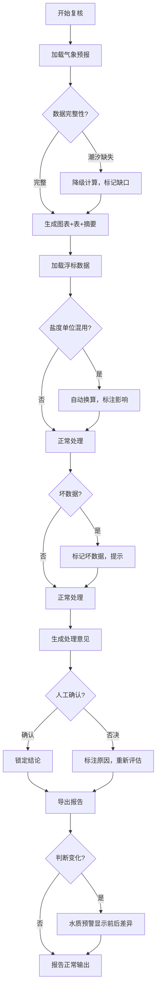

## 1. 产品概述

海底管线路由复核工具，面向海岛运维人员，将气象预报、浮标数据和处理意见集成在同一界面，消除临时群聊带来的信息碎片化问题。核心目标：一次复核运行后，图表、数据表、文字说明三者严格对齐；边界案例（盐度单位混用、潮汐缺失、坏数据）真正改变判断结果而非装饰；支持重复运行、补录、人工确认三种日常操作流程。

- 目标用户：海岛运维团队、船队调度
- 核心价值：告别临时群，复核全流程在一个工具内闭环

## 2. 核心功能

### 2.1 用户角色

| 角色 | 核心权限 |
|------|----------|
| 运维工程师 | 发起复核、查看数据、补录、人工确认、导出报告 |
| 船队调度 | 查看复核报告、查看处理意见 |

### 2.2 功能模块

1. **复核总览页**：气象预报、浮标数据、处理意见三栏联动展示
2. **气象预报面板**：风场图 + 海况表 + 文字摘要，三者对齐
3. **浮标数据面板**：实时/历史数据表 + 趋势图 + 异常标注
4. **水质预警模块**：预警判断 + 报告导出前后差异对比
5. **路由复核引擎**：边界案例处理、降级计算、坏数据标记
6. **操作流程管理**：重复运行、补录、人工确认三种流程
7. **报告导出**：PDF报告生成 + 前后差异高亮

### 2.3 页面详情

| 页面名称 | 模块名称 | 功能描述 |
|----------|----------|----------|
| 复核总览页 | 气象预报卡片区 | 展示风速/风向玫瑰图、海况等级表、气象文字摘要，三者数据对齐 |
| 复核总览页 | 浮标数据卡片区 | 展示水温/盐度/潮位数据表、趋势折线图、异常值红色标注 |
| 复核总览页 | 处理意见卡片区 | 汇总气象+浮标判断，给出路由建议，支持人工确认/否决 |
| 复核总览页 | 操作工具栏 | 重新运行、补录数据、人工确认按钮 |
| 水质预警页 | 预警列表 | 当前预警条目，含触发指标和阈值 |
| 水质预警页 | 前后对比视图 | 报告导出导致判断变化时，高亮前后差异 |
| 报告预览页 | 报告内容 | 图+表+文字三要素完整报告，坏数据真实呈现 |
| 报告预览页 | 差异标记 | 导出改变判断的条目以diff样式展示 |

## 3. 核心流程

### 3.1 复核主流程

运维工程师打开工具 → 查看气象预报（图+表+文字对齐）→ 查看浮标数据 → 系统生成处理意见 → 人工确认或否决 → 导出报告给船队

### 3.2 边界案例流程

系统检测到盐度单位混用（PSU vs ‰）→ 自动换算并标注 → 影响水质判断结果 → 预警前后差异可见

### 3.3 降级计算流程

潮汐表数据缺失 → 已有数据正常计算 → 缺口项列在"待补录"清单 → 运维补录后重新计算

### 3.4 流程图

## 4. 用户界面设计

### 4.1 设计风格

- **主色调**：深海蓝 (#0C2D48) + 浅海蓝 (#2E8BC0)，强调海洋运维场景
- **辅助色**：珊瑚橙 (#FF6B35) 用于预警和差异高亮，薄荷绿 (#2EC4B6) 用于正常状态
- **按钮风格**：圆角矩形，轻微3D阴影，hover时上浮效果
- **字体**：标题使用 Noto Sans SC Bold，正文使用 Noto Sans SC Regular
- **布局风格**：三栏卡片式布局，顶部工具栏，左侧导航
- **图标风格**：线性图标，lucide-react

### 4.2 页面设计概览

| 页面名称 | 模块名称 | UI元素 |
|----------|----------|--------|
| 复核总览页 | 气象预报卡片区 | 风向玫瑰图(SVG)、海况等级表(表格)、文字摘要(文本块) |
| 复核总览页 | 浮标数据卡片区 | 趋势折线图(SVG)、数据表(表格)、异常标注(红色标签) |
| 复核总览页 | 处理意见卡片区 | 结论标签(绿色/橙色/红色)、意见文本、确认/否决按钮 |
| 复核总览页 | 操作工具栏 | 重新运行(旋转图标)、补录(编辑图标)、确认(勾选图标) |
| 水质预警页 | 前后对比视图 | diff样式：删除线(旧值) + 绿色高亮(新值) |
| 报告预览页 | 差异标记 | 橙色边框 + 箭头指示变化方向 |

### 4.3 响应式设计

- 桌面优先，三栏布局在大屏(≥1280px)下横向排列
- 中等屏幕(768-1279px)下气象和浮标两栏横向，处理意见纵向排列
- 小屏(<768px)下单栏纵向滚动

### 4.4 样例数据设计

**样例1：盐度单位混用（PSU vs ‰）**
- 浮标A报盐度 35 PSU，浮标B报盐度 35‰
- PSU换算为‰需×1.00477，35 PSU ≈ 35.17‰
- 混用导致盐度均值从 35.0‰ 偏移到 35.085‰
- 触发"盐度偏高"预警（阈值35.1‰），前后判断不同

**样例2：潮汐表缺失降级**
- 6个时段的潮位数据，缺失2个
- 已有4个时段正常计算路由安全等级
- 缺口2个时段标记为"待补录"，列出给运维

**样例3：坏数据（像日常材料里的小麻烦）**
- 风速记录中出现 "12.5m/s" 和 "12.5" 混写（一条带单位一条不带）
- 水温记录中有明显笔误 "28.7°C" 写成了 "287°C"
- 这些坏数据要真实地像抄录时可能混进来的格式问题
