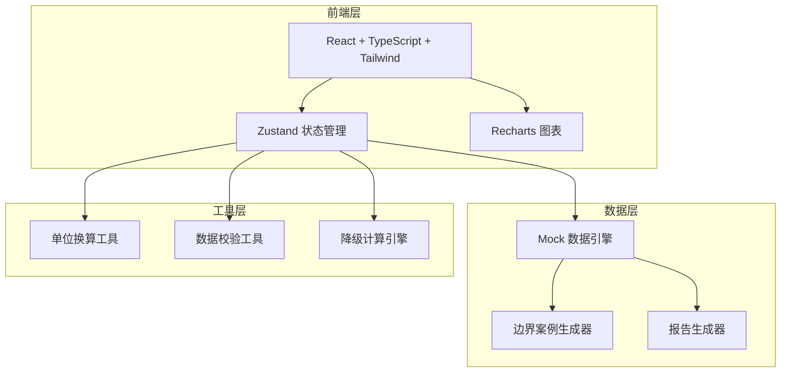
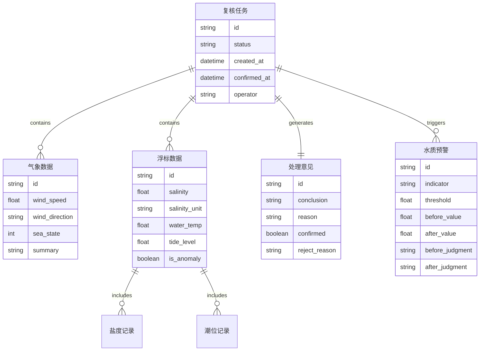

## 1. 架构设计



## 2. 技术说明

- **前端**：React@18 + TypeScript + Tailwind CSS@3 + Vite
- **初始化工具**：vite-init (react-ts 模板)
- **状态管理**：Zustand
- **图表库**：Recharts (折线图、柱状图)
- **后端**：无（纯前端，使用 Mock 数据）
- **数据**：内存 Mock 数据，模拟真实浮标/气象数据

## 3. 路由定义

| 路由 | 用途 |
|------|------|
| `/` | 复核总览页：气象预报 + 浮标数据 + 处理意见三栏联动 |
| `/water-quality` | 水质预警页：预警列表 + 前后对比视图 |
| `/report` | 报告预览页：完整报告 + 差异标记 |

## 4. 数据模型

### 4.1 数据模型定义



## 5. 核心工具函数

### 5.1 单位换算

- `psuToPermille(psu: number): number` — PSU转‰，乘以1.00477
- `permilleToPsu(permille: number): number` — ‰转PSU，除以1.00477
- `normalizeSalinity(value: number, unit: string): number` — 统一换算为‰

### 5.2 数据校验

- `validateWindSpeed(raw: string): { value: number, valid: boolean }` — 处理"12.5m/s"和"12.5"混写
- `validateWaterTemp(raw: string): { value: number, valid: boolean, corrected?: number }` — 检测如"287°C"这种笔误
- `validateSalinity(value: number, unit: string): { normalized: number, unitChanged: boolean }` — 检测并换算盐度

### 5.3 降级计算

- `computeWithPartialData(data: TideRecord[]): { results: ComputedResult[], gaps: GapItem[] }` — 有缺口时先算能算的，列出缺口

## 6. 边界案例设计

### 案例1：盐度单位混用改变判断

```
浮标A: 盐度 35 PSU → 换算为 35.17‰
浮标B: 盐度 35‰
均值(未换算): (35 + 35) / 2 = 35.0‰ → 未超阈值(35.1‰) → 正常
均值(已换算): (35.17 + 35) / 2 = 35.085‰ → 未超阈值 → 但加上浮标C(35.3‰)
三站均值(已换算): (35.17 + 35 + 35.3) / 2 = 35.16‰ → 超阈值 → 触发预警
```

### 案例2：潮汐缺失降级

```
6个时段: 00:00, 04:00, 08:00, 12:00, 16:00, 20:00
缺失: 08:00, 16:00
已计算: 4个时段的安全等级正常
缺口: 列出08:00和16:00，提示运维补录
```

### 案例3：坏数据（真实小麻烦）

```
风速记录: "12.5m/s", "8.3", "15.2m/s", "7.1" → 有带单位有不带
水温记录: "28.7°C", "287°C", "27.9°C" → "287"是笔误，应为28.7
这些错误会影响气象风险评估等级
```
