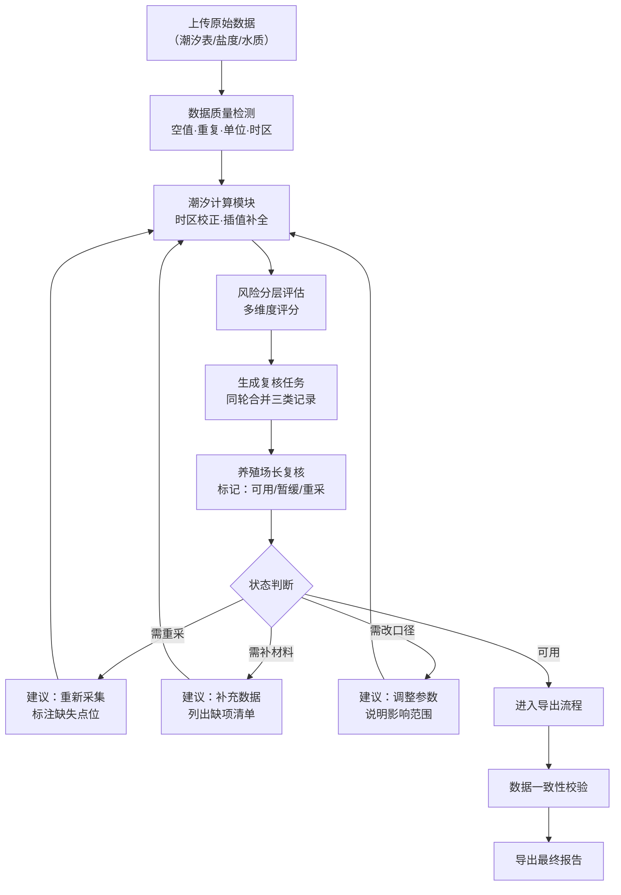

## 1. 产品概述

水下机器人任务队列是面向水产养殖场的专业数据处理系统，解决潮汐表不完整、盐度单位混用、结果导出不一致等常见问题，为养殖场长和课题组提供稳定可靠的潮汐计算、风险分层和复核工作台。

- **核心目标**：兜住水产数据处理中最常见的坑，让异常数据一目了然，让复核流程清晰可追溯
- **目标用户**：水产养殖场长、科研课题组、现场工程师
- **价值主张**：不默认材料干净，每一条异常都告诉你下一步该补材料还是改口径

---

## 2. 核心功能

### 2.1 用户角色

| 角色 | 登录方式 | 核心权限 |
|------|---------|---------|
| 养殖场长 | 账号登录 | 上传原始数据、复核结果、标记数据状态、导出最终报告 |
| 课题组 | 账号登录 | 查看任务队列、查看计算结果、提交复核意见 |
| 工程师 | 账号登录 | 配置计算参数、查看异常详情、协助数据修正 |

### 2.2 功能模块

1. **任务队列首页**：待处理任务列表、实时计算进度、数据质量概览
2. **潮汐计算模块**：潮汐表数据清洗、潮汐调和分析、潮位预测、时区自动检测与校正
3. **风险分层模块**：基于潮汐+盐度+水质的多维度风险评估、风险等级可视化
4. **复核工作台**：同轮处理风险通报/水质记录/重复上报、数据状态标记（可用/暂缓/重采）、下一步操作建议
5. **地图联动面板**：监测点位地图展示、点击溯源原始材料、风险热力分布
6. **结果导出中心**：数据一致性校验、多格式导出、导出日志留存

### 2.3 页面详情

| 页面名称 | 模块名称 | 功能描述 |
|---------|---------|---------|
| 任务队列首页 | 任务卡片列表 | 展示每个任务的名称、上传时间、数据质量评分、当前状态、风险等级摘要 |
| 任务队列首页 | 数据质量概览 | 统计空值数量、重复记录数、单位混用数、时区异常数，每项配一两句解释 |
| 潮汐计算详情 | 原始数据预览 | 展示潮汐表原始数据，高亮异常值（空值标黄、重复标橙、时区错误标红） |
| 潮汐计算详情 | 潮汐曲线图表 | 绘制计算后的潮汐曲线，标注高低潮时间和潮位，悬浮显示计算依据说明 |
| 风险分层详情 | 风险评估矩阵 | 潮汐-盐度-水质三维风险矩阵，每个单元格有风险解释说明 |
| 风险分层详情 | 风险因素拆解 | 列出每条风险的触发条件、数据来源、建议措施 |
| 复核工作台 | 待复核列表 | 同一轮任务的风险通报、水质记录、重复上报合并展示，避免跨轮混乱 |
| 复核工作台 | 状态标记面板 | 每条数据可选：可用（绿）/暂缓（黄）/需重采（红）/需场长复核（橙），附操作理由输入框 |
| 复核工作台 | 下一步建议 | 根据异常类型自动建议：补材料 / 改口径 / 重新采集 / 无需处理 |
| 地图联动面板 | 点位分布图 | SVG 养殖场地图，标注各监测点位，颜色对应风险等级 |
| 地图联动面板 | 数据溯源面板 | 点击点位后，右侧展示该点位所有原始材料照片、采集记录、计算过程 |
| 结果导出中心 | 导出配置 | 选择导出范围、格式（CSV/Excel/PDF）、是否包含原始数据和异常说明 |
| 结果导出中心 | 一致性校验 | 导出前自动校验数据一致性，列出不一致项供确认后再导出 |

---

## 3. 核心流程

### 3.1 数据处理主流程

养殖场长上传潮汐表、盐度记录、水质数据 → 系统自动进行数据质量检测 → 潮汐计算（含时区校正、空值插值） → 风险分层评估 → 生成复核任务 → 同轮展示风险通报+水质记录+重复上报 → 养殖场长标记每条数据状态（可用/暂缓/重采） → 系统给出下一步操作建议 → 修正后重新计算或直接导出 → 结果一致性校验 → 导出最终报告

### 3.2 异常识别与分级流程

原始数据 → 逐条扫描 → 识别异常类型 → 分配异常等级 → 关联下一步建议 → 展示给用户

异常类型包括：
- 潮汐表空值 → 等级：暂缓 → 建议：补材料或自动插值
- 记录重复 → 等级：暂缓 → 建议：改口径（保留哪一条）
- 盐度单位混用 → 等级：需复核 → 建议：改口径（统一单位）
- 时区错误 → 等级：暂缓 → 建议：改口径（校正时区）
- 备注混写 → 等级：需复核 → 建议：补材料（明确备注含义）
- 数据超出合理范围 → 等级：需重采 → 建议：重新采集

---

## 4. 用户界面设计

### 4.1 设计风格

- **主色调**：深海蓝 `#0F2B4B`，代表专业、可信赖、海洋主题
- **辅助色**：潮汐青 `#2DD4BF`（正常/可用）、警示黄 `#F59E0B`（暂缓）、风险橙 `#F97316`（需复核）、危险红 `#EF4444`（需重采）
- **中性色**：冷灰系列 `#F8FAFC` / `#E2E8F0` / `#64748B` / `#1E293B`，避免暖色调干扰
- **字体**：标题用「思源宋体 Heavy」体现专业稳重，正文用「Inter」保证可读性，数据用「JetBrains Mono」等宽对齐
- **按钮风格**：扁平化设计，2px 圆角，hover 时轻微上浮 + 阴影变化，禁用态 40% 透明度
- **布局风格**：三栏式工作台布局（左：任务导航，中：主内容区，右：详情/溯源面板），固定高度内容区 + 内部滚动
- **图标风格**：Lucide 线性图标，状态标签使用实心色块 + 文字组合，不使用表情符号

### 4.2 关键界面元素

| 页面名称 | 模块名称 | UI 元素说明 |
|---------|---------|-----------|
| 任务队列首页 | 数据质量概览卡片 | 四个指标卡片横向排列，每个卡片含：图标 + 数字 + 一两句解释文字，底部有查看详情按钮。异常数字用对应状态色标红 |
| 任务队列首页 | 任务卡片 | 卡片左侧 4px 色条表示风险等级，卡片内展示任务名称、上传时间、数据质量评分（百分制）、状态标签、操作按钮 |
| 潮汐计算详情 | 异常数据表格 | 每行数据左侧有状态圆点，异常单元格背景染色，悬浮显示异常原因和处理建议。表格列：时间、潮位、单位、时区、状态、说明 |
| 潮汐计算详情 | 潮汐曲线图 | 深色背景 + 青色曲线，高低潮用圆点标注，悬浮弹窗显示：计算值、原始值、计算方法说明 |
| 风险分层详情 | 风险矩阵 | 5x5 网格热力图，每个格子点击后显示风险解释文本："当前潮位+盐度组合下，XX 风险概率为 XX%，主要影响 XX 养殖区" |
| 复核工作台 | 复核条目 | 每条记录左侧是状态选择器（四色按钮组），中间是数据内容和异常说明，右侧是"下一步建议"标签，底部可展开输入复核意见 |
| 复核工作台 | 同轮分组 | 用折叠面板将"风险通报""水质记录""重复上报"分成三组，同一轮任务的三组记录放在同一页面，避免跨页面跳转 |
| 地图联动面板 | SVG 养殖场地图 | 简化的养殖场区域轮廓，监测点位用圆形标记，颜色对应风险等级，点击后右侧面板切换到该点位的所有原始材料 |
| 结果导出中心 | 一致性校验报告 | 用表格列出不一致项：字段名、页面展示值、导出计算值、差异原因，每条可选择"以页面为准"或"以计算为准" |

### 4.3 响应式设计

- **Desktop-first** 设计，主视图 1440px 最优
- 1024px 以下：右侧详情面板改为底部抽屉式
- 768px 以下：左侧导航收起为图标栏，三栏变两栏
- 所有数据表格支持横向滚动，状态按钮最小高度 44px 便于触控

### 4.4 动效与交互

- 页面加载：内容区块淡入 + 轻微上移，stagger 延时 50ms
- 状态变更：颜色渐变过渡 300ms，数字变化使用滚动数字动画
- 表格行 hover：背景色轻微加深，左侧状态圆点放大 1.2 倍
- 复核通过：记录行添加绿色对勾图标 + 轻微缩放确认反馈
- 地图点位点击：点位向外扩散圆环波纹动画，右侧面板滑入

---

## 5. 关键业务规则

1. **数据从不假设干净**：所有上传数据必须经过完整性、唯一性、格式、值域四重校验
2. **异常分级展示**：禁止只用红色数字，必须区分：可用（绿）、暂缓（黄）、需复核（橙）、需重采（红）
3. **同轮复核原则**：同一批次上传的风险通报、水质记录、重复上报必须在同一复核流程中处理，不得拆分
4. **结果必有解释**：每个计算结果、风险等级、异常标记旁边必须有 1-2 句人类可读的解释文字
5. **时区异常可追溯**：时区校正后的数据必须保留原始时区和校正后时区两个字段，可一键切换查看
6. **导出一致性优先**：导出前必须校验，不一致项必须经用户确认后才能导出，禁止静默修正
7. **下一步必明确**：每个异常必须关联明确的下一步操作：补材料 / 改口径 / 重新采集 / 无需处理
