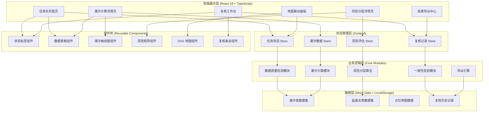
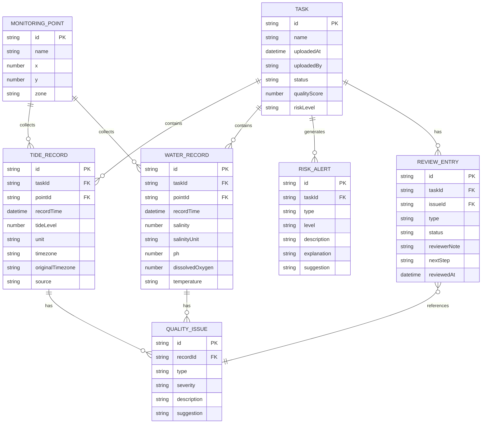

## 1. 架构设计



---

## 2. 技术选型

### 2.1 核心技术栈

| 层级 | 技术选型 | 版本 | 说明 |
|------|---------|------|------|
| 前端框架 | React | 18.2.x | 使用函数组件 + Hooks |
| 类型系统 | TypeScript | 5.x | 严格模式，启用 strictNullChecks |
| 构建工具 | Vite | 5.x | 热更新，快速构建 |
| 样式方案 | Tailwind CSS | 3.4.x | 原子化 CSS，自定义主题 |
| 状态管理 | Zustand | 4.5.x | 轻量级，不可变更新 |
| 路由管理 | React Router DOM | 6.x | 声明式路由 |
| 图表库 | Recharts | 2.12.x | React 生态图表组件 |
| 图标库 | Lucide React | 0.400.x | 线性图标，按需加载 |
| 数据处理 | date-fns | 3.6.x | 日期时区处理 |
| 数据校验 | Zod | 3.23.x | 运行时类型校验 |

### 2.2 初始化方式

使用 `react-ts` 模板（纯前端项目，Mock 数据）：

```bash
npm init vite-init@latest -y . -- --template react-ts --force
```

---

## 3. 路由定义

| 路由路径 | 页面组件 | 说明 |
|---------|---------|------|
| `/` | 重定向到 `/tasks` | 根路径 |
| `/tasks` | `TaskQueuePage` | 任务队列首页 |
| `/tasks/:id/tide` | `TideCalculationPage` | 潮汐计算详情页 |
| `/tasks/:id/risk` | `RiskAssessmentPage` | 风险分层详情页 |
| `/tasks/:id/review` | `ReviewWorkspacePage` | 复核工作台 |
| `/tasks/:id/map` | `MapPanelPage` | 地图联动面板 |
| `/tasks/:id/export` | `ExportCenterPage` | 结果导出中心 |

---

## 4. 目录结构

```
/
├── src/
│   ├── components/          # 通用组件
│   │   ├── layout/          # 布局组件
│   │   │   ├── AppLayout.tsx
│   │   │   ├── Sidebar.tsx
│   │   │   └── Header.tsx
│   │   ├── StatusBadge.tsx  # 状态标签
│   │   ├── DataTable.tsx    # 数据表格
│   │   ├── TideChart.tsx    # 潮汐曲线图
│   │   ├── RiskMatrix.tsx   # 风险矩阵
│   │   ├── FarmMap.tsx      # SVG 养殖场地图
│   │   ├── ReviewItem.tsx   # 复核条目
│   │   ├── QualityCard.tsx  # 数据质量卡片
│   │   └── TaskCard.tsx     # 任务卡片
│   ├── pages/               # 页面组件
│   │   ├── TaskQueuePage.tsx
│   │   ├── TideCalculationPage.tsx
│   │   ├── RiskAssessmentPage.tsx
│   │   ├── ReviewWorkspacePage.tsx
│   │   ├── MapPanelPage.tsx
│   │   └── ExportCenterPage.tsx
│   ├── store/               # Zustand 状态管理
│   │   ├── useTaskStore.ts
│   │   ├── useTideStore.ts
│   │   ├── useRiskStore.ts
│   │   └── useReviewStore.ts
│   ├── core/                # 业务逻辑核心
│   │   ├── dataQuality.ts   # 数据质量检测
│   │   ├── tideCalculator.ts # 潮汐计算
│   │   ├── riskAssessment.ts # 风险分层算法
│   │   ├── consistency.ts   # 一致性校验
│   │   ├── unitConverter.ts # 单位转换
│   │   └── timezone.ts      # 时区处理
│   ├── types/               # TypeScript 类型定义
│   │   ├── task.ts
│   │   ├── tide.ts
│   │   ├── risk.ts
│   │   ├── review.ts
│   │   └── common.ts
│   ├── data/                # Mock 数据
│   │   ├── mockTasks.ts
│   │   ├── mockTideData.ts
│   │   ├── mockWaterData.ts
│   │   └── mockMapData.ts
│   ├── utils/               # 工具函数
│   │   ├── format.ts
│   │   ├── color.ts
│   │   └── validation.ts
│   ├── hooks/               # 自定义 Hooks
│   │   ├── useDataQuality.ts
│   │   ├── useTideCalculation.ts
│   │   └── useReviewFlow.ts
│   ├── App.tsx
│   ├── main.tsx
│   └── index.css
├── api/                     # 后端（预留，暂不实现）
├── shared/                  # 前后端共享类型
├── .trae/
│   └── documents/
├── package.json
├── tsconfig.json
├── vite.config.ts
├── tailwind.config.js
└── postcss.config.js
```

---

## 5. 数据模型

### 5.1 实体关系图



### 5.2 核心类型定义

```typescript
// 数据状态枚举
export enum DataStatus {
  AVAILABLE = 'available',     // 可用 - 绿
  PENDING = 'pending',         // 暂缓 - 黄
  NEED_REVIEW = 'need_review', // 需复核 - 橙
  RECOLLECT = 'recollect',     // 需重采 - 红
}

// 下一步操作枚举
export enum NextStep {
  SUPPLEMENT_DATA = 'supplement', // 补材料
  ADJUST_PARAMS = 'adjust',       // 改口径
  RECOLLECT = 'recollect',        // 重新采集
  NO_ACTION = 'none',             // 无需处理
}

// 异常类型枚举
export enum QualityIssueType {
  NULL_VALUE = 'null_value',
  DUPLICATE = 'duplicate',
  UNIT_MIXED = 'unit_mixed',
  TIMEZONE_ERROR = 'timezone_error',
  NOTE_MIXED = 'note_mixed',
  OUT_OF_RANGE = 'out_of_range',
}

// 盐度单位
export enum SalinityUnit {
  PSU = 'PSU',
  PPT = 'ppt',
  PERMILLE = '‰',
  MG_L = 'mg/L',
}

// 潮汐计算结果
export interface TideCalculationResult {
  recordId: string;
  originalTime: Date;
  originalTimezone: string;
  correctedTime: Date;
  correctedTimezone: string;
  tideLevel: number;
  unit: string;
  isInterpolated: boolean;
  calculationMethod: string;
  explanation: string;
  qualityScore: number;
}

// 风险分层结果
export interface RiskAssessmentResult {
  taskId: string;
  overallRiskLevel: 'low' | 'medium' | 'high' | 'critical';
  overallRiskScore: number;
  explanation: string;
  factors: RiskFactor[];
  matrix: RiskMatrixCell[][];
}

export interface RiskFactor {
  id: string;
  name: string;
  weight: number;
  value: number;
  riskLevel: string;
  description: string;
  dataSource: string;
  suggestion: string;
}

export interface RiskMatrixCell {
  tideLevel: string;
  salinityLevel: string;
  riskLevel: string;
  riskScore: number;
  explanation: string;
  affectedZone: string;
}
```

---

## 6. 核心模块设计

### 6.1 数据质量检测模块 (`src/core/dataQuality.ts`)

**职责**：检测潮汐表和水质数据中的各类异常

**核心方法**：
- `detectNullValues(records)` - 检测空值，返回 PENDING 状态，建议补材料或自动插值
- `detectDuplicates(records)` - 检测重复记录，返回 PENDING 状态，建议改口径
- `detectUnitMismatch(records, expectedUnit)` - 检测单位混用，返回 NEED_REVIEW 状态，建议改口径统一单位
- `detectTimezoneIssues(records, expectedZone)` - 检测时区错误，返回 PENDING 状态，建议改口径校正时区
- `detectOutOfRange(records, min, max)` - 检测超出合理范围，返回 RECOLLECT 状态，建议重新采集
- `generateQualityReport(records)` - 生成综合质量报告，包含每项异常的解释说明

### 6.2 潮汐计算模块 (`src/core/tideCalculator.ts`)

**职责**：潮汐调和分析、潮位预测、时区校正、空值插值

**核心方法**：
- `correctTimezone(record, targetZone)` - 时区校正，保留原始时区字段
- `interpolateMissingValues(records, method)` - 空值插值（线性/样条）
- `calculateHarmonicComponents(records)` - 潮汐调和分析，提取 M2、S2、K1、O1 分潮
- `predictTideLevel(date, components)` - 预测指定日期的潮位
- `findHighLowTides(records)` - 识别高低潮时间和潮位
- `generateExplanation(record, method)` - 生成计算过程的人类可读解释

### 6.3 风险分层算法 (`src/core/riskAssessment.ts`)

**职责**：基于潮汐、盐度、水质多维度数据进行风险评估

**核心方法**：
- `calculateTideRisk(tideLevel, threshold)` - 潮汐风险评分
- `calculateSalinityRisk(salinity, optimalRange)` - 盐度风险评分
- `calculateWaterQualityRisk(ph, do, temperature)` - 水质综合风险评分
- `buildRiskMatrix(tideLevels, salinityLevels)` - 构建 5x5 风险矩阵，每个单元格包含解释文本
- `calculateOverallRisk(factors, weights)` - 综合风险计算
- `generateRiskExplanation(factor, level)` - 为每个风险因素生成解释说明和建议措施

### 6.4 一致性校验模块 (`src/core/consistency.ts`)

**职责**：导出前校验页面展示数据与计算数据的一致性

**核心方法**：
- `checkDisplayVsCalculation(displayData, calculationData)` - 逐条比对，返回差异列表
- `resolveConflict(item, resolution)` - 处理不一致项（以页面为准或以计算为准）
- `generateConsistencyReport(differences)` - 生成一致性校验报告

### 6.5 导出引擎 (`src/core/exportEngine.ts`)

**职责**：多格式导出，包含原始数据、计算结果、异常说明

**核心方法**：
- `exportToCSV(data, options)` - 导出 CSV
- `exportToExcel(data, options)` - 导出 Excel
- `exportToPDF(data, options)` - 导出 PDF
- `includeQualityReport(exportData, qualityReport)` - 附带数据质量报告
- `includeReviewLogs(exportData, reviewLogs)` - 附带复核历史记录

---

## 7. 状态管理设计

### 7.1 Task Store (`src/store/useTaskStore.ts`)

```typescript
interface TaskState {
  tasks: Task[];
  currentTaskId: string | null;
  isLoading: boolean;
  filters: TaskFilters;
  
  setCurrentTask: (id: string) => void;
  loadTasks: () => Promise<void>;
  updateTaskStatus: (id: string, status: TaskStatus) => void;
  getTaskQualitySummary: (id: string) => QualitySummary;
}
```

### 7.2 Tide Store (`src/store/useTideStore.ts`)

```typescript
interface TideState {
  rawRecords: TideRecord[];
  calculatedResults: TideCalculationResult[];
  qualityIssues: QualityIssue[];
  chartData: TideChartPoint[];
  
  loadTideData: (taskId: string) => void;
  runCalculation: (taskId: string) => void;
  correctTimezone: (recordId: string, targetZone: string) => void;
  interpolateMissing: (recordIds: string[], method: string) => void;
}
```

### 7.3 Review Store (`src/store/useReviewStore.ts`)

```typescript
interface ReviewState {
  reviewEntries: ReviewEntry[];
  currentBatch: ReviewBatch | null;
  isSaving: boolean;
  
  loadReviewBatch: (taskId: string) => void; // 同轮加载三类记录
  updateEntryStatus: (entryId: string, status: DataStatus, note?: string) => void;
  getNextStepSuggestion: (issueType: QualityIssueType) => NextStep;
  completeReview: (taskId: string) => void;
}
```

---

## 8. 关键业务规则实现

### 8.1 同轮复核原则

实现位置：`src/core/reviewFlow.ts`

```typescript
// 同一批次任务必须合并风险通报、水质记录、重复上报三类记录
// 禁止拆分到不同复核流程
export function loadReviewBatch(taskId: string): ReviewBatch {
  const riskAlerts = getRiskAlertsByTask(taskId);
  const waterRecords = getWaterRecordsByTask(taskId);
  const duplicates = getDuplicateRecordsByTask(taskId);
  
  return {
    taskId,
    riskAlerts: riskAlerts.map(toReviewEntry),
    waterRecords: waterRecords.map(toReviewEntry),
    duplicates: duplicates.map(toReviewEntry),
    createdAt: new Date(),
  };
}
```

### 8.2 结果必有解释

实现位置：各业务模块的 `generateExplanation` 方法

每条计算结果必须包含 `explanation` 字段，1-2 句话说明：
- 使用了什么算法/方法
- 基于哪些原始数据
- 结果的含义和使用建议

### 8.3 时区异常可追溯

实现位置：`src/core/timezone.ts`

```typescript
// 时区校正后保留双字段
interface TimezoneCorrected {
  originalTime: Date;
  originalTimezone: string;
  correctedTime: Date;
  correctedTimezone: string;
  correctionExplanation: string; // 如："原始记录使用东九区，已校正为东八区北京时间"
}
```

---

## 9. Mock 数据设计

为了不使用通用样例，将创建具体的水产养殖场场景数据：

- **养殖场**：明珠海珍品养殖场（虚构），位于广东湛江
- **监测点位**：A1-A5（近岸浅海）、B1-B3（深水养殖区）、C1-C2（进水渠）
- **潮汐数据**：2026年6月1-15日逐时潮位，人为注入：3个空值、2条重复、1个时区错误（误写为东九区）
- **盐度数据**：同步期监测数据，人为注入：2个单位混用（PSU 和 ‰ 混用）、1个异常高值
- **水质数据**：pH、溶解氧、水温，人为注入：1个超出合理范围的值
- **复核记录**：包含风险通报 3 条、水质异常记录 5 条、重复上报 2 条

---

## 10. 配置文件说明

### 10.1 Tailwind 主题配置

```javascript
// tailwind.config.js
module.exports = {
  theme: {
    extend: {
      colors: {
        'ocean': {
          50: '#F0F9FF',
          100: '#E0F2FE',
          500: '#0EA5E9',
          900: '#0F2B4B', // 主色：深海蓝
        },
        'tide': {
          400: '#2DD4BF', // 辅助色：潮汐青
          500: '#14B8A6',
        },
        'status': {
          available: '#2DD4BF',   // 可用 - 绿
          pending: '#F59E0B',     // 暂缓 - 黄
          review: '#F97316',      // 需复核 - 橙
          recollect: '#EF4444',   // 需重采 - 红
        },
      },
      fontFamily: {
        'display': ['"Noto Serif SC"', 'serif'], // 标题
        'sans': ['Inter', 'system-ui', 'sans-serif'],
        'mono': ['"JetBrains Mono"', 'monospace'],
      },
    },
  },
};
```

---

## 11. 测试策略

### 11.1 单元测试

使用 Vitest，测试覆盖：
- `src/core/` 下所有业务逻辑模块
- 异常场景：空值、重复、时区错误、单位混用
- 边界条件：极值数据、临界风险值
- 测试文件：`src/core/__tests__/*.test.ts`

### 11.2 组件测试

使用 React Testing Library：
- 状态标签组件的四色显示
- 复核条目组件的状态切换
- 潮汐曲线图的数据展示

### 11.3 运行验证

```bash
npm run dev      # 启动开发服务器
npm run build    # 构建生产版本
npm run check    # TypeScript 类型检查
npm run test     # 运行测试
```
