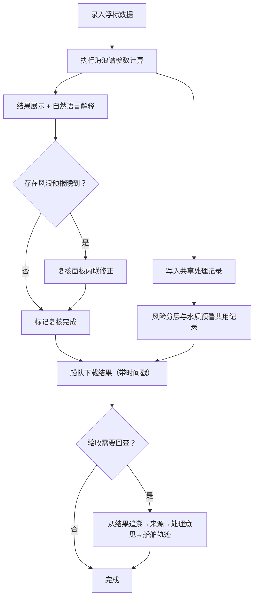

## 1. 产品概述

海浪谱参数计算工具——面向海洋监测员的轻量级计算与复核平台，赶潮汐窗口前少一次人工对账和口头解释。将浮标数据、巡检照片、浮标离线事件纳入同一轮复核，让风险分层与水质预警共享处理记录，计算结果旁附可读解释，全程可从结果追溯至来源与处理意见，支持下载区分与验收回查。

- 目标用户：海洋监测员、船队调度、验收审查人员
- 核心价值：一次录入、统一计算、全程可追溯、结果可解释、复核可修正

## 2. 核心功能

### 2.1 用户角色

| 角色 | 使用方式 | 核心权限 |
|------|----------|----------|
| 海洋监测员 | 日常操作 | 录入数据、执行计算、复核修正、下载结果 |
| 船队调度 | 查看与验收 | 查看计算结果与解释、下载报告、追溯异常 |
| 验收审查员 | 回查审计 | 从异常回查处理记录、船舶轨迹、处理意见 |

### 2.2 功能模块

1. **计算工作台**：海浪谱参数计算、结果展示与解释、风浪预报晚到标记
2. **复核面板**：浮标数据/巡检照片/浮标离线统一复核、风浪预报晚到修正入口
3. **追溯链路**：从结果到来源数据到处理记录的完整链路、异常回查
4. **下载与导出**：可区分运行批次的文件下载、内容简洁可读

### 2.3 页面详情

| 页面名称 | 模块名称 | 功能描述 |
|----------|----------|----------|
| 计算工作台 | 参数录入区 | 输入浮标观测数据（有效波高、谱峰周期、主波向等），支持风浪预报数据导入 |
| 计算工作台 | 计算执行区 | 一键执行海浪谱参数计算，展示计算进度与耗时 |
| 计算工作台 | 结果展示区 | 展示计算结果（Hs、Tp、谱型、风浪/涌浪分离），每项结果旁附1-2句自然语言解释 |
| 计算工作台 | 处理记录条 | 底部展示本次处理记录摘要（含风险分层与水质预警共享标记） |
| 复核面板 | 材料总览区 | 浮标数据、巡检照片、浮标离线事件同屏展示，标注数据来源和时间 |
| 复核面板 | 风浪预报晚到区 | 标记晚到的风浪预报记录，提供内联修正入口（无需重新导入） |
| 复核面板 | 处理意见区 | 填写或查看处理意见，关联船舶轨迹信息 |
| 追溯链路 | 结果→来源追溯 | 从任意计算结果点击追溯，展示完整链路：结果→计算参数→原始数据→处理记录 |
| 追溯链路 | 异常回查视图 | 选中异常记录后，展示船舶轨迹、处理意见、复核记录 |
| 下载导出 | 结果下载 | 生成文件名含批次时间戳的CSV/JSON，内容简洁，可区分本次与上次运行 |

## 3. 核心流程

海洋监测员在潮汐窗口前，将浮标观测数据录入计算工作台，执行海浪谱参数计算。计算结果旁自动生成可读解释，风险分层与水质预警共享同一批处理记录。如遇风浪预报晚到，在复核面板中直接修正，无需重新导入。船队查看结果后下载报告，文件名带时间戳可区分。验收审查员从异常结果点击追溯，经计算参数回到原始数据和处理意见，完成回查。

## 4. 用户界面设计

### 4.1 设计风格

- 主色调：深海蓝 (#0C2D48) + 浅海蓝 (#145DA0)，强调色：潮汐绿 (#2EC4B6)，警告色：珊瑚橙 (#E76F51)
- 按钮风格：圆角矩形、微投影，主要操作按钮带潮汐绿底色
- 字体：思源黑体/Noto Sans SC，标题 18px/16px，正文 14px，注释 12px
- 布局风格：左侧导航 + 右侧工作区，卡片式内容分组
- 图标风格：线性图标（lucide-react），搭配海洋主题小装饰

### 4.2 页面设计概览

| 页面名称 | 模块名称 | UI元素 |
|----------|----------|--------|
| 计算工作台 | 参数录入区 | 表单卡片，浮标数据字段分组，带输入验证与占位提示 |
| 计算工作台 | 计算执行区 | 主操作按钮 + 进度条 + 耗时计数 |
| 计算工作台 | 结果展示区 | 参数卡片网格，每张卡片含数值+解释文字，风浪/涌浪分区色标 |
| 计算工作台 | 处理记录条 | 底部固定条，展示批次号、风险等级、预警状态 |
| 复核面板 | 材料总览区 | 三栏并排（浮标数据/巡检照片/浮标离线），来源与时间标注 |
| 复核面板 | 风浪预报晚到区 | 高亮行，行内编辑按钮，修正后即时更新 |
| 复核面板 | 处理意见区 | 文本输入框 + 船舶轨迹缩略图 |
| 追溯链路 | 结果→来源追溯 | 面包屑式链路图，可点击各节点查看详情 |
| 追溯链路 | 异常回查视图 | 异常卡片 + 展开的轨迹图 + 处理意见时间线 |
| 下载导出 | 结果下载 | 下载按钮 + 批次信息预览，文件名示例展示 |

### 4.3 响应式设计

桌面优先设计，保证监测员在办公电脑上高效操作。平板端简化为单栏布局，手机端仅支持查看结果和下载。

### 4.4 设计意象

- 海洋仪表盘风格：深色背景 + 发光数据指标，像船桥上的监测面板
- 波纹微动效：计算进行中时卡片边框有微弱波纹
- 潮汐色带：处理记录条用潮汐绿/珊瑚橙色带标识状态
