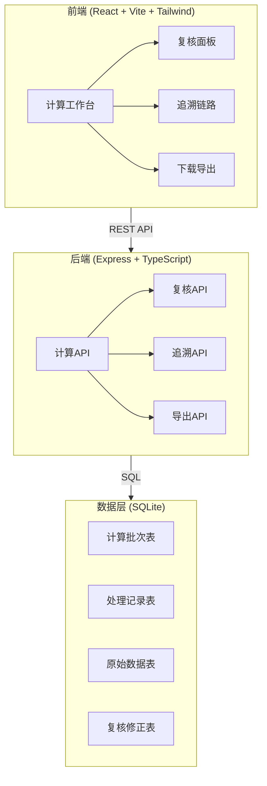
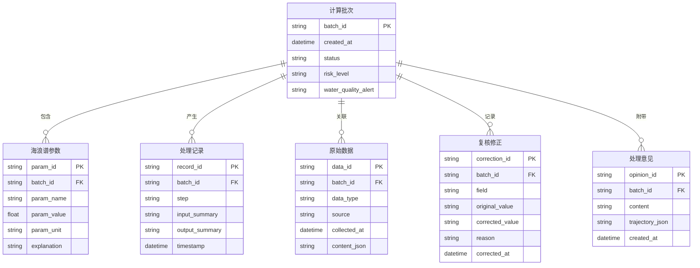

## 1. 架构设计



## 2. 技术说明

- 前端：React@18 + tailwindcss@3 + vite + zustand
- 初始化工具：vite-init
- 后端：Express@4 + TypeScript (ESM)
- 数据库：SQLite (better-sqlite3)，轻量嵌入式，无需额外服务
- 数据策略：本地 SQLite 存储计算批次与处理记录，前端使用 mock 数据演示浮标数据与巡检照片

## 3. 路由定义

| 路由 | 用途 |
|------|------|
| / | 计算工作台 - 参数录入、计算执行、结果展示与解释 |
| /review | 复核面板 - 材料总览、风浪预报晚到修正、处理意见 |
| /trace | 追溯链路 - 结果追溯、异常回查 |
| /export | 下载导出 - 结果下载、批次管理 |

## 4. API 定义

### 4.1 计算相关

```typescript
interface ComputeRequest {
  buoyData: {
    significantWaveHeight: number;
    peakPeriod: number;
    mainDirection: number;
    windSpeed: number;
    windDirection: number;
    waterTemp: number;
  };
  forecastData?: {
    forecastWaveHeight: number;
    forecastPeriod: number;
    forecastDirection: number;
    arrivalTime: string;
    isLate: boolean;
  };
  inspectionPhotos: string[];
  buoyOfflineEvents: { startTime: string; endTime: string; reason: string }[];
}

interface ComputeResult {
  batchId: string;
  timestamp: string;
  parameters: {
    hs: { value: number; unit: string; explanation: string };
    tp: { value: number; unit: string; explanation: string };
    spectrumType: { value: string; explanation: string };
    windWaveRatio: { value: number; explanation: string };
    swellRatio: { value: number; explanation: string };
    dominantDirection: { value: number; unit: string; explanation: string };
  };
  riskLevel: "low" | "medium" | "high";
  waterQualityAlert: "normal" | "watch" | "warning";
  processingRecordId: string;
}
```

### 4.2 复核相关

```typescript
interface ReviewRequest {
  batchId: string;
  corrections: {
    field: string;
    originalValue: number | string;
    correctedValue: number | string;
    reason: string;
  }[];
  processingOpinion: string;
  vesselTrajectory?: { lat: number; lng: number; timestamp: string }[];
}

interface ReviewRecord {
  batchId: string;
  buoyDataStatus: "verified" | "corrected";
  inspectionPhotosStatus: "verified" | "pending";
  buoyOfflineStatus: "verified" | "needs_attention";
  lateForecastCorrections: CorrectionRecord[];
  processingOpinion: string;
  vesselTrajectory: TrajectoryPoint[];
  reviewedAt: string;
  reviewedBy: string;
}
```

### 4.3 追溯相关

```typescript
interface TraceChain {
  result: ComputeResult;
  computeParams: ComputeRequest;
  rawDataSource: {
    buoyData: { id: string; collectedAt: string; stationId: string };
    forecastData: { id: string; issuedAt: string; arrivalAt: string };
    inspectionPhotos: { id: string; takenAt: string; inspector: string }[];
    buoyOfflineEvents: { id: string; recordedAt: string }[];
  };
  processingRecords: ProcessingRecord[];
  reviewRecords: ReviewRecord[];
}

interface ProcessingRecord {
  id: string;
  batchId: string;
  step: string;
  input: string;
  output: string;
  riskLevel: string;
  waterQualityAlert: string;
  timestamp: string;
}
```

### 4.4 导出相关

```typescript
interface ExportRequest {
  batchId: string;
  format: "csv" | "json";
}

interface ExportInfo {
  batchId: string;
  filename: string;
  content: string;
  createdAt: string;
  previousBatchId: string | null;
}
```

## 5. 数据模型

### 5.1 数据模型定义



### 5.2 数据定义语言

```sql
CREATE TABLE compute_batches (
    batch_id TEXT PRIMARY KEY,
    created_at TEXT NOT NULL,
    status TEXT NOT NULL DEFAULT 'computing',
    risk_level TEXT NOT NULL DEFAULT 'low',
    water_quality_alert TEXT NOT NULL DEFAULT 'normal'
);

CREATE TABLE wave_parameters (
    param_id TEXT PRIMARY KEY,
    batch_id TEXT NOT NULL REFERENCES compute_batches(batch_id),
    param_name TEXT NOT NULL,
    param_value REAL NOT NULL,
    param_unit TEXT,
    explanation TEXT NOT NULL
);

CREATE TABLE processing_records (
    record_id TEXT PRIMARY KEY,
    batch_id TEXT NOT NULL REFERENCES compute_batches(batch_id),
    step TEXT NOT NULL,
    input_summary TEXT,
    output_summary TEXT,
    timestamp TEXT NOT NULL
);

CREATE TABLE raw_data (
    data_id TEXT PRIMARY KEY,
    batch_id TEXT NOT NULL REFERENCES compute_batches(batch_id),
    data_type TEXT NOT NULL,
    source TEXT NOT NULL,
    collected_at TEXT NOT NULL,
    content_json TEXT NOT NULL
);

CREATE TABLE corrections (
    correction_id TEXT PRIMARY KEY,
    batch_id TEXT NOT NULL REFERENCES compute_batches(batch_id),
    field TEXT NOT NULL,
    original_value TEXT NOT NULL,
    corrected_value TEXT NOT NULL,
    reason TEXT NOT NULL,
    corrected_at TEXT NOT NULL
);

CREATE TABLE processing_opinions (
    opinion_id TEXT PRIMARY KEY,
    batch_id TEXT NOT NULL REFERENCES compute_batches(batch_id),
    content TEXT NOT NULL,
    trajectory_json TEXT,
    created_at TEXT NOT NULL
);

CREATE INDEX idx_params_batch ON wave_parameters(batch_id);
CREATE INDEX idx_records_batch ON processing_records(batch_id);
CREATE INDEX idx_raw_data_batch ON raw_data(batch_id);
CREATE INDEX idx_corrections_batch ON corrections(batch_id);
CREATE INDEX idx_opinions_batch ON processing_opinions(batch_id);
```
