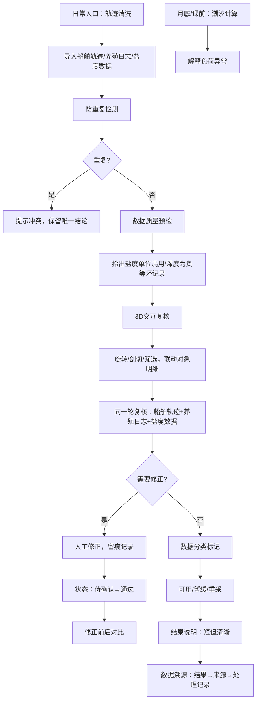

## 1. 产品概述

岛礁供电负荷预测系统是专为海事安全员设计的交互式数据复核平台，用于对岛礁供电相关的多源数据（船舶轨迹、养殖日志、盐度监测）进行质量检查、三维可视化复核和人工修正。系统以Three.js三维场景为核心，实现数据旋转、剖切、筛选与对象明细的联动交互，帮助海事安全员快速识别盐度单位混用、深度为负等异常记录，确保负荷预测数据的准确性。

## 2. 核心功能

### 2.1 用户角色

| 角色 | 登录方式 | 核心权限 |
|------|----------|----------|
| 海事安全员 | 系统登录 | 数据复核、异常识别、人工修正、溯源查询、报告导出 |
| 课题组用户 | 系统登录 | 查看复核结果、数据统计、历史记录 |

### 2.2 功能模块

1. **数据质量检查首页**：异常记录概览、盐度单位混用检测、深度为负记录定位、数据可用性分类
2. **3D交互复核页**：岛礁供电负荷三维可视化、旋转/平移/缩放、剖切分析、多维筛选、对象明细联动
3. **轨迹清洗模块**：日常数据入口、船舶轨迹数据清洗、养殖日志录入、盐度数据导入
4. **复核工作流**：船舶轨迹、养殖日志、盐度单位混用同一轮复核、人工修正留痕、状态流转（待确认→通过）
5. **数据溯源中心**：从结果反查来源和处理记录、修正前后对比、处理链路可视化
6. **潮汐计算分析**：月底/课前专项检查、潮汐数据与负荷关联分析
7. **防重复机制**：重复导入检测、补录数据去重、唯一结论保障

### 2.3 页面详情

| 页面名称 | 模块名称 | 功能描述 |
|----------|----------|----------|
| 数据质量概览 | 异常仪表盘 | 盐度单位混用统计、深度为负记录数、数据可用/暂缓/重采分类展示 |
| 数据质量概览 | 快捷操作区 | 一键拎出坏记录、跳转到3D复核、轨迹清洗入口 |
| 3D交互复核页 | 三维场景 | Three.js岛礁供电模型、实时负荷热力渲染、供电线路可视化 |
| 3D交互复核页 | 交互控制 | 轨道控制器（旋转/缩放/平移）、剖切平面控制、时间轴播放 |
| 3D交互复核页 | 筛选面板 | 按数据类型/时间/区域/质量状态筛选、筛选结果与3D场景联动 |
| 3D交互复核页 | 对象明细 | 点击3D对象显示完整属性、数据来源、处理历史、修正操作入口 |
| 轨迹清洗页 | 数据导入 | 船舶轨迹、养殖日志、盐度数据批量导入、重复检测 |
| 轨迹清洗页 | 清洗规则 | 异常值检测、格式标准化、单位统一处理 |
| 复核工作台 | 多源联动 | 船舶轨迹、养殖日志、盐度数据同屏复核、关联分析 |
| 复核工作台 | 人工修正 | 修正表单、原因填写、状态变更（待确认→通过） |
| 数据溯源页 | 链路追踪 | 数据来源→处理过程→最终结果的完整链路展示 |
| 数据溯源页 | 变更对比 | 修正前后数据对比、差异高亮、留痕记录 |
| 潮汐分析页 | 关联分析 | 潮汐数据与供电负荷关联度计算、异常解释 |
| 系统设置 | 防重复配置 | 去重规则设置、导入冲突处理策略 |

## 3. 核心流程

## 4. 用户界面设计

### 4.1 设计风格

- **主色调**：深海蓝 #0A2463（专业、稳重）、科技青 #3E92CC（数据、交互）
- **辅助色**：警示橙 #E63946（异常记录）、确认绿 #2A9D8F（通过状态）、暂缓黄 #E9C46A（待确认）
- **字体**：标题使用 Space Grotesk（科技感），正文使用 Noto Sans SC（中文可读性）
- **按钮风格**：微立体、圆角8px、hover状态带轻微发光效果
- **布局风格**：左侧导航 + 主内容区 + 右侧详情面板的三栏布局，3D场景全屏展示时可折叠侧栏
- **图标**：使用 lucide-react 线性图标，异常数据使用带警示角标的图标

### 4.2 页面设计概述

| 页面名称 | 模块名称 | UI元素 |
|----------|----------|--------|
| 数据质量概览 | 异常仪表盘 | 卡片式统计、环形进度图、异常记录列表、渐变背景、入场动画 |
| 3D交互复核页 | 三维场景 | 全屏Three.js画布、悬浮工具条、剖切控制面板、筛选抽屉、对象详情弹窗 |
| 3D交互复核页 | 交互控制 | 轨道控制器、剖切平面手柄、时间轴滑块、视图预设按钮 |
| 复核工作台 | 多源联动 | 三栏联动布局（轨迹/日志/盐度）、关联高亮、修正表单抽屉 |
| 数据溯源页 | 链路追踪 | 时间线布局、节点可展开、差异对比表、渐变连接线 |

### 4.3 响应式

- Desktop-first 设计，主内容区最小宽度1280px
- 3D场景自适应窗口大小，移动端降级为2D数据可视化
- 触控优化：支持双指缩放、单指旋转、长按选中
- 侧边栏可折叠，小屏幕下自动隐藏

### 4.4 3D场景指引

- **环境与氛围**：深海蓝渐变背景，模拟海洋环境，使用HDRI环境贴图增加真实感
- **光照设置**：主光源（平行光，模拟日光）+ 环境光（半球光，天空/海洋色）+ 点光源（岛礁供电设施发光效果）
- **相机设置**：透视相机，初始位置俯瞰岛礁全景，支持轨道控制，最小距离100m，最大距离5000m
- **构图与焦点**：岛礁为中心，供电线路呈放射状分布，负荷热力图以颜色渐变显示（蓝→绿→黄→红）
- **交互与动画**：选中对象时轻微上浮+发光效果，剖切时截面高亮显示，时间轴播放时数据平滑过渡
- **后处理效果**：Bloom发光（供电设施）、轻微景深（突出焦点对象）、色彩校正
- **性能预算**：模型三角面控制在50万以内，使用实例化渲染供电设施，Lod分级显示

