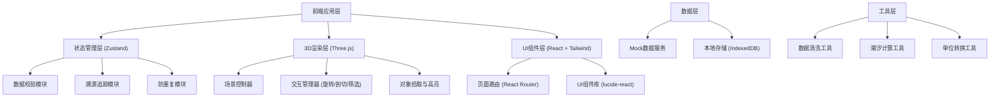
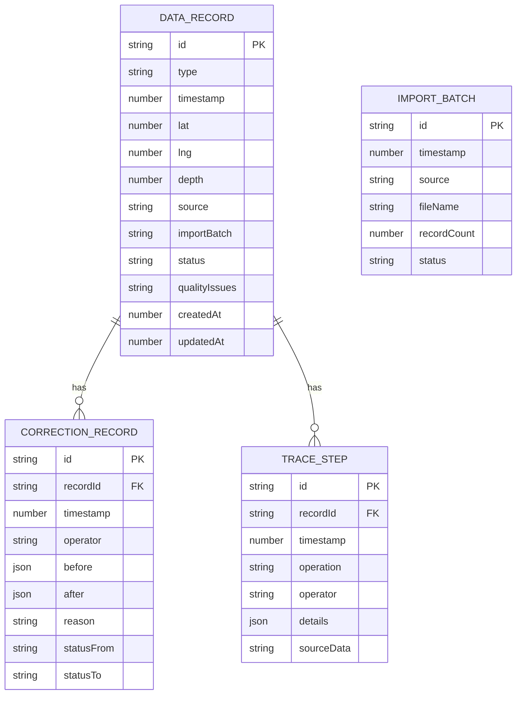

## 1. 架构设计



## 2. 技术描述

- **前端框架**: React@18 + TypeScript + Vite@5
- **3D渲染**: three@^0.160.0 + @react-three/fiber@^8.15.0 + @react-three/drei@^9.92.0 + @react-three/postprocessing@^2.15.0
- **状态管理**: zustand@^4.4.0
- **路由**: react-router-dom@^6.20.0
- **样式**: tailwindcss@^3.3.0
- **图标**: lucide-react@^0.294.0
- **数据持久化**: localforage (IndexedDB封装)
- **后端**: 无后端，纯前端Mock数据 + IndexedDB本地存储

## 3. 路由定义

| 路由 | 用途 |
|------|------|
| / | 数据质量概览页 - 异常仪表盘、快捷操作 |
| /review-3d | 3D交互复核页 - 三维场景、剖切、筛选 |
| /track-cleaning | 轨迹清洗页 - 日常数据入口、导入、清洗 |
| /workbench | 复核工作台 - 多源数据联动复核、人工修正 |
| /traceability | 数据溯源页 - 链路追踪、变更对比 |
| /tide-analysis | 潮汐分析页 - 月底/课前专项检查 |
| /settings | 系统设置页 - 防重复配置、规则设置 |

## 4. API 定义（Mock）

```typescript
// 数据类型定义
type DataType = 'ship_track' | 'aquaculture_log' | 'salinity';
type DataStatus = 'pending' | 'approved' | 'rejected' | 'suspended' | 'recollect';
type QualityIssue = 'unit_mismatch' | 'negative_depth' | 'outlier' | 'duplicate' | 'missing';

interface BaseDataRecord {
  id: string;
  type: DataType;
  timestamp: number;
  location: { lat: number; lng: number; depth?: number };
  source: string;
  importBatch: string;
  status: DataStatus;
  qualityIssues: QualityIssue[];
  createdAt: number;
  updatedAt: number;
  correctionHistory: CorrectionRecord[];
}

interface ShipTrack extends BaseDataRecord {
  type: 'ship_track';
  vesselId: string;
  vesselName: string;
  speed: number;
  heading: number;
  powerConsumption: number;
}

interface AquacultureLog extends BaseDataRecord {
  type: 'aquaculture_log';
  farmId: string;
  farmName: string;
  equipmentCount: number;
  dailyPowerUsage: number;
  stockDensity: number;
}

interface SalinityData extends BaseDataRecord {
  type: 'salinity';
  stationId: string;
  salinity: number;
  unit: 'ppt' | 'psu' | '‰';  // 单位混用检测点
  temperature: number;
  relatedLoad: number;
}

interface CorrectionRecord {
  id: string;
  timestamp: number;
  operator: string;
  before: Record<string, any>;
  after: Record<string, any>;
  reason: string;
  statusChange: { from: DataStatus; to: DataStatus };
}

interface ProcessingTrace {
  recordId: string;
  steps: TraceStep[];
}

interface TraceStep {
  id: string;
  timestamp: number;
  operation: string;
  operator: string;
  details: Record<string, any>;
  sourceData: string;
}

// API 接口
interface DataAPI {
  getRecords(filters?: Partial<BaseDataRecord>): Promise<BaseDataRecord[]>;
  getRecordById(id: string): Promise<BaseDataRecord | null>;
  importRecords(records: BaseDataRecord[]): Promise<{
    success: BaseDataRecord[];
    duplicates: BaseDataRecord[];
    errors: string[];
  }>;
  updateRecord(id: string, updates: Partial<BaseDataRecord>, correction: CorrectionRecord): Promise<BaseDataRecord>;
  getProcessingTrace(recordId: string): Promise<ProcessingTrace | null>;
  getQualityStats(): Promise<{
    total: number;
    unitMismatch: number;
    negativeDepth: number;
    available: number;
    suspended: number;
    recollect: number;
  }>;
  detectDuplicates(records: BaseDataRecord[]): Promise<string[]>;  // 返回重复记录ID
  calculateTideCorrelation(period: { start: number; end: number }): Promise<{
    correlation: number;
    explanation: string;
    anomalies: Array<{ time: number; load: number; tide: number }>;
  }>;
}
```

## 5. 数据模型

### 5.1 ER图



### 5.2 数据定义（IndexedDB）

```typescript
// 数据库配置
const DB_CONFIG = {
  name: 'IslandPowerDB',
  version: 1,
  stores: {
    records: { keyPath: 'id', indexes: ['type', 'status', 'importBatch', 'timestamp'] },
    corrections: { keyPath: 'id', indexes: ['recordId', 'timestamp'] },
    traceSteps: { keyPath: 'id', indexes: ['recordId', 'timestamp'] },
    importBatches: { keyPath: 'id', indexes: ['timestamp', 'status'] },
    settings: { keyPath: 'key' }
  }
};

// 防重复哈希计算规则
function generateRecordHash(record: BaseDataRecord): string {
  const coreFields = {
    type: record.type,
    timestamp: Math.floor(record.timestamp / 60000) * 60000,  // 1分钟精度
    location: { lat: record.location.lat.toFixed(6), lng: record.location.lng.toFixed(6) },
    source: record.source
  };
  return SHA256(JSON.stringify(coreFields));
}

// 盐度单位检测规则
function detectSalinityUnitMismatch(records: SalinityData[]): string[] {
  const units = new Set(records.map(r => r.unit));
  if (units.size > 1) {
    return records.filter(r => r.unit !== 'ppt').map(r => r.id);
  }
  return [];
}

// 深度为负检测规则
function detectNegativeDepth(records: BaseDataRecord[]): string[] {
  return records
    .filter(r => r.location.depth !== undefined && r.location.depth < 0)
    .map(r => r.id);
}
```

