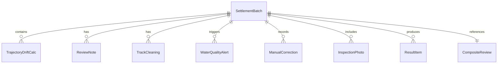

## 1. 架构设计

```mermaid
graph TD
    "前端 React 应用" --> "Zustand 状态管理"
    "Zustand 状态管理" --> "Mock 数据层"
    "前端 React 应用" --> "页面路由（React Router）"
    "页面路由" --> "结算总览页"
    "页面路由" --> "轨迹漂移复核页"
    "页面路由" --> "水质预警页"
    "页面路由" --> "人工修正留痕页"
    "页面路由" --> "巡检照片页"
    "页面路由" --> "结果说明页"
    "页面路由" --> "复合材料复核页"
```

纯前端项目，无后端服务，使用 Mock 数据模拟真实结算数据。

## 2. 技术说明

- 前端：React@18 + TypeScript + Tailwind CSS@3 + Vite
- 初始化工具：vite-init
- 状态管理：Zustand
- 路由：React Router DOM
- 后端：无（纯前端，Mock 数据）
- 数据库：无（前端 Mock 数据）

## 3. 路由定义

| 路由 | 用途 |
|------|------|
| / | 结算总览页面，展示当前批次状态看板与分级标签 |
| /trajectory | 轨迹漂移复核页面，含计算工具、复核备注、轨迹清洗 |
| /water-quality | 水质预警页面，含预警结论与来源材料溯源 |
| /corrections | 人工修正留痕页面，展示修正时间线与前后对比 |
| /photos | 巡检照片页面，含原始行号、图片名、来源备注追溯 |
| /results | 结果说明页面，含可用/暂缓/重新采集分级 |
| /composite | 复合材料复核页面，气象/潮汐/禁航区同一轮展示 |

## 4. API 定义

无后端 API，使用前端 Mock 数据。

### 4.1 数据模型

```typescript
interface SettlementBatch {
  id: string
  batchName: string
  status: "pending" | "reviewing" | "approved" | "rejected"
  createdAt: string
  vesselName: string
  portName: string
}

interface TrajectoryDriftCalc {
  inputParams: {
    startPosition: { lat: number; lng: number }
    endPosition: { lat: number; lng: number }
    timeElapsed: number
    vesselSpeed: number
    currentSpeed: number
    windSpeed: number
  }
  result: {
    driftDistance: number
    driftDirection: number
    driftIndex: number
  }
  formula: string
  unit: string
  scope: string
  failureReasons: string[]
}

interface ReviewNote {
  id: string
  batchId: string
  author: string
  content: string
  createdAt: string
  relatedTrajectoryId: string
}

interface TrackCleaning {
  id: string
  batchId: string
  originalPoints: { lat: number; lng: number; timestamp: string }[]
  cleanedPoints: { lat: number; lng: number; timestamp: string }[]
  anomalies: { index: number; reason: string }[]
}

interface WaterQualityAlert {
  id: string
  batchId: string
  level: "normal" | "warning" | "critical"
  conclusion: string
  sourceMaterial: {
    id: string
    name: string
    type: string
    lineReference: string
  }
}

interface ManualCorrection {
  id: string
  batchId: string
  operator: string
  timestamp: string
  field: string
  oldValue: string
  newValue: string
  statusChange: "待确认" | "通过"
  reason: string
}

interface InspectionPhoto {
  id: string
  batchId: string
  originalLineNo: number
  imageName: string
  sourceRemark: string
  thumbnailUrl: string
  sourceTable: string
  sourceRecordId: string
}

interface ResultItem {
  id: string
  batchId: string
  category: string
  description: string
  status: "可用" | "暂缓" | "重新采集"
  statusReason: string
  relatedDataIds: string[]
}

interface CompositeReview {
  batchId: string
  weatherForecast: {
    date: string
    condition: string
    windSpeed: number
    waveHeight: number
    anomaly: boolean
  }[]
  tideTable: {
    date: string
    highTide: string
    lowTide: string
    anomaly: boolean
  }[]
  navigationZoneViolation: {
    zoneName: string
    violationTime: string
    vesselId: string
    severity: "低" | "中" | "高"
  }[]
}
```

## 5. 服务端架构

不适用（纯前端项目）

## 6. 数据模型

### 6.1 数据模型定义



### 6.2 数据定义语言

前端 Mock 数据，无需 DDL。数据通过 TypeScript 常量文件提供，初始化时注入 Zustand Store。
