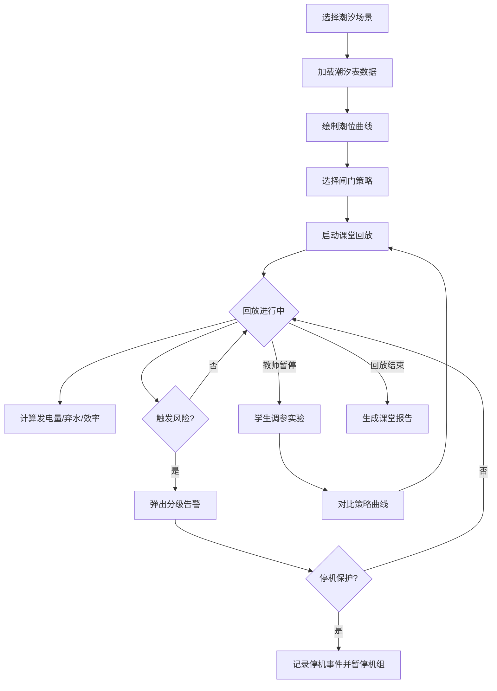

## 1. 产品概述

潮汐发电闸门演示系统是一款面向海洋课堂的教学演示工具，帮助学生直观理解潮汐发电原理：涨潮蓄水、落潮放水发电，而非"涨潮开闸、落潮关闸"的常见误解。系统提供潮汐数据模拟、闸门策略调控、发电量计算与风险预警，并支持课堂节奏回放和参数实时调整。

- 目标用户：海洋科学教师、中学/大学学生
- 核心价值：将抽象的潮汐发电过程转化为可操作、可回放、可对比的可视化课堂演示

## 2. 核心功能

### 2.1 用户角色

| 角色 | 使用方式 | 核心权限 |
|------|----------|----------|
| 教师 | 打开演示页面即可 | 调整参数、切换策略、控制回放、导出报告 |
| 学生 | 观看演示 / 自行调参 | 修改闸门开度、切换策略、查看曲线变化 |

### 2.2 功能模块

1. **潮汐数据面板**：展示多组潮汐表（涨潮/落潮时间、潮位高度），支持时区切换与错误时区提示
2. **闸门控制面板**：可视化闸门开度调节（0-100%），记录人工临时改开度事件，展示闸门状态动画
3. **发电量计算引擎**：根据潮汐数据 + 闸门开度策略计算发电量、弃水时段、机组效率
4. **风险预警系统**：机组温度过载保护、闸门异常操作提示、弃水损失提示，分级告警（提示/警告/停机）
5. **课堂回放模式**：按一节课节奏（约45分钟压缩为若干关键时段），标注发电/蓄水/停机区间，支持进度拖动
6. **参数实验区**：学生修改闸门策略、开度等参数后，实时刷新发电曲线与结论对比

### 2.3 页面详情

| 页面名称 | 模块名称 | 功能描述 |
|----------|----------|----------|
| 演示主页 | 潮汐水位曲线 | 实时绘制24小时潮位曲线，标注涨潮/落潮/平潮区间 |
| 演示主页 | 闸门状态动画 | 可视化闸门开度，显示水流方向与流量 |
| 演示主页 | 发电量仪表盘 | 实时/累计发电量、机组效率、弃水量 |
| 演示主页 | 风险告警栏 | 分级告警列表，含时区错误、温度保护、操作异常等 |
| 演示主页 | 课堂回放控制 | 时间轴进度条，标注关键时段（发电/蓄水/停机） |
| 参数实验页 | 策略对比面板 | 两种策略并排对比发电曲线与指标 |
| 参数实验页 | 参数调节器 | 闸门开度滑块、策略选择、时区设置 |
| 报告页 | 课堂报告 | 按时段汇总发电量、风险事件、教学建议 |

## 3. 核心流程

1. 教师打开系统，选择预设潮汐场景（如"半日潮""全日潮"）
2. 系统加载潮汐表数据，绘制潮位曲线
3. 教师选择闸门策略（正确策略：落潮开闸发电 / 错误策略：涨潮开闸）并启动回放
4. 回放过程中，系统实时计算并展示发电量、水流方向、闸门状态
5. 当触发风险条件（温度过高、闸门异常操作等），系统弹出分级告警而非简单失败
6. 教师暂停回放，学生可调整参数，对比不同策略下的发电量曲线
7. 回放结束，系统生成课堂报告，标注每个时段适合的操作

## 4. 用户界面设计

### 4.1 设计风格

- 主色调：深海蓝 (#0A2342) + 浪花白 (#F0F4F8)，强调色用潮汐绿 (#00C9A7) 和告警橙 (#FF6B35)
- 按钮风格：圆角胶囊按钮，带微弱水波纹动效
- 字体：中文使用"思源黑体"风格（Noto Sans SC），数字/英文使用 JetBrains Mono 等宽字体
- 布局风格：深色仪表盘风格，左侧控制面板 + 中间可视化区 + 右侧数据面板
- 图标/动效：水流动画、闸门开合动画、潮位涨落动画

### 4.2 页面设计概览

| 页面名称 | 模块名称 | UI 元素 |
|----------|----------|----------|
| 演示主页 | 潮汐水位曲线 | 深色背景渐变、半透明面积图、区域着色（涨潮蓝/落潮绿）、时间轴标注 |
| 演示主页 | 闸门状态动画 | SVG 闸门截面图、水流粒子动画、开度百分比数字、方向箭头 |
| 演示主页 | 发电量仪表盘 | 环形进度条、大字数值、效率百分比、弃水体积指示 |
| 演示主页 | 风险告警栏 | 分级色条（绿/黄/橙/红）、时间戳、详情折叠、时区错误特殊标记 |
| 演示主页 | 课堂回放控制 | 底部时间轴、时段色块标注、播放/暂停按钮、速度调节 |
| 参数实验页 | 策略对比面板 | 双曲线叠加图、差值填充、指标对比卡片 |
| 参数实验页 | 参数调节器 | 滑块组、策略下拉、时区选择器、重置按钮 |
| 报告页 | 课堂报告 | 分时段表格、结论高亮、导出按钮 |

### 4.3 响应式设计

- 桌面优先设计，课堂投影场景下确保大屏可读性
- 最小支持 1280px 宽度，中控面板可折叠
- 关键数值和曲线在大屏上保持高对比度

### 4.4 动效设计

- 潮位曲线绘制：从左到右渐进展开动画
- 闸门开合：平滑过渡动画（0.5s ease-in-out）
- 水流粒子：沿水流方向持续流动
- 告警出现：从右侧滑入，按严重程度脉冲
- 回放进度：平滑推进，时段切换时短暂暂停高亮
