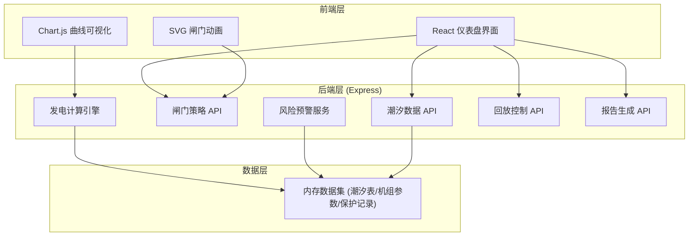
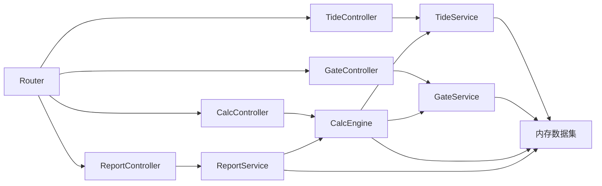
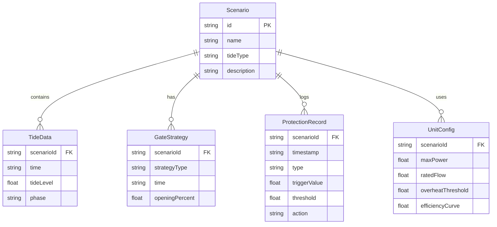

## 1. 架构设计



## 2. 技术说明

- **前端**：React@18 + Tailwind CSS@3 + Vite
- **初始化工具**：Vite (React + TypeScript 模板)
- **后端**：Express@4，纯内存数据集，无需数据库
- **可视化**：Chart.js 用于潮位/发电曲线，SVG + CSS 动画用于闸门状态
- **数据**：内置 3 组潮汐场景（半日潮、全日潮、混合潮），含预设闸门策略与保护停机记录

## 3. 路由定义

| 路由 | 用途 |
|------|------|
| `/` | 演示主页：潮位曲线 + 闸门动画 + 发电仪表盘 + 回放控制 |
| `/experiment` | 参数实验页：策略对比 + 参数调节 |
| `/report` | 课堂报告页：分时段汇总 + 教学建议 |

## 4. API 定义

### 4.1 获取潮汐场景列表

```typescript
GET /api/scenarios

Response:
{
  scenarios: Array<{
    id: string;
    name: string;           // "半日潮"、"全日潮"、"混合潮"
    description: string;
    tideType: "semidiurnal" | "diurnal" | "mixed";
  }>
}
```

### 4.2 获取潮汐数据

```typescript
GET /api/scenarios/:id/tides?timezone=Asia/Shanghai

Response:
{
  scenarioId: string;
  timezone: string;
  timezoneOffset: number;
  timezoneWarning?: string;  // 时区不匹配时的警告信息
  data: Array<{
    time: string;            // ISO 8601
    tideLevel: number;       // 米
    phase: "rising" | "falling" | "slack";
    isHighTide: boolean;
    isLowTide: boolean;
  }>
}
```

### 4.3 计算发电量

```typescript
POST /api/calculate

Body:
{
  scenarioId: string;
  strategy: "correct" | "wrong" | "custom";
  customGates?: Array<{
    time: string;
    openingPercent: number;  // 0-100
  }>;
  timezone?: string;
}

Response:
{
  totalEnergy: number;       // kWh
  peakPower: number;         // kW
  efficiency: number;        // 0-1
  waterDiscarded: Array<{
    startTime: string;
    endTime: string;
    volume: number;          // m³
    reason: string;
  }>;
  timeline: Array<{
    time: string;
    tideLevel: number;
    gateOpening: number;
    flowRate: number;        // m³/s
    power: number;           // kW
    energy: number;          // kWh (累计)
    phase: "generating" | "storing" | "idle" | "discarding";
    alerts: Array<{
      level: "info" | "warning" | "danger" | "shutdown";
      message: string;
      code: string;
    }>;
  }>;
  alerts: Array<{
    level: "info" | "warning" | "danger" | "shutdown";
    message: string;
    code: string;
    timestamp: string;
    detail: string;          // 详细解释，面向教学
  }>;
}
```

### 4.4 获取保护停机记录

```typescript
GET /api/scenarios/:id/protection-records

Response:
{
  records: Array<{
    id: string;
    timestamp: string;
    type: "overheat" | "overspeed" | "vibration" | "manual_override";
    description: string;
    triggerValue: number;
    threshold: number;
    unit: string;
    action: string;          // "自动停机" | "人工干预" 等
    teachingNote: string;    // 面向学生的解释
  }>
}
```

### 4.5 人工修改闸门开度

```typescript
POST /api/scenarios/:id/gate-override

Body:
{
  time: string;
  openingPercent: number;
  reason?: string;
}

Response:
{
  success: boolean;
  warning?: string;          // 如"在涨潮期关闭闸门将导致蓄水不足"
  impact: {
    energyDelta: number;     // kWh 变化量
    riskLevel: "none" | "low" | "medium" | "high";
  };
  alert?: {
    level: "info" | "warning" | "danger";
    message: string;
    teachingNote: string;
  };
}
```

### 4.6 获取课堂报告

```typescript
POST /api/report

Body:
{
  scenarioId: string;
  strategy: string;
  customGates?: Array<{ time: string; openingPercent: number }>;
  timezone?: string;
}

Response:
{
  summary: {
    totalEnergy: number;
    peakPower: number;
    efficiency: number;
    totalWaterDiscarded: number;
    alertCount: { info: number; warning: number; danger: number; shutdown: number };
  };
  segments: Array<{
    startTime: string;
    endTime: string;
    label: string;           // "最佳发电时段"、"蓄水时段"、"应停机时段" 等
    recommendation: string;  // 教学建议
    energy: number;
    avgPower: number;
    events: Array<{
      time: string;
      type: string;
      description: string;
    }>;
  }>;
  teachingNotes: Array<{
    title: string;
    content: string;
  }>;
}
```

## 5. 服务端架构



## 6. 数据模型

### 6.1 数据模型定义



### 6.2 内置数据集

**场景一：半日潮（典型沿海）**
- 周期约12小时25分钟，一日两涨两落
- 潮差2-4米，适合教学演示

**场景二：全日潮（赤道附近）**
- 一日一涨一落，潮差较小

**场景三：混合潮（过渡区域）**
- 不规则潮汐，含时区错误样例数据

**保护停机记录预设：**
- 机组过温保护：温度达到95°C触发
- 人工闸门干预：教师演示临时改开度
- 振动超限保护：模拟机组异常振动

**时区错误样例：**
- 潮位时间使用UTC但未标注，导致"白天涨潮"变成"夜间涨潮"
- 系统检测时区不匹配时给出教学提示而非报错
