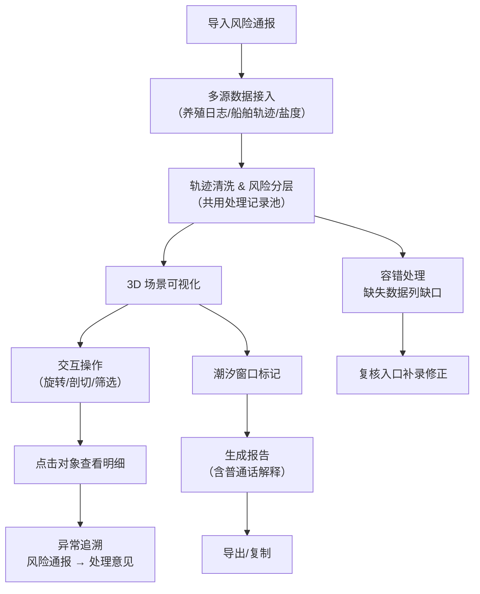

## 1. 产品概述

海面溢油扩散复盘系统是一款面向潜水教练和海事处的专业级溢油事件复盘分析工具。通过 3D 可视化交互、多源数据融合和智能风险分层，帮助用户快速梳理溢油扩散轨迹、复核浮标数据、导出潮汐窗口说明报告。

- 核心目标：解决溢油事件复盘效率低、数据分散、追溯困难的问题
- 目标用户：潜水教练、海事处工作人员、环境监测人员
- 产品价值：一套数据、多方复用，可视化交互降低专业门槛，报告直接可用

## 2. 核心功能

### 2.1 用户角色

| 角色 | 登录方式 | 核心权限 |
|------|---------|----------|
| 潜水教练 | 本地账号 | 导入数据、3D 交互查看、导出报告、复核修正 |
| 海事处人员 | 本地账号 | 查看复盘结果、追溯异常链路、验证处理意见 |

### 2.2 功能模块

1. **数据导入面板**：风险通报导入、浮标数据复核、养殖日志/船舶轨迹/盐度数据统一接入
2. **3D 海面场景**：溢油扩散三维可视化、旋转/剖切/筛选交互、对象明细联动展示
3. **轨迹清洗中心**：轨迹去噪修正、风险分层计算、共用处理记录池
4. **报告导出模块**：潮汐窗口说明、普通话解释段落、缺口清单
5. **复核追溯链路**：异常点回溯、风险通报关联、处理意见查看

### 2.3 页面详情

| 页面名称 | 模块名称 | 功能描述 |
|---------|---------|----------|
| 主工作台 | 左侧数据面板 | 风险通报列表、浮标状态、数据源管理 |
| 主工作台 | 中央 3D 场景 | 海面溢油 3D 可视化、旋转交互、剖切操作 |
| 主工作台 | 右侧明细面板 | 对象详情、风险分层、处理意见、复核入口 |
| 主工作台 | 底部时间轴 | 溢油扩散时间线、潮汐窗口标记、播放控制 |
| 报告预览页 | 报告内容区 | 潮汐窗口说明、普通话解释、缺口清单、复核记录 |
| 报告预览页 | 导出操作区 | 多种格式导出、一键复制、打印 |

## 3. 核心流程

用户导入风险通报和多源数据后，系统自动进行轨迹清洗和风险分层，生成共用处理记录。用户在 3D 场景中交互查看溢油扩散过程，通过剖切、筛选定位异常点，点击异常可追溯关联的风险通报和处理意见。水质记录缺失时系统部分计算并列出缺口，用户可通过复核入口补录修正。最后导出包含普通话解释的报告。

## 4. 用户界面设计

### 4.1 设计风格

- 主色调：深海蓝（#0a2540）+ 警示橙（#ff6b35）+ 冰蓝（#74c0fc）
- 辅助色：油膜彩虹色（用于溢油层可视化）
- 按钮风格：微立体圆角按钮，主操作荧光边框
- 字体：标题用 Space Grotesk，正文用 Inter，数字用 JetBrains Mono
- 布局风格：三栏式工作台，沉浸式 3D 场景居中
- 视觉风格：工业科技感 + 深海氛围，暗色系为主，数据高亮醒目

### 4.2 页面设计概览

| 页面名称 | 模块名称 | UI 元素 |
|---------|---------|---------|
| 主工作台 | 左侧数据面板 | 折叠式卡片、状态指示灯、导入按钮、进度条 |
| 主工作台 | 中央 3D 场景 | 海面网格、溢油半透明层、浮标标记、剖切平面、罗盘 |
| 主工作台 | 右侧明细面板 | 标签页切换、风险等级色条、时间戳、复核按钮 |
| 主工作台 | 底部时间轴 | 刻度线、潮汐窗口高亮、播放/暂停、速度调节 |
| 报告预览页 | 报告内容区 | 卡片式布局、重点内容高亮、普通话解释区块 |
| 报告预览页 | 导出操作区 | 图标按钮组、复制成功动效 |

### 4.3 响应式

- 桌面端优先（1440px+），三栏布局完整展示
- 平板端（1024px）左右面板可折叠收起
- 移动端暂不支持，定位为专业桌面工具

### 4.4 3D 场景指引

- 环境：深海暗色调，带体积光和水面扰动效果
- 光照：主方向光模拟日光 + 环境光补光 + 溢油层自发光
- 相机：默认俯视 45° 透视视角，支持轨道控制器旋转缩放
- 交互：鼠标左键旋转、滚轮缩放、右键平移、双击聚焦
- 动画：溢油扩散逐帧动画、水面波动、浮标呼吸灯效果
- 后处理：轻微泛光、色阶调整、屏幕空间环境光遮蔽
- 性能目标：稳定 60fps，溢油粒子数 ≤ 5000

## 5. 数据与业务规则

### 5.1 共用处理记录池

轨迹清洗与风险分层共用同一批处理记录，界面展示和报告导出均从该记录池读取，确保数据一致性。

### 5.2 容错机制

水质记录缺失时不整批失败：
1. 先计算已有数据可支撑的部分
2. 生成缺口清单（缺失项、影响范围、建议补录方式）
3. 在界面和报告中明确标注哪些结论受数据缺失影响

### 5.3 异常追溯链路

任何异常点均可反向追溯：
- 异常点 → 关联的风险通报 → 原始处理意见 → 复核记录

### 5.4 复核入口

- 右侧明细面板内联复核按钮
- 终端/日志输出中包含复核链接
- 支持直接修正数据并重新计算相关联的处理记录
