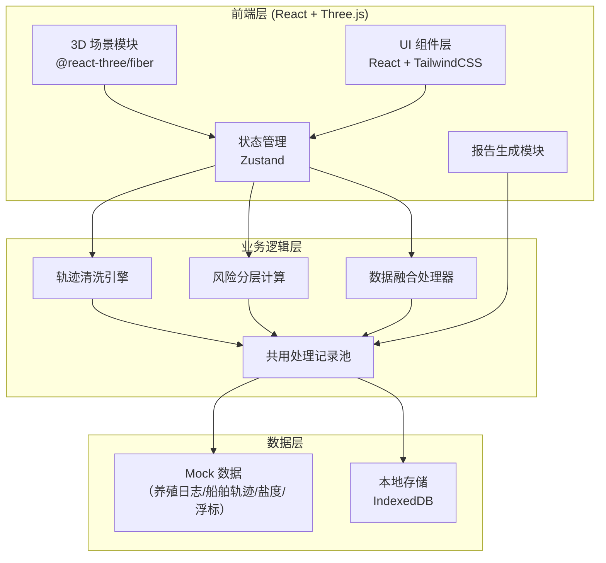
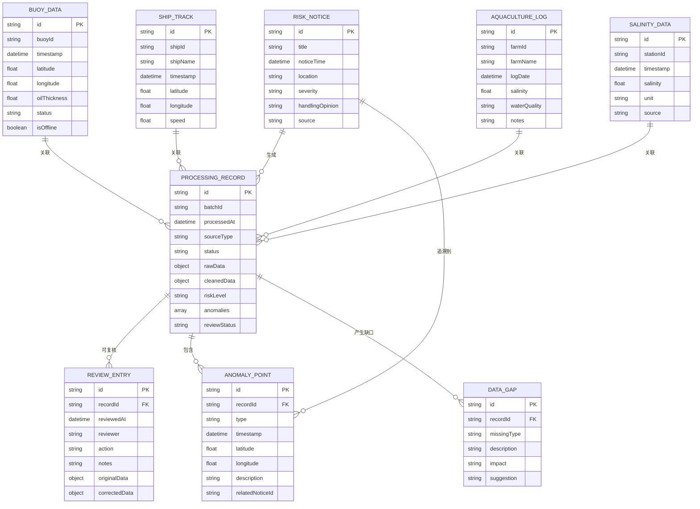

## 1. 架构设计



## 2. 技术选型说明

- 前端框架：React@18 + TypeScript
- 构建工具：Vite@5
- 样式方案：TailwindCSS@3
- 3D 渲染：Three.js + @react-three/fiber + @react-three/drei
- 状态管理：Zustand（轻量级，支持共享状态）
- 图标：Lucide React
- 后端：无后端，纯前端 + Mock 数据
- 本地数据持久化：IndexedDB（存储处理记录和复核数据）

## 3. 路由定义

| 路由 | 页面用途 |
|-----|---------|
| / | 主工作台（3D 场景 + 左右面板 + 底部时间轴） |
| /report | 报告预览与导出页 |

## 4. 数据模型

### 4.1 核心数据模型



### 4.2 状态管理 (Zustand Store)

- `useProcessStore`: 处理记录池管理（轨迹清洗、风险分层共用）
- `useSceneStore`: 3D 场景状态（相机位置、剖切平面、筛选条件、选中对象）
- `useDataStore`: 原始数据管理（风险通报、浮标、船舶、养殖、盐度）
- `useReviewStore`: 复核记录管理

## 5. 核心模块说明

### 5.1 共用处理记录池

轨迹清洗和风险分层共用同一批 `ProcessingRecord`，通过 `batchId` 关联。界面展示和报告导出均从 `useProcessStore` 读取，确保数据一致性。

### 5.2 容错计算流程

```
数据接入 → 检查完整性 → 部分计算（已有数据）→ 生成缺口清单 → 标记受影响结论
```

支持部分失败不影响整体，缺口清单包含：缺失数据类型、影响范围、建议补录方式、快速复核入口。

### 5.3 异常追溯链路

每个 `AnomalyPoint` 保存 `relatedNoticeId`，点击异常点时：
1. 查询关联的风险通报 (`RISK_NOTICE`)
2. 展示原始处理意见
3. 列出相关复核记录
4. 可跳转到复核入口修正

### 5.4 3D 场景交互

- 旋转：OrbitControls
- 剖切：ClippingPlane，支持多平面剖切
- 筛选：按风险等级、时间范围、数据来源筛选
- 对象明细联动：点击 3D 对象 → 更新右侧面板 → 高亮关联数据

### 5.5 报告生成

报告内容从共用处理记录池读取，包含：
- 潮汐窗口说明
- 普通话解释段落（可一键复制）
- 风险分层统计
- 数据缺口清单
- 复核记录摘要
