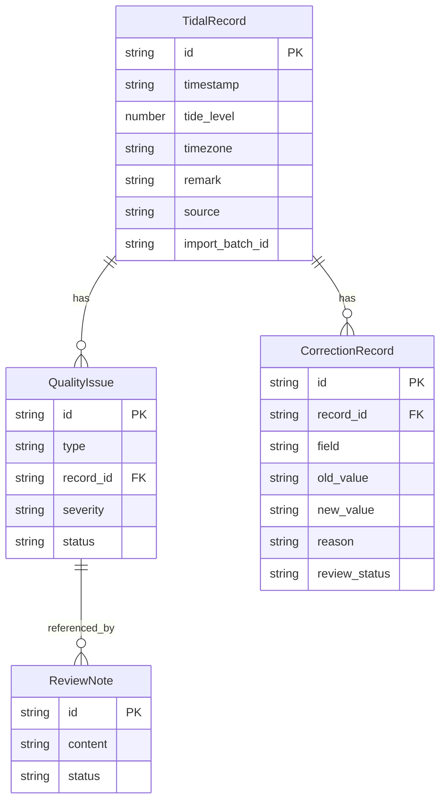

## 1. 架构设计

```mermaid
graph TD
    "前端应用[React + Vite]" --> "状态管理[Zustand]"
    "状态管理" --> "数据层[本地Store + Mock数据]"
    "前端应用" --> "图表渲染[Recharts]"
    "前端应用" --> "表格渲染[自研组件]"
    "前端应用" --> "报告生成[自研模板]"
    "数据层" --> "数据清洗引擎[自研]"
    "数据清洗引擎" --> "去重检测器"
    "数据清洗引擎" --> "空值检测器"
    "数据清洗引擎" --> "时区校验器"
    "数据层" --> "修正留痕引擎[自研]"
    "修正留痕引擎" --> "变更记录存储"
    "修正留痕引擎" --> "前后对比生成器"
```

## 2. 技术说明

- 前端：React@18 + TypeScript + TailwindCSS@3 + Vite
- 初始化工具：Vite
- 后端：无（纯前端应用，数据存储在浏览器 localStorage）
- 数据库：无后端数据库，使用 Zustand + localStorage 持久化
- 图表库：Recharts@2（潮汐曲线、数据质量统计图）
- 状态管理：Zustand@4（轻量、支持持久化中间件）
- 日期处理：date-fns@3（时区校验与日期格式化）
- 唯一标识：uuid@9（修正记录ID、去重指纹生成）

## 3. 路由定义

| 路由 | 用途 |
|------|------|
| / | 潮汐计算首页，展示当日潮汐曲线/表格/摘要 |
| /review | 数据复核面板，数据质量检测与人工修正留痕 |
| /report | 复核报告，统一展示风险通报+水质+重复上报 |

## 4. API定义

无后端API。所有数据操作通过 Zustand Store 完成，关键接口定义如下：

```typescript
interface TidalRecord {
  id: string
  timestamp: string
  tideLevel: number | null
  timezone: string
  remark: string
  source: "manual" | "import" | "supplement"
  importBatchId?: string
}

interface QualityIssue {
  id: string
  type: "null_value" | "duplicate" | "timezone_error" | "mixed_remark"
  recordId: string
  description: string
  severity: "critical" | "warning" | "info"
  status: "pending" | "confirmed" | "resolved"
}

interface CorrectionRecord {
  id: string
  recordId: string
  field: string
  oldValue: string | number | null
  newValue: string | number | null
  reason: string
  operator: string
  timestamp: string
  reviewStatus: "pending" | "approved"
}

interface ReviewNote {
  id: string
  content: string
  relatedIssueIds: string[]
  status: "pending" | "approved"
  createdAt: string
  approvedAt?: string
}

interface ReportData {
  riskNotices: RiskNotice[]
  waterQualityRecords: WaterQualityRecord[]
  duplicateReports: DuplicateReport[]
  consistencyCheck: {
    status: "pass" | "warning" | "inconsistent"
    details: string[]
  }
}
```

## 5. 服务端架构图

不适用（纯前端应用）

## 6. 数据模型

### 6.1 数据模型定义



### 6.2 示例数据集

首次打开时加载的示例数据包含以下场景：

- **正常潮汐记录**：6条，覆盖完整潮汐周期
- **空值记录**：2条，潮位字段为null
- **重复记录**：2条，与已有记录时间戳相同但来源不同
- **时区错误记录**：1条，UTC+9误录为UTC+8
- **备注混写记录**：1条，备注字段同时包含数值和文字说明
- **水质关联记录**：3条，包含溶氧量、盐度、温度
- **风险通报**：2条，赤潮预警与台风影响
