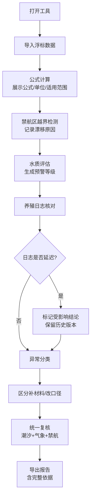

## 1. 产品概述

海藻养殖收成估算工具是一款面向科研助理和课题组的日常科研计算工具，用于快速处理浮标监测数据、检测禁航区越界、评估水质状况，并综合潮汐、气象等多源数据进行养殖收成估算。

- **目标用户**：科研助理、海藻养殖课题组研究人员
- **核心价值**：将评审文档式的复杂估算流程转化为可操作的日常工具，让数据处理透明化、异常分类清晰化、复核过程可追溯
- **设计理念**：工具化、透明化、可追溯，而非形式化的评审报告

## 2. 核心功能

### 2.1 用户角色

| 角色 | 使用场景 | 核心需求 |
|------|----------|----------|
| 科研助理 | 日常数据处理、收成估算 | 快速导入数据、自动计算、异常分类提示、复核记录 |
| 课题组评审 | 查看估算结果、导出报告 | 理解计算依据、查看异常原因、追溯复核过程 |

### 2.2 功能模块

1. **浮标数据处理模块**：数据导入/录入、公式计算、单位换算、适用范围说明
2. **禁航区越界检测模块**：轨迹分析、越界判定、漂移原因记录
3. **水质预警与复核模块**：水质指标评估、预警分级、补录复核、备注更新
4. **养殖日志管理模块**：日志录入、延迟检测、受影响结论提示、历史版本保留
5. **异常分类系统**：区分"需补材料"和"需改口径"两类异常，明确下一步动作
6. **统一复核流程**：潮汐表、气象预报、禁航区越界整合到同一轮复核
7. **报告导出模块**：包含完整计算依据和异常原因说明的可追溯报告

### 2.3 页面详情

| 页面名称 | 模块名称 | 功能描述 |
|----------|----------|----------|
| 主工作台 | 数据概览 | 当前批次数据状态、异常统计、待办事项 |
| 主工作台 | 浮标数据面板 | 数据导入、公式展示、计算结果、单位说明、适用范围 |
| 主工作台 | 禁航区检测面板 | 轨迹图、越界点标记、漂移原因分析、拦截记录 |
| 主工作台 | 水质预警面板 | 指标卡片、预警等级、复核记录、补录入口 |
| 主工作台 | 养殖日志面板 | 日志列表、延迟标记、受影响结论提示、版本对比 |
| 主工作台 | 异常分类面板 | 补材料类异常、改口径类异常、下一步动作建议 |
| 复核中心 | 统一复核面板 | 潮汐数据、气象数据、禁航检测整合复核 |
| 报告导出 | 报告预览 | 完整计算过程、异常原因说明、轨迹拦截详情 |

## 3. 核心流程

### 3.1 主要工作流程

科研助理打开工具 → 导入或录入当前批次浮标数据 → 系统自动计算并展示公式与单位 → 系统检测禁航区越界并标记漂移原因 → 水质数据评估并生成预警 → 养殖日志核对（若延迟则提示受影响结论）→ 异常分类展示（补材料/改口径）→ 整合潮汐、气象进行统一复核 → 导出包含完整依据的报告

### 3.2 流程图

## 4. 用户界面设计

### 4.1 设计风格

- **主色调**：深海蓝（#0F4C75）+ 海藻绿（#3282B8），体现海洋科研主题
- **辅助色**：暖橙（#F4A261）用于预警、薄荷绿（#2A9D8F）用于正常、珊瑚红（#E76F51）用于严重异常
- **设计风格**：科研工具风格，清晰的信息层级，数据卡片化布局
- **字体**：标题使用 Source Serif Pro（专业感），正文使用 Inter（可读性）
- **卡片风格**：轻微阴影、圆角 8px、边框纤细，突出数据内容
- **图标风格**：线性图标 + 轻微填充，科技感与专业感平衡

### 4.2 页面设计概述

| 页面名称 | 模块名称 | UI 元素 |
|----------|----------|---------|
| 主工作台 | 顶部导航 | 工具标题、批次选择器、复核进度、导出按钮 |
| 主工作台 | 左侧面板 | 功能菜单、异常分类概览 |
| 主工作台 | 中央工作区 | 数据卡片网格、公式展开区、图表区 |
| 主工作台 | 右侧面板 | 复核记录、操作日志、下一步建议 |
| 复核中心 | 时间线视图 | 按复核轮次组织潮汐/气象/禁航数据 |
| 报告导出 | 预览模式 | 类文档布局，可展开详情，支持打印/导出 |

### 4.3 响应式

- 桌面端优先设计，三栏布局
- 平板端自适应为两栏，右侧面板折叠为抽屉
- 移动端简化为单栏流式布局，保留核心数据卡片

### 4.4 交互细节

- 公式区域默认折叠，点击展开显示完整推导过程和单位说明
- 异常卡片悬停显示详细原因和建议动作
- 养殖日志延迟时，受影响的结论用虚线边框和问号图标标记
- 复核过程用时间线展示，每轮复核包含三类数据的状态
- 导出报告中，轨迹漂移拦截原因以独立章节呈现，附示意图
