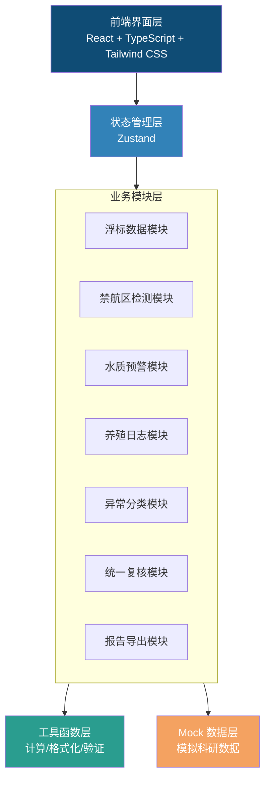
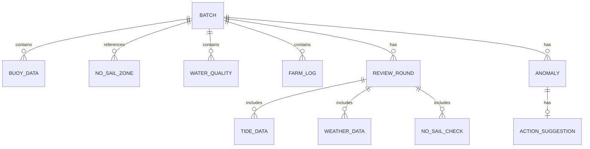

## 1. 架构设计

### 1.1 整体架构



## 2. 技术描述

- **前端框架**：React@18 + TypeScript
- **构建工具**：Vite
- **样式方案**：Tailwind CSS@3
- **状态管理**：Zustand
- **路由管理**：React Router DOM
- **图表库**：Recharts（数据可视化）
- **图标库**：Lucide React
- **后端**：无（纯前端工具，数据使用 Mock 模拟）
- **导出方案**：HTML 转 PDF（浏览器打印）+ 纯文本/Markdown 导出

## 3. 路由定义

| 路由 | 页面 | 用途 |
|------|------|------|
| `/` | 主工作台 | 浮标数据、禁航检测、水质预警、养殖日志、异常分类总览 |
| `/review` | 统一复核中心 | 潮汐表、气象预报、禁航区整合复核 |
| `/export` | 报告导出 | 报告预览与导出 |

## 4. 数据模型

### 4.1 数据实体关系



### 4.2 核心数据结构

#### 浮标数据 (BuoyData)
```typescript
interface BuoyData {
  id: string;
  timestamp: Date;
  location: { lat: number; lng: number };
  temperature: number;      // 水温 (°C)
  salinity: number;         // 盐度 (psu)
  dissolvedOxygen: number;  // 溶解氧 (mg/L)
  pH: number;               // pH值
  chlorophyll: number;      // 叶绿素a (μg/L)
  turbidity: number;        // 浊度 (NTU)
}
```

#### 禁航区与越界检测 (NoSailZone / Violation)
```typescript
interface NoSailZone {
  id: string;
  name: string;
  polygon: { lat: number; lng: number }[];
  reason: string;           // 禁航原因
}

interface TrajectoryPoint {
  timestamp: Date;
  location: { lat: number; lng: number };
}

interface ViolationRecord {
  id: string;
  point: TrajectoryPoint;
  zoneId: string;
  zoneName: string;
  driftReason: string;      // 漂移原因
  intercepted: boolean;     // 是否已拦截
  interceptionNote: string; // 拦截说明
}
```

#### 水质预警 (WaterQuality)
```typescript
interface WaterQualityRecord {
  id: string;
  timestamp: Date;
  index: string;            // 指标名称
  value: number;
  unit: string;
  standard: number;         // 标准值
  level: 'normal' | 'warning' | 'critical';
  reviewNotes: ReviewNote[];
}

interface ReviewNote {
  id: string;
  timestamp: Date;
  reviewer: string;
  content: string;
  isSupplement: boolean;    // 是否为补录
  source: string;           // 数据来源
}
```

#### 养殖日志 (FarmLog)
```typescript
interface FarmLog {
  id: string;
  date: Date;
  content: string;
  isDelayed: boolean;
  delayedDays: number;
  affectedConclusions: string[]; // 受影响的结论ID列表
  previousVersion?: string;      // 上一版本数据快照
  version: number;
}
```

#### 异常分类 (Anomaly)
```typescript
type AnomalyCategory = 'supplement_material' | 'adjust_caliber';

interface Anomaly {
  id: string;
  title: string;
  description: string;
  category: AnomalyCategory;
  severity: 'low' | 'medium' | 'high';
  sourceModule: string;
  nextAction: string;       // 下一步建议
  relatedDataId: string;
}
```

#### 复核轮次 (ReviewRound)
```typescript
interface ReviewRound {
  id: string;
  roundNumber: number;
  timestamp: Date;
  status: 'pending' | 'in_progress' | 'completed';
  tideData: TideData;
  weatherData: WeatherData;
  noSailCheck: NoSailCheckResult;
  reviewer: string;
  notes: string;
}

interface TideData {
  date: Date;
  highTideTime: string;
  highTideHeight: number;   // 米
  lowTideTime: string;
  lowTideHeight: number;
  source: string;
}

interface WeatherData {
  date: Date;
  temperature: { min: number; max: number };
  windSpeed: number;        // m/s
  windDirection: string;
  precipitation: number;    // mm
  source: string;
}
```

## 5. 目录结构

```
src/
├── components/           # 公共组件
│   ├── DataCard/         # 数据卡片
│   ├── FormulaPanel/     # 公式展示面板
│   ├── AnomalyBadge/     # 异常标记
│   ├── ReviewTimeline/   # 复核时间线
│   └── ...
├── pages/                # 页面组件
│   ├── Dashboard/        # 主工作台
│   ├── ReviewCenter/     # 复核中心
│   └── ReportExport/     # 报告导出
├── store/                # Zustand 状态
│   ├── useBuoyStore.ts
│   ├── useWaterStore.ts
│   ├── useLogStore.ts
│   └── useReviewStore.ts
├── utils/                # 工具函数
│   ├── calculations/     # 计算公式
│   ├── formatters/       # 格式化工具
│   └── validators/       # 验证工具
├── data/                 # Mock 数据
│   ├── buoyData.ts
│   ├── noSailZones.ts
│   ├── waterQuality.ts
│   └── ...
├── types/                # TypeScript 类型定义
│   └── index.ts
├── App.tsx
├── main.tsx
└── index.css
```

## 6. 核心计算逻辑

### 6.1 海藻收成估算公式

```
估算产量 = 养殖面积 × 单位面积生物量 × 成活率 × 校正系数

其中：
- 单位面积生物量 = f(水温, 盐度, 溶解氧, 叶绿素a)
- 成活率 = g(水质等级, 养殖密度, 病害风险)
- 校正系数 = h(潮汐影响, 气象条件, 禁航干扰)

适用范围：
- 水温：15-28°C
- 盐度：20-35 psu
- 水深：3-20米
- 养殖周期：30-180天
```

### 6.2 水质综合指数计算

```
WQI = Σ(Wi × Ii) / ΣWi

其中：
- Wi：第i项指标的权重
- Ii：第i项指标的标准化得分
- 指标包括：溶解氧、pH、浊度、叶绿素a等
```

## 7. 状态管理设计

使用 Zustand 进行模块化状态管理，每个业务模块独立一个 store，通过 selectors 避免不必要的重渲染。

主要 stores：
- `useBatchStore`：当前批次信息
- `useBuoyStore`：浮标数据与计算结果
- `useNoSailStore`：禁航区与越界检测
- `useWaterStore`：水质数据与预警
- `useLogStore`：养殖日志与版本管理
- `useAnomalyStore`：异常分类与处理建议
- `useReviewStore`：复核轮次与数据整合
