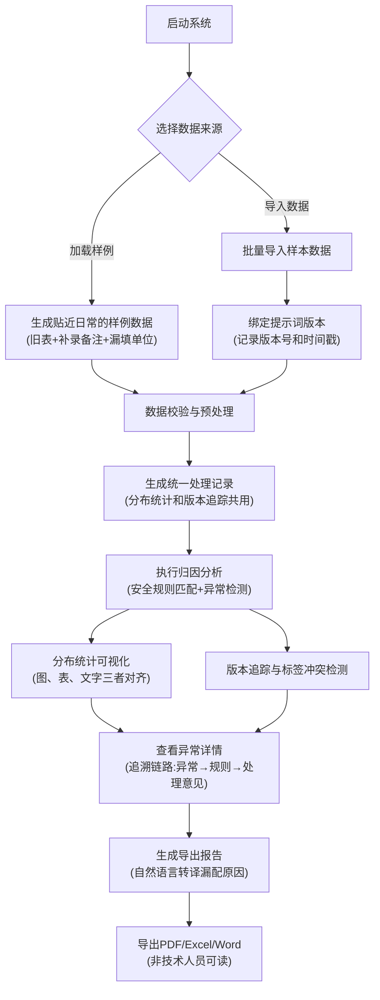

## 1. 产品概述

安全拒答样本归因系统是为数据标注团队打造的归因分析工具，解决安全拒答样本在评审过程中因提示词版本不一致、标签冲突、临时补材料导致的判断失效问题。系统通过统一处理记录层、版本追踪机制和可视化归因链路，帮助标注负责人向模型评审会提交可复现、可追溯、三者对齐（图、表、文字）的分析报告。

### 1.1 核心痛点解决
- **版本不一致风险**：提示词版本晚到半天导致标签冲突判断作废
- **三者对齐问题**：图、表、文字说明各算各的，无法交叉验证
- **数据来源混杂**：旧表、补录备注、漏填单位混在一起难以追溯
- **报告可读性差**：导出文件充斥字段名和缩写，非技术人员无法理解
- **追溯链路断裂**：从异常无法回溯到具体安全规则和处理意见

### 1.2 目标用户
- 数据标注负责人（主要用户）
- 模型评审会成员（报告阅读者）
- 安全规则配置人员（异常追溯使用者）

### 1.3 产品价值
- 确保归因分析结果可复现，避免因版本问题返工
- 统一处理记录层，分布统计和版本追踪共用同一数据源
- 提供贴近日常工作的样例数据，降低学习成本
- 生成非技术人员可读的导出报告，减少沟通成本
- 建立完整追溯链路，满足评审会验收标准

## 2. 核心功能

### 2.1 用户角色

| 角色 | 使用方式 | 核心需求 |
|------|----------|----------|
| 数据标注负责人 | 日常操作全流程 | 快速导入、分析、导出、准备评审材料 |
| 模型评审会成员 | 只读导出报告 | 看懂归因分析，验证图、表、文字一致性 |
| 安全规则配置人员 | 异常追溯 | 顺着异常找到规则漏配原因并处理 |

### 2.2 功能模块

1. **启动页**：系统介绍、操作指引、样例数据集入口
2. **数据导入页**：批量导入样本、提示词版本管理、数据校验
3. **归因分析页**：分布统计图表、安全规则匹配、异常检测
4. **版本追踪页**：提示词版本对比、标签冲突检测、变更历史
5. **异常详情页**：单条异常追溯、安全规则关联、处理意见记录
6. **结果导出页**：报告生成、自然语言转译、多格式导出

### 2.3 页面详情

| 页面名称 | 模块名称 | 功能描述 |
|---------|----------|----------|
| 启动页 | 操作指引卡片 | 四步操作流程图：启动→导入→查看异常→导出结果 |
| 启动页 | 样例数据入口 | 一键加载贴近日常的样例数据（旧表、补录备注、漏填单位） |
| 数据导入页 | 文件上传区 | 支持Excel/CSV批量导入，拖拽上传 |
| 数据导入页 | 提示词版本管理 | 版本号录入、版本时间戳、版本说明 |
| 数据导入页 | 数据校验模块 | 漏填检测、格式校验、冲突预检测 |
| 归因分析页 | 分布统计图表 | 拒答原因分布、安全规则命中分布、异常类型分布 |
| 归因分析页 | 三者对齐视图 | 图表、数据表格、文字说明同屏联动 |
| 归因分析页 | 可复现样例运行 | 一键运行预设样例，输出可复现结果 |
| 版本追踪页 | 版本对比视图 | 多版本提示词并排对比、高亮差异 |
| 版本追踪页 | 标签冲突检测 | 自动识别因版本变化导致的标签冲突 |
| 版本追踪页 | 处理时间轴 | 各版本处理时间线，避免"晚到半天"问题 |
| 异常详情页 | 异常追溯链路 | 异常样本→匹配的安全规则→处理意见 完整链路 |
| 异常详情页 | 漏配原因说明 | 自然语言解释安全规则漏配原因，避免字段名和缩写 |
| 异常详情页 | 处理意见记录 | 记录处理措施、处理人、处理时间 |
| 结果导出页 | 报告模板选择 | 评审会专用模板、日常分析模板 |
| 结果导出页 | 自然语言转译 | 自动将技术术语转译为易懂的中文说明 |
| 结果导出页 | 多格式导出 | PDF、Excel、Word格式导出 |

## 3. 核心流程

### 3.1 主业务流程

标注负责人启动系统后，可选择加载样例数据或导入实际数据。系统首先进行数据校验和提示词版本绑定，然后执行归因分析。分析过程中，分布统计和版本追踪共用同一批处理记录，确保数据一致性。分析完成后，可在异常详情页追溯单条异常的完整链路，最后导出非技术人员可读的报告。

### 3.2 异常追溯流程

验收时，评审会成员可顺着一条异常往回查：从异常样本查看其命中/未命中的安全规则，再查看规则漏配的具体原因和对应的处理意见。

## 4. 用户界面设计

### 4.1 设计风格

**整体定位**：专业严谨的数据分析工具，偏向审计/合规类软件风格，强调可信性、可追溯性

- **主色调**：深海军蓝 `#1e3a5f` 作为主色，代表专业和可信
- **辅助色**：琥珀橙 `#f59e0b` 用于异常高亮，松绿 `#10b981` 用于正常状态，珊瑚红 `#ef4444` 用于严重冲突
- **中性色**：冷灰系列，避免过于柔和的白色，使用 `#f8fafc` 作为背景
- **字体选择**：
  - 标题：思源宋体 CN，衬线字体增强专业感和可读性
  - 正文：思源黑体 CN，清晰易读的无衬线字体
  - 数据/表格：JetBrains Mono，等宽字体确保数据对齐
- **按钮风格**：直角矩形，细边框，轻微悬停阴影，强调功能性而非装饰性
- **布局风格**：三栏式为主，左侧导航+中间内容区+右侧详情面板
- **图标风格**：线性图标，粗细1.5px，避免过于卡通的图标

### 4.2 页面设计概述

| 页面名称 | 模块名称 | UI元素 |
|---------|----------|--------|
| 启动页 | 操作指引 | 竖向时间线布局，四步操作带图标和说明，琥珀色进度指示 |
| 启动页 | 样例数据卡片 | 做旧纸张纹理背景，展示"旧表"、"补录备注"、"漏填单位"标签 |
| 数据导入页 | 上传区 | 虚线边框拖拽区，支持文件预览，校验进度条 |
| 数据导入页 | 版本绑定 | 时间轴式版本选择器，带时间戳和版本说明输入框 |
| 归因分析页 | 三者对齐视图 | 上半区双图表（分布图+热力图），下半区数据表格，右侧文字说明面板，支持联动高亮 |
| 归因分析页 | 可复现样例 | 带"复现"标签的按钮组，运行后显示运行ID和时间戳，确保结果可追溯 |
| 版本追踪页 | 版本对比 | 左右分栏对比布局，中间箭头指示变化，冲突处用珊瑚红背景高亮 |
| 版本追踪页 | 处理时间轴 | 横向时间轴，精确到小时的时间刻度，避免"晚到半天"的版本遗漏 |
| 异常详情页 | 追溯链路 | 竖向流程图，节点间用带箭头的连接线，点击节点展开详情 |
| 异常详情页 | 漏配原因 | 卡片式展示，绿色标签标注"已处理"/"待处理"，自然语言描述 |
| 结果导出页 | 报告预览 | 模拟打印纸效果，带页码和页眉，实时预览转译效果 |
| 结果导出页 | 导出选项 | 卡片式格式选择，带文件大小预估和下载按钮 |

### 4.3 响应式设计

- **桌面端优先**：针对1920×1080及以上分辨率优化，三栏布局充分利用宽屏
- **平板适配**：1024px以下自动切换为两栏布局，右侧详情面板改为底部抽屉
- **手机适配**：768px以下切换为单栏布局，导航改为底部Tab，图表支持触控缩放
- **触控优化**：按钮最小尺寸44×44px，图表支持双指缩放和单指滑动

### 4.4 动效与交互细节

- **页面加载**：骨架屏逐步加载，数据表格先行渲染，图表延迟200ms带渐入动画
- **图表联动**：鼠标悬停图表数据点时，表格对应行高亮，文字说明同步更新
- **追溯动画**：点击异常追溯时，链路节点逐个点亮，带波纹扩散效果
- **版本冲突**：检测到冲突时，冲突区域轻微抖动（3次，每次100ms）吸引注意力
- **导出进度**：环形进度条，转译、格式化、打包各阶段有明确文字提示

