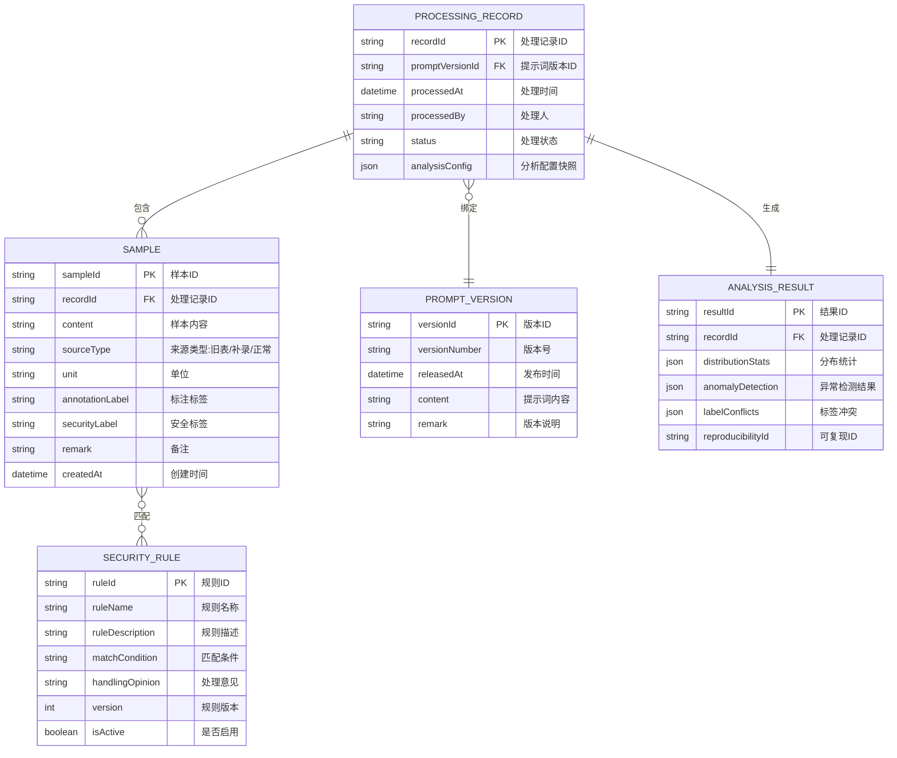

## 1. 技术架构设计

```mermaid
graph TD
    subgraph "前端层"
        A["React 18 应用层
        B["状态管理层<br/>
        A1["启动页面"]
        A2["数据导入页面"]
        A3["归因分析页面"]
        A4["版本追踪页面"]
        A5["异常详情页面"]
        A6["结果导出页面"]
        end
    end
    
    subgraph "核心服务层"
        C["统一处理记录层<br/>(Shared Processing Record)
        D["归因分析引擎"]
        E["版本管理服务"]
        F["数据校验服务"]
        G["导出服务"]
        end
        
    subgraph "数据层"
        H["样例数据生成器<br/>(贴近日常场景)"]
        I["安全规则库"]
        J["本地存储<br/>(IndexedDB)"]
        end
        
    subgraph "可视化层"
        K["ECharts 图表组件<br/>(分布图/热力图/时间轴)"]
        L["Mermaid 流程图<br/>(追溯链路)"]
        end
        
    A1 & A2 & A3 & A4 & A5 & A6 --> B
    B --> C
    C --> D & E & F & G
    D & E --> I
    F --> H
    C --> J
    A3 & A4 & A5 --> K & L
    
    style C fill:#1e3a5f,stroke:#334155,stroke-width:2px
    style D fill:#f59e0b,stroke:#334155
    style E fill:#10b981,stroke:#334155
    style F fill:#ef4444,stroke:#334155
    style G fill:#8b5cf6,stroke:#334155
```

## 2. 技术选型

### 2.1 前端技术栈

| 技术 | 版本 | 用途说明 |
|------|------|----------|
| React | 18.x | 核心UI框架，函数式组件+Hooks |
| TypeScript | 5.x | 类型安全，减少运行时错误 |
| Vite | 5.x | 构建工具，快速开发体验 |
| Tailwind CSS | 3.x | 原子化CSS，快速构建UI |
| React Router | 6.x | 路由管理 |
| Zustand | 4.x | 轻量级状态管理，替代Redux |
| ECharts | 5.x | 数据可视化，图表绘制 |
| Mermaid | 10.x | 流程图、追溯链路图 |
| Lucide React | 0.29x | 线性图标库 |
| XLSX/SheetJS | 0.18x | Excel导入导出 |
| jsPDF | 2.5x | PDF导出 |
| Day.js | 1.11x | 日期时间处理 |

### 2.2 初始化方式

使用 `npm create vite@latest` 初始化 React + TypeScript 项目，然后配置 Tailwind CSS 和其他依赖。

### 2.3 数据存储方案

由于本系统为纯前端应用，数据存储采用：
- **IndexedDB**：存储处理记录、安全规则、版本历史
- **LocalStorage**：存储用户偏好、当前会话状态
- **内存状态**：Zustand 管理运行时状态
- **Mock数据**：内置贴近日常场景的样例数据生成器

**无后端服务**，所有计算在浏览器端完成，确保数据安全和可复现性。

## 3. 路由定义

| 路由路径 | 页面名称 | 功能说明 |
|-----------|----------|----------|
| `/` | 启动页 | 系统介绍、操作指引、样例数据加载入口 |
| `/import` | 数据导入页 | 文件上传、版本绑定、数据校验 |
| `/analysis` | 归因分析页 | 分布统计、安全规则匹配、三者对齐视图 |
| `/version` | 版本追踪页 | 版本对比、标签冲突检测、处理时间轴 |
| `/anomaly/:id` | 异常详情页 | 异常追溯链路、漏配原因说明、处理意见 |
| `/export` | 结果导出页 | 报告预览、自然语言转译、多格式导出 |

## 4. 状态管理架构

```typescript
// Zustand Store 结构
interface AppState {
  // 处理记录层（核心，分布统计和版本追踪共用）
  processingRecords: ProcessingRecord[];
  currentRecordId: string | null;
  
  // 数据状态
  samples: Sample[];
  securityRules: SecurityRule[];
  promptVersions: PromptVersion[];
  
  // 分析结果
  analysisResult: AnalysisResult | null;
  
  // UI状态
  activeTab: string;
  selectedSampleId: string | null;
  isLoading: boolean;
  
  // Actions
  loadSampleData: () => void;
  importSamples: (file: File) => Promise<void>;
  bindPromptVersion: (version: PromptVersion) => void;
  runAnalysis: () => void;
  exportReport: (format: 'pdf' | 'excel' | 'word') => Promise<void>;
}
```

## 5. 核心数据模型

### 5.1 ER图



### 5.2 核心数据结构定义

```typescript
// 处理记录 - 分布统计和版本追踪共用的核心层
interface ProcessingRecord {
  recordId: string;
  promptVersionId: string;
  processedAt: string;
  processedBy: string;
  status: 'pending' | 'processing' | 'completed' | 'error';
  analysisConfig: {
    ruleVersion: string;
    detectionThreshold: number;
    conflictRules: string[];
  };
  sampleCount: number;
  anomalyCount: number;
  conflictCount: number;
}

// 安全规则
interface SecurityRule {
  ruleId: string;
  ruleCode: string;
  ruleName: string;
  ruleDescription: string;
  matchCondition: {
    type: 'regex' | 'keyword' | 'custom';
    value: string;
  };
  handlingOpinion: string;
  version: number;
  isActive: boolean;
  createdAt: string;
}

// 样本数据
interface Sample {
  sampleId: string;
  recordId: string;
  content: string;
  sourceType: 'old_table' | 'supplement' | 'normal' | 'missing_unit';
  sourceRemark?: string;
  unit?: string;
  annotationLabel: string;
  securityLabel: string;
  remark?: string;
  createdAt: string;
  matchedRules: string[];
  anomalies: Anomaly[];
}

// 异常信息
interface Anomaly {
  anomalyId: string;
  type: 'missing_rule' | 'label_conflict' | 'missing_unit' | 'format_error';
  severity: 'low' | 'medium' | 'high' | 'critical';
  description: string;
  naturalDescription: string;
  relatedRuleId?: string;
  handlingStatus: 'pending' | 'resolved' | 'ignored';
  handlingOpinion?: string;
  handledBy?: string;
  handledAt?: string;
}

// 提示词版本
interface PromptVersion {
  versionId: string;
  versionNumber: string;
  releasedAt: string;
  content: string;
  remark: string;
  changes: string[];
}

// 分析结果
interface AnalysisResult {
  resultId: string;
  recordId: string;
  distributionStats: {
    bySourceType: Record<string, number>;
    byAnomalyType: Record<string, number>;
    byRuleMatch: Record<string, { matched: number; unmatched: number }>;
    bySecurityLabel: Record<string, number>;
  };
  anomalySamples: string[];
  labelConflicts: LabelConflict[];
  reproducibility: {
    runId: string;
    seed: number;
    timestamp: string;
  };
}

// 标签冲突
interface LabelConflict {
  conflictId: string;
  sampleId: string;
  previousLabel: string;
  currentLabel: string;
  reason: string;
  versionDiff: string;
}
```

## 6. 核心模块设计

### 6.1 统一处理记录层

**设计原则**：所有分布统计和版本追踪操作都基于同一批 ProcessingRecord，确保数据一致性。

```typescript
// 核心伪代码：
class ProcessingRecordService {
  // 创建处理记录时快照当前配置
  createRecord(samples: Sample[], promptVersion: PromptVersion) {
    const record: ProcessingRecord = {
      recordId: generateId(),
      promptVersionId: promptVersion.versionId,
      processedAt: now(),
      // 快照分析配置
      analysisConfig: {
        ruleVersion: getCurrentRuleVersion(),
        detectionThreshold: 0.8,
        conflictRules: activeRules.map(r => r.ruleId)
      },
      // ...
    };
    return record;
  }
  
  // 分布统计基于recordId查询
  getDistributionStats(recordId: string) {
    return db.samples
      .where('recordId')
      .equals(recordId)
      .aggregate(...);
  }
  
  // 版本追踪同样基于recordId
  getVersionTrace(recordId: string) {
    const record = db.records.get(recordId);
    return {
      promptVersion: db.versions.get(record.promptVersionId),
      samples: db.samples.where('recordId').equals(recordId),
      // 同一批数据
    };
  }
}
```

### 6.2 归因分析引擎

```typescript
class AttributionAnalyzer {
  // 安全规则匹配
  matchSecurityRules(sample: Sample, rules: SecurityRule[]): string[] {
    return rules
      .filter(rule => this.isMatch(sample, rule))
      .map(rule => rule.ruleId);
  }
  
  // 异常检测
  detectAnomalies(sample: Sample, matchedRuleIds: string[]): Anomaly[] {
    const anomalies: Anomaly[] = [];
    
    // 漏填单位检测
    if (!sample.unit || sample.unit.trim() === '') {
      anomalies.push({
        anomalyId: generateId(),
        type: 'missing_unit',
        severity: 'medium',
        description: 'unit_field_empty',
        naturalDescription: '该样本未填写单位字段，可能导致安全规则R003（单位校验规则无法生效',
        relatedRuleId: 'R003',
        handlingStatus: 'pending'
      });
    }
    
    // 规则漏配检测
    const shouldHaveMatched = this.checkExpectedRules(sample);
    const missingRules = shouldHaveMatched.filter(id => !matchedRuleIds.includes(id));
    
    missingRules.forEach(ruleId => {
      const rule = rules.find(r => r.ruleId === ruleId);
      anomalies.push({
        anomalyId: generateId(),
        type: 'missing_rule',
        severity: 'high',
        description: `rule_${ruleId}_not_matched',
        naturalDescription: `按照${rule?.ruleName || '该安全规则'}的要求，此样本本应被该规则捕获，但实际未匹配。可能原因：规则配置中未包含此类关键词或正则表达式不够全面',
        relatedRuleId: ruleId,
        handlingStatus: 'pending'
      });
    });
    
    return anomalies;
  }
  
  // 标签冲突检测
  detectLabelConflicts(samples: Sample[], prevVersionSamples?: Sample[]): LabelConflict[] {
    if (!prevVersionSamples) return [];
    
    return samples.map(sample => {
      const prev = prevVersionSamples.find(p => p.sampleId === sample.sampleId);
      if (prev && prev.securityLabel !== sample.securityLabel) {
        return {
          conflictId: generateId(),
          sampleId: sample.sampleId,
          previousLabel: prev.securityLabel,
          currentLabel: sample.securityLabel,
          reason: 'prompt_version_change',
          versionDiff: '提示词版本变更导致标签不一致'
        };
      }
      return null;
    }).filter(Boolean) as LabelConflict[];
  }
  
  // 自然语言转译 - 避免字段名和缩写
  translateToNaturalLanguage(technicalTerm: string): string {
    const translationMap: Record<string, string> = {
      'unit_field_empty': '样本的"单位"这一列没有填写内容',
      'rule_R001_not_matched': '安全规则R001（敏感词检测规则）未能识别到该样本应当包含的敏感内容',
      'label_conflict_version': '由于提示词版本更新后，该样本的安全标签与之前版本标注结果不一致',
      'source_type_old_table': '数据来源于历史旧表导入',
      'source_type_supplement': '数据来源于后期补录备注',
      // ... 更多转译规则
    };
    return translationMap[technicalTerm] || technicalTerm;
  }
}
```

### 6.3 样例数据生成器

生成贴近日常工作场景的样例数据，包含旧表、补录备注、漏填单位等。

```typescript
class SampleDataGenerator {
  generateRealisticSamples(count: number = 100): Sample[] {
    const samples: Sample[] = [];
    
    const sourceTypes: Array<'old_table' | 'supplement' | 'normal' | 'missing_unit'> = [
      'old_table',
      'supplement',
      'normal',
      'missing_unit'
    ];
    
    const oldTableRemarks = [
      '2023年Q4旧表导入',
      '历史数据迁移',
      'Excel旧格式转换',
      '早期标注数据'
    ];
    
    const supplementRemarks = [
      '张三补录2024-01-15',
      '李四补充说明：客户反馈追加',
      '王工补填备注',
      '审核后补充标注'
    ];
    
    const commonUnits = ['个', '条', '件', '篇', '条', '项'];
    
    for (let i = 0; i < count; i++) {
      const sourceType = sourceTypes[Math.floor(Math.random() * sourceTypes.length)];
      const isMissingUnit = sourceType === 'missing_unit';
      const hasRemark = sourceType === 'old_table' 
        ? oldTableRemarks[Math.floor(Math.random() * oldTableRemarks.length)]
        : sourceType === 'supplement'
        ? supplementRemarks[Math.floor(Math.random() * supplementRemarks.length)]
        : undefined;
      
      samples.push({
        sampleId: `SAMPLE-${String(i + 1).padStart(4, '0')},
        recordId: '',
        content: this.generateSampleContent(),
        sourceType,
        sourceRemark: hasRemark,
        unit: isMissingUnit ? undefined : commonUnits[Math.floor(Math.random() * commonUnits.length)],
        annotationLabel: this.generateAnnotationLabel(),
        securityLabel: this.generateSecurityLabel(),
        remark: hasRemark,
        createdAt: this.generateRandomDate(),
        matchedRules: [],
        anomalies: []
      });
    }
    
    return samples;
  }
}
```

## 7. 目录结构

```
src/
├── assets/              # 静态资源
├── components/          # 通用组件
│   ├── charts/         # 图表组件
│   │   ├── DistributionChart.tsx
│   │   ├── RuleMatchHeatmap.tsx
│   │   └── VersionTimeline.tsx
│   ├── layout/         # 布局组件
│   └── ui/           # UI基础组件
├── pages/               # 页面组件
│   ├── LandingPage.tsx
│   ├── ImportPage.tsx
│   ├── AnalysisPage.tsx
│   ├── VersionPage.tsx
│   ├── AnomalyDetailPage.tsx
│   └── ExportPage.tsx
├── store/               # 状态管理
│   └── useAppStore.ts
├── services/            # 业务服务
│   ├── processingRecord.ts
│   ├── attributionAnalyzer.ts
│   ├── sampleGenerator.ts
│   ├── versionManager.ts
│   └── exportService.ts
├── data/                # 数据和配置
│   ├── securityRules.ts
│   └── mockData.ts
├── types/               # TypeScript类型定义
│   └── index.ts
├── utils/               # 工具函数
│   ├── naturalLanguage.ts
│   └── reproducibility.ts
├── App.tsx
├── main.tsx
└── index.css
```

## 8. 可复现性设计

为确保分析结果可复现，系统设计了以下机制：

```typescript
// 可复现ID生成机制
class ReproducibilityManager {
  // 每次运行时生成唯一运行ID和随机种子
  generateRunId(): string {
    return `RUN-${Date.now()}-${Math.random().toString(36).substr(2, 8)}`;
  }
  
  // 固定随机种子确保样例数据生成可复现
  generateSamplesWithSeed(seed: number, count: number): Sample[] {
    const rng = this.createSeededRandom(seed);
    // 使用rng替代Math.random()生成数据
    // ...
  }
  
  // 保存运行配置快照
  saveRunSnapshot(recordId: string, config: any): void {
    const snapshot = {
      runId: this.generateRunId(),
      seed: this.currentSeed,
      timestamp: new Date().toISOString(),
      config,
      ruleVersions: securityRules.map(r => ({ id: r.ruleId, version: r.version })),
      promptVersion: currentPromptVersion
    };
    // 存储到处理记录中
  }
  
  // 根据runId复现结果
  reproduceByRunId(runId: string): AnalysisResult {
    const snapshot = db.snapshots.get(runId);
    // 使用相同种子和配置重新运行分析
    // ...
  }
}
```

## 9. 性能优化

1. **虚拟滚动**：数据表格使用虚拟滚动，支持10000+条数据流畅渲染
2. **Web Worker**：复杂分析计算移至Web Worker，避免阻塞UI
3. **懒加载**：图表组件按需加载，首屏只加载必要内容
4. **索引优化**：IndexedDB创建合适索引加速查询
5. **防抖节流**：搜索、筛选操作防抖处理
6. **缓存策略**：分析结果缓存，避免重复计算

