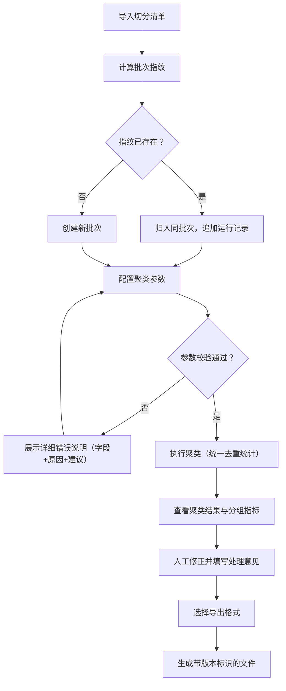

## 1. 产品概述
训练日志异常聚类工具是面向AI/ML模型训练团队的工作流工具，用于对训练过程中产生的异常日志进行聚类分析、人工复核和版本化追踪。解决当前工具报告信息模糊、数据割裂、结论冲突、回溯困难等问题。
- 目标用户：模型训练工程师、训练组审核人员、非技术产品/运营人员
- 核心价值：统一数据口径、消除结论冲突、提供完整追溯链路、降低非技术人员理解门槛

## 2. 核心功能

### 2.1 用户角色
| 角色 | 说明 | 核心权限 |
|------|------|----------|
| 模型训练工程师 | 执行聚类、上传数据、人工修正 | 全部操作权限 |
| 训练组审核人员 | 复核异常结论、追溯处理历史 | 查看、评论、导出权限 |
| 非技术协作方 | 阅读导出报告 | 仅查看友好格式导出文件 |

### 2.2 功能模块
1. **数据导入与批次管理**：切分清单导入、批次指纹识别、重复导入检测
2. **异常聚类工作台**：参数配置校验、聚类执行、统一去重统计、分组指标展示
3. **人工修正与评论**：单条/批量修正、修正记录追踪、处理意见留痕
4. **异常追溯链路**：从异常记录回溯至提示词版本、参数配置、历史处理意见
5. **报告导出中心**：区分运行版本的文件命名、面向非技术人员的友好格式

### 2.3 页面详情
| 页面名称 | 模块名称 | 功能描述 |
|----------|----------|----------|
| 批次管理首页 | 批次列表 | 展示所有导入批次、运行次数、最新结论、冲突状态 |
| 批次管理首页 | 导入区域 | 拖拽上传切分清单、自动识别批次指纹、重复导入提示 |
| 聚类工作台 | 参数配置 | 参数实时校验、错误详细说明（非模糊提示） |
| 聚类工作台 | 聚类结果 | 统一去重统计、分布展示、异常分组指标 |
| 聚类工作台 | 人工修正 | 单条/批量修正、修正理由填写、修正记录展示 |
| 异常详情页 | 追溯时间线 | 完整追溯：原始样本→提示词版本→聚类参数→历次处理意见 |
| 导出中心 | 导出配置 | 选择导出格式（技术/非技术）、自动区分运行版本的文件名 |
| 导出中心 | 友好报告预览 | 训练验证泄漏等异常的自然语言解释（非字段名/缩写） |

## 3. 核心流程

### 3.1 主工作流
用户导入切分清单→系统计算批次指纹→检测是否重复导入→确认后创建批次→配置聚类参数（实时校验）→执行聚类（统一去重统计）→工程师查看异常聚类→人工修正并填写处理意见→导出面向不同受众的报告

### 3.2 异常追溯流程
审核人员发现可疑异常→打开异常详情→查看追溯时间线→定位到某次具体运行→查看该次运行的提示词版本和聚类参数→阅读历次处理意见→给出复核结论

## 4. 用户界面设计

### 4.1 设计风格
- **主色调**：深灰蓝 #1E293B（专业工具感），搭配青色 #06B6D4 作为状态强调
- **辅助色**：琥珀 #F59E0B（警告）、翠绿 #10B981（正常）、玫红 #F43F5E（异常）
- **按钮风格**：直角微圆角（4px），实心按钮带细边框，悬停时轻微上浮
- **字体**：标题使用 JetBrains Mono（等宽，技术工具感），正文使用 Noto Sans SC（中文可读性）
- **布局风格**：三栏式工作区布局（左导航/批次列表 + 中主工作区 + 右详情/追溯面板）
- **图标风格**：Lucide 线性图标，保持统一线条粗细

### 4.2 页面设计概览
| 页面名称 | 模块名称 | UI元素 |
|----------|----------|--------|
| 批次管理首页 | 批次卡片列表 | 卡片式批次展示，运行次数徽章，冲突状态高亮，最新运行时间戳 |
| 聚类工作台 | 参数校验区 | 错误字段红框标注 + 行内错误说明气泡 + 修复建议链接 |
| 聚类工作台 | 统计卡片组 | 样本总数、去重后数量、分布占比，所有卡片来自同一批处理记录 |
| 聚类工作台 | 异常分组表 | 可展开分组、修正状态标签、修正人/时间 |
| 异常详情页 | 追溯时间线 | 垂直时间线，节点可展开查看提示词版本原文、参数快照、处理意见 |
| 导出中心 | 格式切换器 | Tab切换「技术格式」/「友好格式」，友好格式实时预览自然语言解释 |

### 4.3 响应式
- Desktop-first 设计，最小支持宽度 1280px
- 详情面板可折叠为底部抽屉，适配中等屏幕
- 时间线追溯采用垂直滚动，不依赖横向空间
