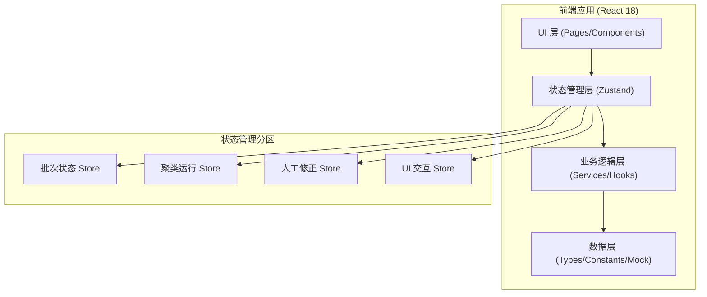
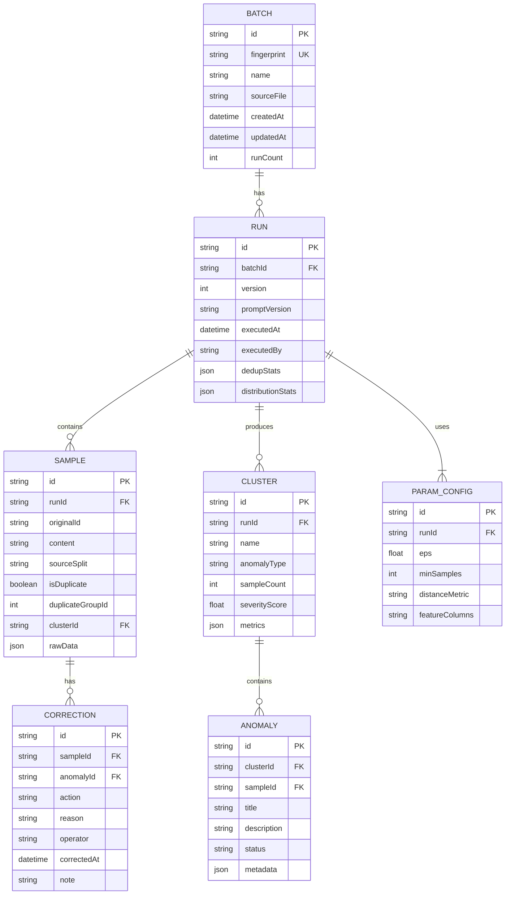

## 1. 架构设计



## 2. 技术栈说明

- **前端框架**：React@18 + TypeScript@5
- **构建工具**：Vite@5
- **样式方案**：TailwindCSS@3 + PostCSS
- **状态管理**：Zustand@4（轻量级，支持跨组件共享统一数据记录）
- **路由**：React Router@6
- **图标**：lucide-react
- **导出功能**：xlsx（Excel导出）、jspdf（PDF导出）
- **日期处理**：date-fns
- **数据持久化**：localStorage（用于演示）
- **后端**：无（纯前端演示，内置 Mock 数据）
- **数据库**：无（使用内存状态 + localStorage 持久化）

## 3. 路由定义

| 路由路径 | 页面名称 | 用途 |
|----------|----------|------|
| / | 批次管理首页 | 批次列表展示、导入切分清单、快速进入工作台 |
| /batch/:batchId | 聚类工作台 | 聚类参数配置、执行聚类、结果展示、人工修正 |
| /batch/:batchId/anomaly/:anomalyId | 异常详情页 | 单条异常追溯、时间线、提示词版本、处理历史 |
| /batch/:batchId/export | 导出中心 | 导出格式选择、预览、文件下载 |

## 4. 数据模型

### 4.1 实体关系图



### 4.2 核心数据结构定义

```typescript
// 批次 - 同一批切分清单通过指纹归为一个批次
interface Batch {
  id: string;
  fingerprint: string; // 文件内容hash，用于检测重复导入
  name: string;
  sourceFile: string;
  createdAt: Date;
  updatedAt: Date;
  runCount: number;
}

// 运行记录 - 同批次的每次聚类执行
interface Run {
  id: string;
  batchId: string;
  version: number; // 第几次运行，自增
  promptVersion: string; // 提示词版本标识
  executedAt: Date;
  executedBy: string;
  // 统一去重和分布统计（界面和报告共用此数据，不会各算各的）
  dedupStats: {
    totalSamples: number;
    uniqueSamples: number;
    duplicateSamples: number;
    duplicateGroups: number;
  };
  distributionStats: {
    trainSplit: number;
    valSplit: number;
    testSplit: number;
    byLabel: Record<string, number>;
  };
  paramConfig: ParamConfig;
}

// 参数配置
interface ParamConfig {
  eps: number;
  minSamples: number;
  distanceMetric: 'cosine' | 'euclidean' | 'manhattan';
  featureColumns: string[];
}

// 参数校验错误 - 详细说明，非模糊提示
interface ParamValidationError {
  field: keyof ParamConfig;
  value: any;
  errorCode: string;
  message: string; // 人可读的错误描述
  suggestion: string; // 修复建议
  example?: any; // 正确示例
}

// 样本
interface Sample {
  id: string;
  runId: string;
  originalId: string;
  content: string;
  sourceSplit: 'train' | 'val' | 'test';
  isDuplicate: boolean;
  duplicateGroupId?: string;
  clusterId?: string;
  rawData: Record<string, any>;
}

// 聚类分组
interface Cluster {
  id: string;
  runId: string;
  name: string;
  anomalyType: AnomalyType;
  sampleCount: number;
  severityScore: number; // 0-1
  metrics: {
    precision?: number;
    recall?: number;
    leakageRatio?: number;
  };
}

type AnomalyType = 
  | 'train_val_leakage'   // 训练验证泄漏
  | 'duplicate_cluster'   // 重复样本聚簇
  | 'label_noise'         // 标签噪声
  | 'distribution_shift'  // 分布偏移
  | 'other';

// 异常记录
interface Anomaly {
  id: string;
  clusterId: string;
  sampleId: string;
  title: string;
  description: string; // 技术描述
  friendlyDescription: string; // 面向非技术人员的自然语言描述
  status: 'pending' | 'confirmed' | 'rejected' | 'fixed';
  metadata: Record<string, any>;
}

// 人工修正记录
interface Correction {
  id: string;
  sampleId: string;
  anomalyId: string;
  action: 'keep' | 'remove' | 'relabel' | 'move_split';
  reason: string;
  operator: string;
  correctedAt: Date;
  note: string;
}

// 导出文件命名规则
// 格式: {批次名}_run{运行版本}_{类型}_{时间戳}.{扩展名}
// 示例: batch_001_run2_friendly_20260617_023045.xlsx
```

### 4.3 异常类型友好描述映射

```typescript
const ANOMALY_FRIENDLY_MAPPING: Record<AnomalyType, {
  title: string;
  description: (data: any) => string;
  suggestion: string;
}> = {
  train_val_leakage: {
    title: '训练验证数据重叠',
    description: (d) => `检测到有 ${d.overlapCount} 条数据同时出现在训练集和验证集中。` +
      `这意味着模型在训练时已经"见过"验证数据，会导致验证结果虚高，不能真实反映模型在新数据上的表现。`,
    suggestion: '建议：请将重叠数据只保留在一个数据集中，或从两个集合中都移除。'
  },
  duplicate_cluster: {
    title: '重复样本聚集',
    description: (d) => `发现 ${d.duplicateCount} 组高度相似的重复样本。` +
      `重复样本会让模型过度记忆这些内容，降低泛化能力。`,
    suggestion: '建议：每组重复样本只保留一条质量最好的，其余删除。'
  },
  label_noise: {
    title: '标签异常',
    description: (d) => `有 ${d.noiseCount} 条数据的标签与其内容特征不一致。` +
      `错误的标签会误导模型学习方向。`,
    suggestion: '建议：人工逐条复核，修正错误标签。'
  },
  distribution_shift: {
    title: '数据分布偏移',
    description: (d) => `训练集与验证集在「${d.feature}」特征上的分布差异较大（差异度: ${d.diff}）。` +
      `分布不一致会导致模型在验证集上表现下降。`,
    suggestion: '建议：重新划分数据集，确保各集合分布相近；或考虑使用数据增强。'
  },
  other: {
    title: '其他异常',
    description: () => '该异常类型需要进一步人工分析。',
    suggestion: '建议：联系模型训练工程师做深入分析。'
  }
};
```
