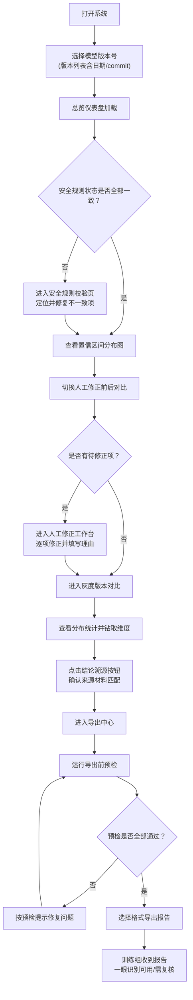

## 1. 产品概述

评测分数置信区间系统是面向数据标注团队和训练组的可视化复盘工具，解决模型版本追溯困难、评测结果不可复现、图表文不一致、安全规则导出与界面摘要矛盾等核心问题。通过一站式置信区间分析面板，让数据标注负责人打开即可复盘，训练组拿到结果能一眼分清可用等级。

- 核心目标：消除聊天记录翻找模型日志的低效流程，建立可复现、可追溯、可校验的评测置信度分析闭环
- 目标用户：数据标注负责人、模型训练组、质量审核人员
- 产品价值：评测结果可信度透明化 + 人工复核流程标准化 + 从结论回溯原始材料的完整链路

## 2. 核心功能

### 2.1 用户角色

| 角色 | 进入方式 | 核心权限 |
|------|----------|----------|
| 数据标注负责人 | 直接打开系统 | 复盘全部评测、人工修正标注、管理灰度版本、导出报告、标记复核状态 |
| 训练组 | 系统链接/导出文件 | 查看置信区间图表、查看样例复现结果、识别"直接可用"与"需复核"条目 |
| 质量审核 | 权限入口 | 校验安全规则一致性、抽查来源可追溯性 |

### 2.2 功能模块

1. **总览仪表盘**：模型版本选择器、评测批次总览、安全规则状态灯、直接可用/需复核比例概览
2. **置信区间可视化**：分数分布直方图 + 置信区间误差棒图、版本对比折线图、人工修正前后对比
3. **人工修正工作台**：逐条标注修正、修正理由记录、修正前后置信度变化追踪
4. **灰度版本对比**：多版本并排对比表、显著性检验标注、版本差异热力图
5. **分布统计分析**：按维度钻取的分布图、结论与来源材料的关联跳转、分布异常检测
6. **安全规则校验引擎**：实时规则检查、界面摘要与导出内容一致性校验、矛盾项高亮
7. **可追溯详情面板**：原始行号、图片名、来源备注全链路展示、一键跳转原始记录
8. **报告导出中心**：PDF/Excel 导出、导出前一致性预检、导出摘要水印与版本戳

### 2.3 页面详情

| 页面名称 | 模块名称 | 功能描述 |
|----------|----------|----------|
| 总览仪表盘 | 版本选择器 | 下拉选择模型版本（含版本号、训练日期、commit hash），点击直接切换全部视图数据 |
| 总览仪表盘 | 置信度卡片矩阵 | 四类卡片：高分高置信（绿色✅直接可用）、高分低置信（橙色⚠️需复核）、低分高置信（红色❌不合格）、低分低置信（灰色🔄需补测） |
| 总览仪表盘 | 安全规则状态面板 | 每条安全规则显示：界面结论、导出文件结论、是否一致，不一致项红框闪烁 |
| 置信区间分析页 | 分布图 + 误差棒 | 直方图显示分数分布，叠加 95% 置信区间误差棒，鼠标悬停显示样本数、标准差、上下界 |
| 置信区间分析页 | 人工修正前后对比 | 左右双栏：修正前分布 vs 修正后分布，标注变化条数、置信度提升幅度 |
| 置信区间分析页 | 灰度版本对比 | 多版本折线图，同一维度下各版本分数与置信区间，显著性差异用星号标注 |
| 人工修正工作台 | 待修正列表 | 表格展示：原始行号、图片名、模型分数、人工修正分、修正理由、来源备注 |
| 人工修正工作台 | 逐项修正表单 | 修正分数滑块、理由下拉+自定义、复核状态切换、修改留痕（操作人+时间） |
| 分布统计页 | 维度钻取面板 | 按数据来源、标注批次、图片类型等维度下钻，分布图随选择联动更新 |
| 分布统计页 | 结论溯源面板 | 每条统计结论旁附"来源材料"按钮，点击展开对应原始记录行号+图片缩略图 |
| 安全规则校验页 | 规则逐条检查 | 规则清单 + 页面状态 + 文件状态 + 一致性判定，支持单条重新校验 |
| 安全规则校验页 | 预检与导出 | 导出前自动跑完全部规则校验，不一致项禁止导出或强制标注"待确认"水印 |
| 可追溯详情 | 行级追溯弹窗 | 显示：原始行号、源文件名、图片名/链接、来源备注、历次修改记录、跳转链接 |
| 导出中心 | 导出配置 | 选择格式（PDF/Excel）、选择包含模块、附加版本戳、可选加密 |
| 导出中心 | 预检报告 | 导出前生成预检清单：安全规则一致率、样例可复现率、追溯完整度，全部达标方可导出 |

## 3. 核心流程

### 主流程：数据标注负责人复盘

### 训练组使用流程

## 4. 用户界面设计

### 4.1 设计风格

- **主色调**：深墨蓝 (#0F172A) 作为信息密度底色，配合钢青色 (#2563EB) 主按钮、翡翠绿 (#10B981) 表示通过、琥珀橙 (#F59E0B) 表示待复核、玫红 (#F43F5E) 表示不通过/不一致
- **辅助色**：石板灰渐变用于卡片分割、淡紫 (#8B5CF6) 用于置信区间高亮带
- **按钮风格**：微立体圆角 (radius 10px)，主按钮带 1px 内发光描边，hover 时有轻微上浮 + 阴影加深
- **字体选型**：标题使用 Playfair Display（衬线，学术感，增强可信度），正文使用 JetBrains Mono（等宽，便于对齐行号和数字），数据表格数字使用 Tabular 对齐
- **布局风格**：三栏式信息密度布局 — 左侧固定导航（版本+功能模块）、中间主视图（高密度图表+表格）、右侧浮动追溯面板（点击数据点弹出）
- **图标风格**：线性 Lucide 图标 + 状态 emoji 混合，关键节点用 emoji 强化记忆点（✅⚠️❌🔄）
- **数据可视化风格**：图表区带极淡网格纹理，置信区间用半透明渐变带而非纯误差棒，数据点悬停有十字辅助线

### 4.2 页面设计概览

| 页面名称 | 模块名称 | UI 元素 |
|----------|----------|----------|
| 总览仪表盘 | 顶部版本条 | 版本号胶囊标签 + 日期 + commit hash 可复制按钮，右侧安全规则状态灯组 |
| 总览仪表盘 | 置信度卡片矩阵 | 2x2 大卡片，每卡含：状态emoji、数量、占比环图、趋势小箭头，卡背景用对应状态色渐变 |
| 总览仪表盘 | 安全规则面板 | 窄条表格，每行三灯列（页面/文件/一致性），不一致行左侧加红色垂直脉动条 |
| 置信区间分析页 | 分布主图 | 占满中栏 70% 高度的大图，深色背景 + 白色网格，置信区渐变紫带，图例浮动右上角 |
| 置信区间分析页 | 对比侧栏 | 左右双面板各带小分布图，中间用箭头+数字展示变化量 |
| 人工修正工作台 | 数据表格 | 斑马纹 + 固定表头 + 行首原始行号锚点列 + 状态标签列 + 操作按钮列 |
| 人工修正工作台 | 修正抽屉 | 从右侧滑出的半屏表单，含图片预览缩略图 + 分数滑块 + 理由输入 + 提交按钮 |
| 分布统计页 | 维度钻取条 | 顶部横向排列维度胶囊，选中项填充主色，下方分布图跟随过渡动画 |
| 分布统计页 | 结论溯源区 | 每条统计结论右侧挂「📎来源」按钮，点击展开含行号+图片名+备注的折叠卡 |
| 安全规则校验页 | 规则列表 | 每行：规则名 + 描述 + 页面状态徽章 + 文件状态徽章 + 一致性✅/❌图标 + 重新校验按钮 |
| 导出中心 | 预检进度条 | 分步进度：安全规则→样例复现→追溯完整度，每步完成打勾，完成后显示通过率 |
| 通用组件 | 追溯弹窗 | 半透明遮罩 + 居中白色卡片，顶部面包屑（版本→批次→行号），主体为元数据键值对 + 图片缩略图 + 跳转按钮 |

### 4.3 响应式

- 桌面端优先（1440px+）：三栏固定布局，中间图表区最小 800px
- 平板端（1024-1439px）：右侧追溯面板改为底部弹出抽屉，图表区自适应
- 移动端（<1024px）：导航折叠为底部 Tab 栏，表格横滑，图表单列堆叠
- 表格组件全部支持列宽拖拽、列固定、横滑

### 4.4 动效设计

- 页面加载：卡片错峰淡入（200ms 间隔），图表数据从 0 渐出绘制
- 版本切换：全页面遮罩过渡 + 骨架屏占位，数据加载完后骨架消退
- 状态变更：安全规则从"不一致"改为"一致"时，行背景绿色闪光一次
- 追溯面板：从数据点位置弹性滑出，关闭时缩小回点击位置
- 导出预检：每完成一项打勾时伴随轻微弹跳动效
