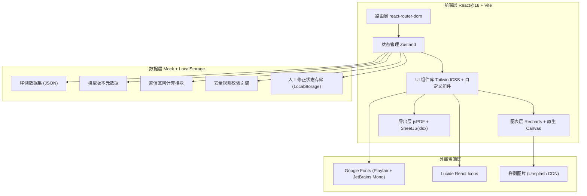

## 1. 架构设计



## 2. 技术说明

- **前端框架**: React@18.2 + TypeScript + Vite@5
- **初始化工具**: `npm create vite@latest`
- **样式方案**: TailwindCSS@3.4 + PostCSS + Autoprefixer（CSS Variables 管理主题色）
- **状态管理**: Zustand@4（轻量，避免 Redux 冗余，适合中后台密度场景）
- **路由**: React Router DOM@6（SPA 多页面切换）
- **图表库**: Recharts@2.12（直方图/折线图/饼图）+ 原生 Canvas 辅助绘制热力图
- **导出**: jsPDF + html2canvas（PDF 导出）、SheetJS/xlsx（Excel 导出）
- **图标**: Lucide React@0.395
- **工具库**: clsx（className 合并）、date-fns（日期处理）
- **后端**: 无后端，使用本地 JSON 样例数据 + LocalStorage 持久化人工修正
- **数据库**: 无真实 DB，mock 数据存放于 `src/data/` 目录

## 3. 路由定义

| Route | 页面组件 | 用途 |
|-------|----------|------|
| `/` | Redirect 至 `/dashboard` | 根路径跳转 |
| `/dashboard` | DashboardPage | 总览仪表盘：版本选择、置信度卡片矩阵、安全规则状态 |
| `/confidence` | ConfidencePage | 置信区间分析：分布图+误差棒、人工修正前后对比、灰度版本折线 |
| `/correction` | CorrectionPage | 人工修正工作台：待修正列表、逐项修正抽屉、修正留痕 |
| `/gray-compare` | GrayComparePage | 灰度版本对比：多版本并排表、显著性检验、差异热力图 |
| `/distribution` | DistributionPage | 分布统计：维度钻取、分布图、结论溯源面板 |
| `/safety-rules` | SafetyRulesPage | 安全规则校验：规则逐条检查、一致性判定、预检 |
| `/export` | ExportPage | 导出中心：预检进度、导出配置、报告生成 |

## 4. 数据模型定义（TypeScript 类型）

```typescript
// 模型版本
interface ModelVersion {
  id: string;
  version: string;        // 如 "v2.3.1"
  trainDate: string;      // ISO date
  commitHash: string;     // 7位短hash
  description: string;
  batchCount: number;
  sampleCount: number;
}

// 单条评测样本（核心数据单元，含可追溯字段）
interface EvaluationSample {
  id: string;
  originalRowNumber: number;  // 原始行号（必填，追溯用）
  sourceFileName: string;     // 源CSV/Excel文件名
  imageName?: string;         // 图片文件名（如适用）
  imageUrl?: string;          // 图片CDN链接
  sourceNote?: string;        // 来源备注（人工填写）
  modelVersionId: string;
  modelScore: number;         // 0-100
  humanCorrectedScore?: number;  // 人工修正分
  correctionReason?: string;  // 修正理由
  correctedBy?: string;       // 修正人
  correctedAt?: string;       // 修正时间
  confidenceLevel: 'high' | 'medium' | 'low';
  reviewStatus: 'direct_use' | 'need_review' | 'rejected' | 'pending';
  // direct_use=✅直接可用 need_review=⚠️需复核 rejected=❌不合格 pending=🔄需补测
  batchId: string;
  dataSource: 'batch_a' | 'batch_b' | 'batch_c' | 'random';
  imageType?: 'product' | 'document' | 'screenshot' | 'other';
}

// 置信区间统计结果
interface ConfidenceInterval {
  mean: number;
  lowerBound: number;  // 95% CI 下界
  upperBound: number;  // 95% CI 上界
  stdDev: number;
  sampleSize: number;
  marginOfError: number;
}

// 分组置信区间
interface GroupedCI {
  groupKey: string;      // 分组维度值，如 "batch_a"、"v2.3.1"
  groupLabel: string;
  ci: ConfidenceInterval;
  histogram: Array<{ binStart: number; binEnd: number; count: number }>;
}

// 安全规则
interface SafetyRule {
  id: string;
  name: string;
  description: string;
  category: 'threshold' | 'consistency' | 'coverage';
  pageStatus: 'pass' | 'fail' | 'pending';    // 界面显示状态
  exportStatus: 'pass' | 'fail' | 'pending';  // 导出文件状态
  isConsistent: boolean;                      // 两者是否一致
  lastCheckedAt: string;
  detail?: string;
}

// 人工修正操作记录
interface CorrectionLog {
  id: string;
  sampleId: string;
  oldScore: number;
  newScore: number;
  reason: string;
  operator: string;
  timestamp: string;
}

// 导出预检结果
interface PrecheckResult {
  step: 'safety_rules' | 'reproducibility' | 'traceability';
  label: string;
  passed: boolean;
  passRate: number;      // 0-100
  totalItems: number;
  failedItems: number;
  details: string[];
}

// 导出配置
interface ExportConfig {
  format: 'pdf' | 'xlsx';
  includeModules: string[];   // ['dashboard','confidence',...]
  addWatermark: boolean;
  addVersionStamp: boolean;
  password?: string;
}
```

## 5. 核心模块设计

### 5.1 置信区间计算模块 (`src/utils/confidence.ts`)

```typescript
// 核心函数：计算单组数据的 95% 置信区间
function calculateConfidenceInterval(scores: number[]): ConfidenceInterval;
// 按维度分组计算
function calculateGroupedCI(samples: EvaluationSample[], dimension: keyof EvaluationSample): GroupedCI[];
// 人工修正前后对比
function compareBeforeAfterCorrection(samples: EvaluationSample[]): { before: ConfidenceInterval; after: ConfidenceInterval; changedCount: number };
// 灰度版本间差异显著性检验（简化 t-test 近似）
function checkSignificantDifference(ciA: ConfidenceInterval, ciB: ConfidenceInterval): 'significant' | 'not_significant' | 'insufficient_data';
```

### 5.2 安全规则校验引擎 (`src/utils/safetyRules.ts`)

```typescript
// 单条规则校验
function checkSingleRule(rule: SafetyRule, samples: EvaluationSample[]): SafetyRule;
// 全量规则校验
function runAllSafetyChecks(samples: EvaluationSample[]): SafetyRule[];
// 导出内容与页面一致性校验（核心：比对两个数据源的规则结论）
function checkPageExportConsistency(pageRules: SafetyRule[], exportRules: SafetyRule[]): SafetyRule[];
```

### 5.3 可追溯性索引模块 (`src/utils/traceability.ts`)

```typescript
// 按行号/图片名/来源备注快速检索
function findSampleByTrace(samples: EvaluationSample[], query: { rowNumber?: number; imageName?: string; sourceNote?: string }): EvaluationSample[];
// 生成追溯面包屑
function buildTraceBreadcrumb(sample: EvaluationSample, versions: ModelVersion[]): string[];
// 检查追溯完整性（样本是否含全部必填字段）
function checkTraceCompleteness(samples: EvaluationSample[]): { completeRate: number; missingFields: Record<string, string[]> };
```

### 5.4 状态管理 Store (`src/store/useAppStore.ts`)

```typescript
interface AppState {
  // 基础数据
  versions: ModelVersion[];
  samples: EvaluationSample[];
  currentVersionId: string;
  // 派生数据
  groupedCI: GroupedCI[];
  safetyRules: SafetyRule[];
  correctionLogs: CorrectionLog[];
  // 操作
  setCurrentVersion: (id: string) => void;
  correctSample: (sampleId: string, newScore: number, reason: string) => void;
  runSafetyChecks: () => void;
  exportReport: (config: ExportConfig) => Promise<Blob>;
  runPrecheck: () => PrecheckResult[];
}
```

## 6. 目录结构

```
y12915/
├── index.html
├── package.json
├── vite.config.ts
├── tsconfig.json
├── tailwind.config.js
├── postcss.config.js
├── public/
│   └── sample-images/              # 本地样例图片占位
├── src/
│   ├── main.tsx                    # 入口
│   ├── App.tsx                     # 根组件 + 路由
│   ├── index.css                   # Tailwind + 主题CSS变量
│   ├── router/
│   │   └── index.tsx               # 路由配置
│   ├── store/
│   │   └── useAppStore.ts          # Zustand 全局状态
│   ├── data/
│   │   ├── mockVersions.ts         # 模型版本样例数据
│   │   ├── mockSamples.ts          # 评测样本样例数据（含追溯字段）
│   │   ├── mockSafetyRules.ts      # 安全规则样例
│   │   └── mockCorrectionLogs.ts   # 修正日志样例
│   ├── types/
│   │   └── index.ts                # 全部 TypeScript 类型定义
│   ├── utils/
│   │   ├── confidence.ts           # 置信区间计算
│   │   ├── safetyRules.ts          # 安全规则引擎
│   │   ├── traceability.ts         # 可追溯工具
│   │   ├── exportPdf.ts            # PDF 导出
│   │   ├── exportXlsx.ts           # Excel 导出
│   │   └── precheck.ts             # 导出预检逻辑
│   ├── components/
│   │   ├── layout/
│   │   │   ├── Sidebar.tsx         # 左侧导航
│   │   │   ├── VersionBar.tsx      # 顶部版本条
│   │   │   └── TracePanel.tsx      # 右侧追溯面板
│   │   ├── dashboard/
│   │   │   ├── ConfidenceCards.tsx # 2x2 置信度卡片矩阵
│   │   │   └── SafetyStatusTable.tsx
│   │   ├── charts/
│   │   │   ├── DistributionHistogram.tsx
│   │   │   ├── ConfidenceErrorBar.tsx
│   │   │   ├── VersionCompareLine.tsx
│   │   │   └── StatusPieChart.tsx
│   │   ├── correction/
│   │   │   ├── CorrectionTable.tsx
│   │   │   └── CorrectionDrawer.tsx
│   │   ├── common/
│   │   │   ├── StatusBadge.tsx
│   │   │   ├── TraceButton.tsx
│   │   │   └── TraceModal.tsx      # 追溯弹窗
│   │   └── export/
│   │       ├── PrecheckProgress.tsx
│   │       └── ExportConfigForm.tsx
│   └── pages/
│       ├── DashboardPage.tsx
│       ├── ConfidencePage.tsx
│       ├── CorrectionPage.tsx
│       ├── GrayComparePage.tsx
│       ├── DistributionPage.tsx
│       ├── SafetyRulesPage.tsx
│       └── ExportPage.tsx
└── README.md                       # 启动指南（依赖安装、启动命令、样例位置）
```

## 7. 样例数据设计原则（可复现性）

1. **mockSamples.ts** 生成 500 条确定性样例（固定随机种子），覆盖四象限：
   - 高分高置信（>85分，CI<±5）：约 35%
   - 高分低置信（>85分，CI>±5）：约 20%
   - 低分高置信（<60分，CI<±5）：约 25%
   - 低分低置信（<60分，CI>±5）：约 20%
2. 每条样本必含：`originalRowNumber`（1-500连续）、`sourceFileName`、`modelVersionId`
3. 30% 样本含 `imageName` + `imageUrl`（Unsplash 占位图）
4. 15% 样本预设 `humanCorrectedScore` 用于人工修正前后对比展示
5. **mockSafetyRules.ts** 预设 8 条规则，其中故意设置 2 条 pageStatus ≠ exportStatus，用于演示不一致告警
