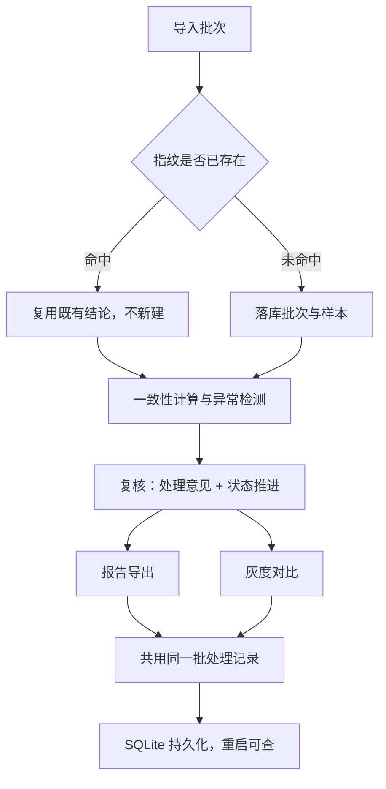

# 标注员一致性复盘系统 · 产品需求文档（PRD）

## 1. 产品概述
标注员一致性复盘系统面向知识库运营与模型评审会，把过去依赖"表格颜色 + 口头约定"的复盘流程，沉淀为可反查、可持久化、可导出的标准流水线。系统覆盖从样本导入、一致性计算、异常复核、状态推进到报告导出的完整链路：每一条结论都能追溯到对应的切分清单与处理意见；服务重启后，上一轮处理痕迹依旧可查。

- 解决问题：复盘结论无法反查、同一批样本二次导入产生冲突结论、报告与界面各算各的、导出文件全是字段名缩写而非技术人员看不懂。
- 目标用户：知识库运营（日常复核）、模型评审会（结论反查与验收）、非技术干系人（阅读导出报告）。
- 产品价值：把口头约定固化为数据痕迹，让"每条结论都可反查"成为默认能力。

## 2. 核心功能

### 2.1 用户角色
| 角色 | 进入方式 | 核心权限 |
|------|----------|----------|
| 知识库运营 | 本地账号登录 | 导入批次、复核异常、录入处理意见、推进状态、导出报告 |
| 模型评审会 | 只读访问 | 反查结论、追溯切分清单与处理意见、查看与下载报告 |
| 非技术干系人 | 无需登录 | 直接阅读导出的报告文件（HTML / 可打印 PDF） |

### 2.2 功能模块
1. **复盘工作台（首页）**：状态看板、批次列表、导入批次（指纹去重）。
2. **批次详情页**：一致性结论、异常清单、单条反查（切分清单 + 标注明细 + 处理意见）、复核与状态推进。
3. **报告与对比页**：报告导出（非技术可读）、灰度对比（与报告共用同一批处理记录）。

### 2.3 页面详情
| 页面名称 | 模块名称 | 功能描述 |
|----------|----------|----------|
| 复盘工作台 | 状态看板 | 汇总各状态批次数、待复核异常数、最近一次导出时间 |
| 复盘工作台 | 批次列表 | 展示批次编号、指纹、状态、一致率、异常数、导入时间，支持按状态筛选与关键词搜索 |
| 复盘工作台 | 导入批次 | 粘贴/上传样本与标注；计算批次指纹；命中已有指纹时提示"复用既有结论"而非新建冲突结论 |
| 批次详情 | 一致性结论 | 展示一致率、Cohen's Kappa、按标注员统计；结论以自然语言表述，非字段堆砌 |
| 批次详情 | 异常清单 | 列出"标注不一致 / 评测集偏科 / 离群标注"等异常，含严重度、状态、反查入口 |
| 批次详情 | 单条反查 | 顺着一条异常回溯：切分清单（train/eval 划分）、标注明细、处理意见、结论依据 |
| 批次详情 | 复核与状态推进 | 录入/修改处理意见；推进批次状态：已导入 → 复核中 → 已复核 → 已导出 |
| 报告与对比 | 报告导出 | 生成非技术可读报告；评测集偏科原因用自然语言 + 简明图表说明，而非字段名缩写 |
| 报告与对比 | 灰度对比 | 选择历史批次做灰度对比，直接复用既有处理记录，不重复计算 |

## 3. 核心流程
主流程：导入批次 → 计算批次指纹 → 命中既有指纹则复用既有结论（不产生冲突）→ 一致性计算 → 异常检测 → 复核（处理意见 + 状态推进）→ 报告导出 / 灰度对比（共用同一批处理记录）。所有记录落库 SQLite，服务重启后可按批次/异常反查。

反查流程（验收场景）：在异常清单中点击某条异常 → 展开反查面板 → 依次可见"该异常归属的切分清单（train/eval 划分与样本）→ 各标注员的标注明细 → 复核录入的处理意见 → 一致性结论依据"，形成完整反查链。

## 4. 用户界面设计

### 4.1 设计风格
- 主色：墨黑（#14110D）作为文字与主结构色；暖纸色（#F7F3EA）作为底色，营造"审计台账"质感。
- 强调色：深青（#0F4C4A）用于主操作与一致通过；琥珀（#B7791F）用于待复核/异常；赭红（#7A2E2E）用于严重异常。
- 字体：标题用 Fraunces（有性格的衬线体），正文用 Hanken Grotesk，编号/指纹/反查码用 JetBrains Mono。
- 布局：桌面优先的台账式分栏，左侧批次导航 + 右侧详情；用细分隔线（ledger rules）区隔记录行。
- 图标：线性极简图标，配合语义色，不使用花哨插画。

### 4.2 页面设计概览
| 页面名称 | 模块名称 | UI 要素 |
|----------|----------|----------|
| 复盘工作台 | 状态看板 | 三栏数字卡片 + 趋势条；暖纸底、墨黑数字、深青强调 |
| 复盘工作台 | 批次列表 | 表格式台账行，每行含状态徽标、一致率进度条、异常数；行 hover 展开指纹 |
| 批次详情 | 一致性结论 | 结论卡片 + 指标条 + 按标注员小多柱图 |
| 批次详情 | 异常清单 | 可展开行，展开后内嵌反查面板（切分清单 + 处理意见） |
| 报告与对比 | 报告导出 | 报告预览区（所见即所得）+ 导出按钮（HTML / 打印 PDF） |
| 报告与对比 | 灰度对比 | 双栏对比表，复用既有记录，标注"数据来源：本批处理记录" |

### 4.3 响应式
桌面优先（1280px+ 为主），平板自适应折叠侧栏，移动端只读查看批次与报告，复核操作建议在桌面进行。

### 4.4 3D 场景
不适用（数据复盘工具，无 3D 需求）。
