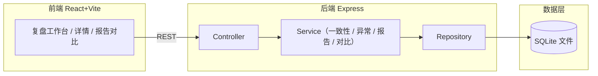
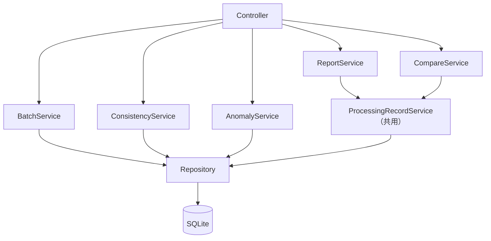

# 标注员一致性复盘系统 · 技术架构文档

## 1. 架构设计
前后端一体工程：React 单页前端 + Express REST 后端 + SQLite 文件数据库。SQLite 落盘于本地文件，服务重启后数据不丢，满足"重启后还能查到上一轮处理痕迹"。报告导出与灰度对比均通过同一 Service 层读取同一批处理记录，避免"界面、报告各算各的"。



## 2. 技术说明
- 前端：React@18 + tailwindcss@3 + vite
- 初始化工具：vite-init
- 后端：Express@4
- 数据库：SQLite（better-sqlite3，文件持久化，无需外部服务）
- 报告：服务端生成 HTML 字符串，前端预览 + 浏览器打印 PDF
- 状态推进：批次状态机已导入(IMPORTED) → 复核中(REVIEWING) → 已复核(REVIEWED) → 已导出(EXPORTED)，状态变更落库留痕

## 3. 路由定义
| 路由 | 用途 |
|------|------|
| / | 复盘工作台（状态看板 + 批次列表 + 导入） |
| /batches/:id | 批次详情（结论 + 异常 + 反查 + 复核/状态推进） |
| /batches/:id/report | 报告与对比（报告导出 + 灰度对比） |

## 4. API 定义

```typescript
// 批次状态
type BatchStatus = 'IMPORTED' | 'REVIEWING' | 'REVIEWED' | 'EXPORTED';

// 异常类型
type AnomalyType = 'DISAGREEMENT' | 'DATASET_BIAS' | 'OUTLIER';
// 异常状态
type AnomalyStatus = 'OPEN' | 'RESOLVED' | 'DISMISSED';

// 导入请求
interface ImportRequest {
  batchNo: string;
  sourceFileName?: string;
  samples: Array<{
    sampleKey: string;
    content: string;
    splitTag: 'train' | 'eval';       // 切分清单归属
    annotations: Array<{
      annotator: string;
      label: string;
    }>;
  }>;
}

// 导入响应（含指纹去重结果）
interface ImportResponse {
  batchId: string;
  fingerprint: string;
  reused: boolean;                    // true=命中既有指纹，复用结论，未新建冲突
  status: BatchStatus;
  summary: BatchSummary;
}

interface BatchSummary {
  sampleCount: number;
  agreementRate: number;               // 0~1
  kappa: number;
  anomalyCount: number;
  conclusionText: string;              // 人类可读结论
}

// 批次
interface Batch extends BatchSummary {
  id: string;
  batchNo: string;
  fingerprint: string;
  status: BatchStatus;
  createdAt: string;
  updatedAt: string;
}

// 异常（含反查链）
interface Anomaly {
  id: string;
  batchId: string;
  sampleId: string;
  type: AnomalyType;
  severity: 'low' | 'medium' | 'high';
  status: AnomalyStatus;
  title: string;                       // 人类可读标题
  description: string;                  // 人类可读描述（非字段名缩写）
  trace: AnomalyTrace;                  // 反查链
  opinion?: ProcessingOpinion;
}

interface AnomalyTrace {
  sample: { sampleKey: string; content: string; splitTag: 'train' | 'eval' };
  splitList: { trainCount: number; evalCount: number; items: SplitItem[] };
  annotations: Array<{ annotator: string; label: string }>;
  conclusionBasis: string;             // 结论依据（自然语言）
}

interface SplitItem { sampleKey: string; splitTag: 'train' | 'eval'; label?: string; }

interface ProcessingOpinion {
  action: 'RELABEL' | 'REMOVE' | 'KEEP' | 'RESPLIT';
  text: string;                        // 处理意见（自然语言）
  reviewer: string;
  createdAt: string;
}
```

| 方法 | 路径 | 用途 | 关键约束 |
|------|------|------|----------|
| POST | /api/batches/import | 导入批次 | 计算指纹；命中既有指纹则复用结论（reused=true），不新建冲突 |
| GET | /api/batches | 批次列表 | 支持按 status、关键词筛选 |
| GET | /api/batches/:id | 批次详情 | 含结论与统计 |
| PATCH | /api/batches/:id/status | 推进状态 | 校验状态机合法迁移 |
| GET | /api/batches/:id/anomalies | 异常清单 | 含类型/状态/严重度筛选 |
| GET | /api/anomalies/:id | 异常详情 | 返回完整反查链 trace |
| PATCH | /api/anomalies/:id | 复核异常 | 录入/更新处理意见与状态 |
| POST | /api/batches/:id/report | 生成报告 | 复用同一批处理记录，生成非技术可读 HTML |
| GET | /api/batches/:id/report | 查看报告 | 返回最近一次报告（重启后仍可查） |
| POST | /api/batches/:id/compare | 灰度对比 | 选择对照批次，复用双方处理记录，不重复计算 |
| GET | /api/batches/:id/comparisons | 对比记录列表 | 持久化对比结果，重启可查 |

## 5. 服务架构图
分层结构：Controller（路由与参数校验）→ Service（一致性计算、异常检测、报告生成、灰度对比）→ Repository（SQL 读写）→ SQLite。报告与对比均调用同一 `ProcessingRecordService` 读取处理记录，保证"共用同一批处理记录"。



## 6. 数据模型

### 6.1 数据模型定义
```mermaid
erDiagram
    BATCH ||--o{ SAMPLE : contains
    BATCH ||--|| CONCLUSION : has
    BATCH ||--o{ ANOMALY : detects
    SAMPLE ||--o{ ANNOTATION : labeled
    ANOMALY ||--o| OPINION : reviewed
    BATCH ||--o{ REPORT : exports
    BATCH ||--o{ COMPARISON : compares

    BATCH {
        text id PK
        text batch_no
        text fingerprint UK
        text status
        real agreement_rate
        real kappa
        integer sample_count
        text conclusion_text
        text created_at
    }
    SAMPLE {
        text id PK
        text batch_id FK
        text sample_key
        text content
        text split_tag
    }
    ANNOTATION {
        text id PK
        text sample_id FK
        text annotator
        text label
    }
    CONCLUSION {
        text id PK
        text batch_id FK_UK
        text summary
        text per_annotator_json
        text computed_at
    }
    ANOMALY {
        text id PK
        text batch_id FK
        text sample_id FK
        text type
        text severity
        text status
        text title
        text description
        text trace_json
    }
    OPINION {
        text id PK
        text anomaly_id FK_UK
        text action
        text text
        text reviewer
        text created_at
    }
    REPORT {
        text id PK
        text batch_id FK
        text html
        text generated_at
    }
    COMPARISON {
        text id PK
        text batch_id FK
        text against_batch_id FK
        text result_json
        text created_at
    }
```

### 6.2 数据定义语言（SQLite DDL）
核心：`batch.fingerprint` 设 UNIQUE，保证二次导入同一批样本命中既有记录而非新建冲突结论；`conclusion.batch_id` 设 UNIQUE，保证一批一结论；`opinion.anomaly_id` 设 UNIQUE，保证一条异常仅一条处理意见。

```sql
CREATE TABLE IF NOT EXISTS batch (
  id TEXT PRIMARY KEY,
  batch_no TEXT NOT NULL,
  fingerprint TEXT NOT NULL UNIQUE,
  source_file_name TEXT,
  status TEXT NOT NULL DEFAULT 'IMPORTED',
  sample_count INTEGER NOT NULL DEFAULT 0,
  agreement_rate REAL NOT NULL DEFAULT 0,
  kappa REAL NOT NULL DEFAULT 0,
  conclusion_text TEXT NOT NULL DEFAULT '',
  created_at TEXT NOT NULL,
  updated_at TEXT NOT NULL
);

CREATE TABLE IF NOT EXISTS sample (
  id TEXT PRIMARY KEY,
  batch_id TEXT NOT NULL REFERENCES batch(id) ON DELETE CASCADE,
  sample_key TEXT NOT NULL,
  content TEXT NOT NULL,
  split_tag TEXT NOT NULL CHECK (split_tag IN ('train','eval')),
  UNIQUE (batch_id, sample_key)
);

CREATE TABLE IF NOT EXISTS annotation (
  id TEXT PRIMARY KEY,
  sample_id TEXT NOT NULL REFERENCES sample(id) ON DELETE CASCADE,
  annotator TEXT NOT NULL,
  label TEXT NOT NULL
);
CREATE INDEX IF NOT EXISTS idx_annotation_sample ON annotation(sample_id);

CREATE TABLE IF NOT EXISTS conclusion (
  id TEXT PRIMARY KEY,
  batch_id TEXT NOT NULL UNIQUE REFERENCES batch(id) ON DELETE CASCADE,
  summary TEXT NOT NULL,
  per_annotator_json TEXT NOT NULL,
  computed_at TEXT NOT NULL
);

CREATE TABLE IF NOT EXISTS anomaly (
  id TEXT PRIMARY KEY,
  batch_id TEXT NOT NULL REFERENCES batch(id) ON DELETE CASCADE,
  sample_id TEXT NOT NULL REFERENCES sample(id) ON DELETE CASCADE,
  type TEXT NOT NULL CHECK (type IN ('DISAGREEMENT','DATASET_BIAS','OUTLIER')),
  severity TEXT NOT NULL CHECK (severity IN ('low','medium','high')),
  status TEXT NOT NULL DEFAULT 'OPEN' CHECK (status IN ('OPEN','RESOLVED','DISMISSED')),
  title TEXT NOT NULL,
  description TEXT NOT NULL,
  trace_json TEXT NOT NULL
);
CREATE INDEX IF NOT EXISTS idx_anomaly_batch ON anomaly(batch_id);

CREATE TABLE IF NOT EXISTS opinion (
  id TEXT PRIMARY KEY,
  anomaly_id TEXT NOT NULL UNIQUE REFERENCES anomaly(id) ON DELETE CASCADE,
  action TEXT NOT NULL CHECK (action IN ('RELABEL','REMOVE','KEEP','RESPLIT')),
  text TEXT NOT NULL,
  reviewer TEXT NOT NULL,
  created_at TEXT NOT NULL
);

CREATE TABLE IF NOT EXISTS report (
  id TEXT PRIMARY KEY,
  batch_id TEXT NOT NULL REFERENCES batch(id) ON DELETE CASCADE,
  html TEXT NOT NULL,
  generated_at TEXT NOT NULL
);
CREATE INDEX IF NOT EXISTS idx_report_batch ON report(batch_id);

CREATE TABLE IF NOT EXISTS comparison (
  id TEXT PRIMARY KEY,
  batch_id TEXT NOT NULL REFERENCES batch(id) ON DELETE CASCADE,
  against_batch_id TEXT NOT NULL REFERENCES batch(id) ON DELETE CASCADE,
  result_json TEXT NOT NULL,
  created_at TEXT NOT NULL
);
CREATE INDEX IF NOT EXISTS idx_comparison_batch ON comparison(batch_id);
```

初始化与迁移：服务启动时执行 `PRAGMA journal_mode=WAL;` 与上述建表语句（`CREATE TABLE IF NOT EXISTS`），数据库文件默认置于 `server/data/review.db`，随服务长期保留，满足重启可查。
