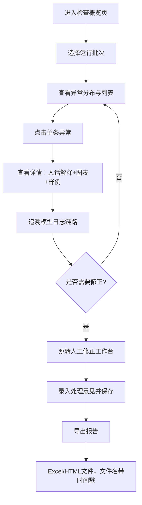

## 1. 产品概述

训练切分隔离检查系统——面向训练组与安全审核员的数据质量核验工具。聚焦训练数据切分后的脏样本识别、安全规则漏配排查、异常追溯与报告导出，目标是减少跨角色沟通成本，让非技术人员也能看懂问题出在哪、为什么没通过。

核心价值：
- 异常原因用日常语言描述，不用字段缩写堆砌
- 同一条异常在界面修正和报告导出中保持一致
- 顺着一条异常能回溯到模型日志和处理意见

## 2. 核心功能

### 2.1 用户角色

| 角色 | 使用场景 | 核心权限 |
|------|----------|----------|
| 安全审核员 | 日常巡检、看异常原因、导出报告 | 查看、筛选、导出报告 |
| 训练组工程师 | 复现问题、修正样本、处理意见录入 | 人工修正、标注、查看模型日志 |

### 2.2 功能模块

1. **检查概览页**：运行批次总览、异常类型分布、脏样本重复统计、安全规则覆盖度
2. **异常详情页**：单条异常完整链路、模型日志回溯、图表+表格+文字三视图对齐
3. **人工修正工作台**：批量修正记录、处理意见、和报告共用同一数据源
4. **报告导出**：Excel/HTML双格式，非技术可读，文件名带时间戳区分运行批次

### 2.3 页面详情

| 页面名称 | 模块名称 | 功能描述 |
|----------|----------|----------|
| 检查概览页 | 批次选择器 | 切换不同运行批次，文件名和摘要一眼区分新旧 |
| 检查概览页 | 异常分布卡片 | 饼图展示脏样本重复、规则漏配、格式错误等占比 |
| 检查概览页 | 异常列表 | 表格展示异常ID、类型、原因摘要、处理状态、操作 |
| 异常详情页 | 异常信息卡片 | 用人话讲清"这条样本为什么不过"，附原文对照 |
| 异常详情页 | 复现样例区 | 该异常类型的典型样例（旧表数据、补录备注、漏填单位等日常场景） |
| 异常详情页 | 模型日志追溯 | 从判定结果倒查特征抽取、规则匹配、阈值判断全链路 |
| 异常详情页 | 图表证据 | 柱状图/雷达图展示该样本与同类样本的指标对比 |
| 人工修正工作台 | 修正列表 | 待处理/已处理分组，支持批量操作 |
| 人工修正工作台 | 处理意见录入 | 下拉模板+自由输入，处理记录和报告共用 |
| 报告导出 | 格式选择 | Excel（给安全审核员）/HTML（可交互） |
| 报告导出 | 命名规则 | `训练切分隔离检查_YYYYMMDD_HHMMSS_批次号.xlsx` |

## 3. 核心流程

用户从概览页进入，筛选异常类型，点击某条异常查看详情，在详情页顺着模型日志回溯判定过程，若需修正则跳转工作台处理，最后导出报告。

## 4. 用户界面设计

### 4.1 设计风格

- **主色**：深石板蓝 `#1e3a5f`（稳重、专业）
- **辅助色**：琥珀橙 `#f59e0b`（异常警示）、松石绿 `#10b981`（已处理通过）、朱红 `#ef4444`（严重错误）
- **中性色**：暖灰白 `#fafaf7` 背景、`#374151` 正文、`#6b7280` 辅助文字
- **按钮风格**：圆角 6px，hover 时上移 1px + 浅阴影
- **字体**：标题用思源宋体（人文感、易读），正文用系统无衬线字体
- **布局**：左侧固定导航 + 右侧内容区，卡片式，卡片间留足呼吸空间
- **图标**：lucide-react，线性风格，统一 18px

### 4.2 页面设计概览

| 页面名称 | 模块名称 | UI元素 |
|----------|----------|--------|
| 检查概览页 | 批次选择器 | 时间线样式卡片，hover 高亮，当前批次用左侧色条标记 |
| 检查概览页 | 异常分布卡片 | 环形图 + 右侧数字汇总，配色与异常类型语义一致 |
| 检查概览页 | 异常列表 | 斑马行，严重程度用左侧色块标识，操作列固定 |
| 异常详情页 | 异常原因卡 | 大号图标 + 人话标题 + 分点解释 + 原文对比框 |
| 异常详情页 | 复现样例 | 标签页切换：旧表数据/补录备注/漏填单位，样例用伪表格高亮问题字段 |
| 异常详情页 | 模型日志 | 瀑布流时间轴，每步有状态色点、步骤名、判定值、说明文字 |
| 异常详情页 | 证据图表 | 柱状对比图，柱子上标注数值，异常柱子用辅助色突出 |
| 人工修正工作台 | 修正列表 | 勾选框批量操作，行内展开修正表单 |
| 报告导出 | 导出面板 | 格式卡片选择 + 文件名预览 + 下载按钮 |

### 4.3 响应性

桌面端优先（1440px 及以上），左侧导航 240px 固定宽度，内容区自适应。1024px 以下导航折叠为汉堡菜单，卡片改为单列堆叠。

## 5. 异常原因表达方式规范（非技术可读）

| 原始字段表达 | 人话表达 |
|-------------|----------|
| `dup_hash_conflict, sim=0.987` | 这条样本和训练集中编号 A0327 的内容几乎一模一样（相似度 98.7%），属于重复样本 |
| `rule_sensitive_v2 missing: field=unit` | 安全规则漏配：金额字段没有填写单位（元/万元），审核时容易读错数值 |
| `format_old_schema, col=remark` | 备注列是旧表格式的长文本，里面混了补录标记，系统拆不出来 |
| `train_val_leak, id=X12` | 同一条记录同时出现在训练集和验证集里，模型会"作弊"看到不该看的答案 |
