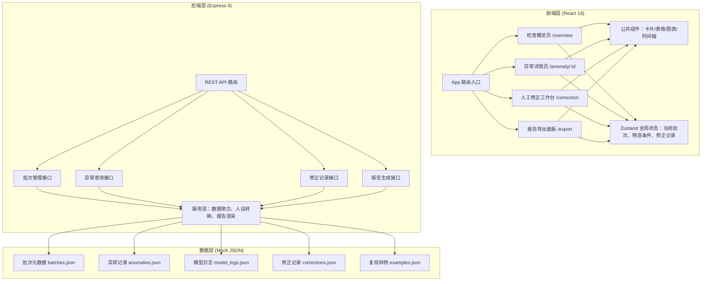
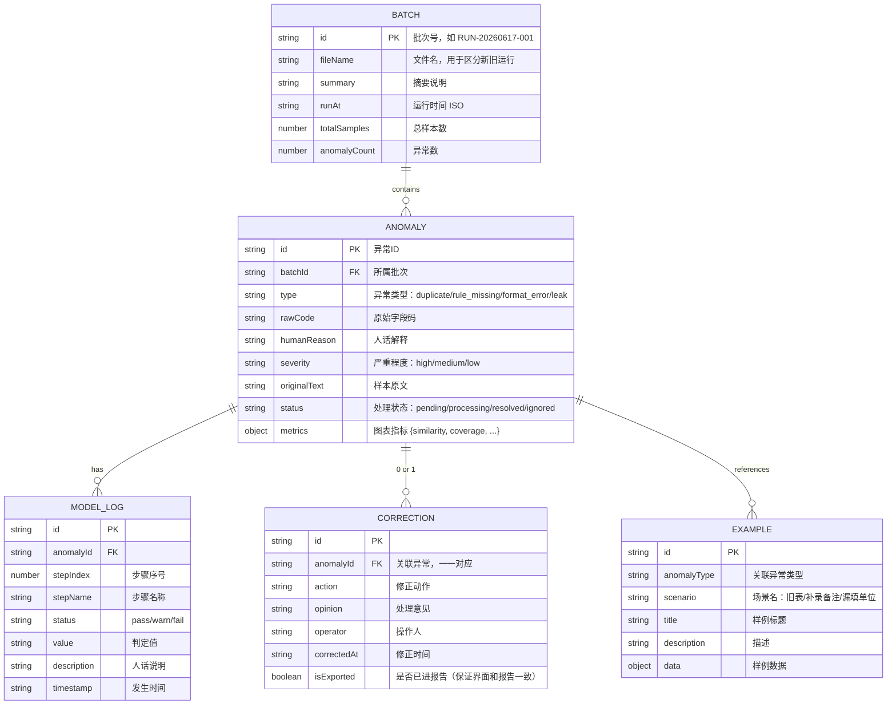

## 1. 架构设计

## 2. 技术说明

- **前端**：React@18 + TypeScript + tailwindcss@3 + react-router-dom + zustand + lucide-react + recharts
- **后端**：Express@4 + TypeScript
- **初始化工具**：vite-init（react-express-ts 模板）
- **数据存储**：本地 JSON Mock 数据，无需数据库
- **报告导出**：Excel 用 xlsx 库，HTML 用模板字符串渲染

## 3. 路由定义

| 前端路由 | 页面组件 | 用途 |
|----------|----------|------|
| / | Redirect 到 /overview | 首页跳转 |
| /overview | OverviewPage | 检查概览：批次选择、异常分布、异常列表 |
| /anomaly/:id | AnomalyDetailPage | 异常详情：原因说明、复现样例、模型日志、图表 |
| /correction | CorrectionPage | 人工修正：待处理/已处理、批量操作、意见录入 |
| /export | ExportPage | 报告导出：格式选择、文件名预览、下载 |

| 后端 API | 方法 | 用途 |
|----------|------|------|
| /api/batches | GET | 获取所有运行批次列表 |
| /api/batches/:id | GET | 获取单个批次详情 |
| /api/anomalies | GET | 按批次+类型筛选异常列表 |
| /api/anomalies/:id | GET | 获取单条异常完整信息（含日志、样例） |
| /api/corrections | GET | 获取修正记录（与报告共用） |
| /api/corrections | POST | 保存/更新修正记录 |
| /api/report/excel | POST | 生成 Excel 报告下载 |
| /api/report/html | POST | 生成 HTML 报告下载 |

## 4. 数据模型

## 5. 命名规范（区分运行批次）

- 文件名格式：`训练切分隔离检查_YYYYMMDD_HHMMSS_{batchId}.{xlsx|html}`
- 示例：`训练切分隔离检查_20260617_143052_RUN-20260617-001.xlsx`
- 文件内容页眉含：生成时间、批次号、操作人、异常总数、已处理数
