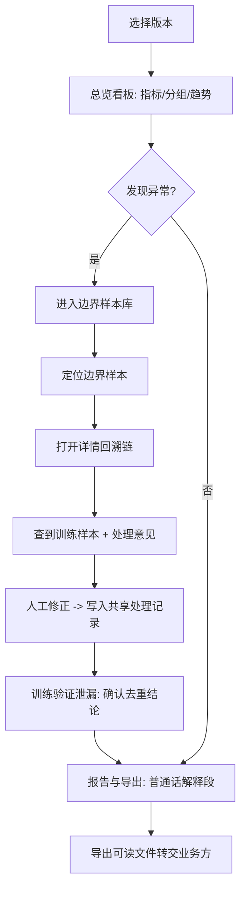

# 拒答边界样本看板 · 产品需求文档（PRD）

## 1. 产品概述

拒答边界样本看板是一款面向算法产品经理的 AI/ML 安全评测工作流工具，围绕模型"拒答边界"附近的样本，把**样本、版本、人工修正、分组指标**串成一条可回溯的链路；安全拦截与人工修正共用同一批处理记录，界面与报告口径一致，避免各算各的。
- 解决的核心痛点：脏样本重复出现时业务方追问依据却查不到；同一评测题库二次导入结论打架；报告术语业务方看不懂；异常无法往回查到训练样本与处理意见。
- 目标用户：算法产品经理（主用）、安全评测工程师、需要看结论的业务方（只读）。

## 2. 核心功能

### 2.2 功能模块

1. **总览看板**：版本切换器、关键指标卡、分组指标矩阵、版本趋势、异常清单入口
2. **边界样本库**：边界样本列表 + 多维过滤 + 边界分数 + 安全拦截/人工修正联动 + 详情回溯链
3. **训练验证泄漏**：泄漏检测记录、题库去重结论统一、普通话原因解释、可读导出
4. **报告与导出**：基于共享处理记录生成报告、普通话解释段、面向非技术人员的导出

### 2.3 页面详情

| 页面名称 | 模块名称 | 功能描述 |
|-----------|-------------|---------------------|
| 总览看板 | 版本切换器 | 切换模型版本/数据集版本，全局联动所有指标与列表 |
| 总览看板 | 关键指标卡 | 拒答率、边界样本数、人工修正率、泄漏样本数（与版本绑定） |
| 总览看板 | 分组指标矩阵 | 按分组（业务线/风险类目）展示拒答率、修正率、泄漏数、边界数 |
| 总览看板 | 版本趋势 | 跨版本折线，对比关键指标变化 |
| 总览看板 | 异常清单 | 当前版本异常条目（边界翻转/泄漏/矛盾），可一键跳转回溯 |
| 边界样本库 | 过滤栏 | 按版本、分组、拦截结果、修正状态、异常类型过滤 |
| 边界样本库 | 样本列表 | 输入摘要、边界分数、安全拦截结论、人工修正状态、关联记录编号 |
| 边界样本库 | 人工修正面板 | 对单条样本修正拒答判定、填写处理意见，写入共享处理记录 |
| 样本详情 | 回溯链 | 异常 → 关联样本 → 关联训练样本(泄漏源) → 处理意见 的可点击链路 |
| 训练验证泄漏 | 题库去重状态 | 评测题库二次导入时复用既有结论，标注"已合并"，不出两份打架结论 |
| 训练验证泄漏 | 泄漏原因(普通话) | 把字段名/缩写原因翻译成普通人能读的句子 |
| 报告与导出 | 报告生成 | 从共享处理记录派生（非另行计算），含普通话解释段 |
| 报告与导出 | 导出 | 面向非技术人员的可读导出（HTML/打印友好），原因不全是字段名 |

## 3. 核心流程

**日常主流程**：算法 PM 选择版本 → 总览看板看关键指标与分组 → 发现异常（如边界样本激增/出现泄漏）→ 进入边界样本库定位条目 → 点开详情顺着回溯链查到训练样本与处理意见 → 做人工修正（写入共享处理记录）→ 跳转训练验证泄漏确认题库去重结论 → 生成报告复制普通话解释段给业务方 → 导出可读文件转交不懂代码的同事。

**关键不变量**：安全拦截与人工修正写入同一份处理记录；报告与界面均从该记录派生；同一评测题库（按内容哈希）二次导入只保留一份统一结论。

## 4. 用户界面设计

### 4.1 设计风格

- **整体调性**："分析实验室 / 取证仪表"风——暗色、克制、数据优先、强可读性，适合每日长时间使用。
- **主色/辅色**：深石色暗底（warm dark）为基底；信号琥珀色为"拒答边界/异常"主强调；翡翠绿为"安全/通过"辅强调；墨色暖白文字。
- **字体**：标题用 Fraunces（特征衬线，编辑式质感）；正文用 IBM Plex Sans（技术、清晰）；标识符/分数/版本/哈希用 IBM Plex Mono。
- **按钮风格**：低高度、细描边、暗色；主操作用琥珀描边，hover 提亮。
- **布局**：左侧固定主导航 + 顶部版本切换器 + 主体卡片/表格网格；数据行可整行点击进入回溯。
- **图标**：lucide-react 线性图标，克制使用。
- **微交互**：行 hover 提亮 + 左侧琥珀指示条；回溯链节点 staggered 淡入；指标数字 count-up。

### 4.2 页面设计概览

| 页面名称 | 模块名称 | UI 元素 |
|-----------|-------------|-------------|
| 总览看板 | 关键指标卡 | 暗卡、大号 mono 数字、趋势箭头、琥珀/绿语义色 |
| 总览看板 | 分组指标矩阵 | 表格热力（按数值深浅）、行 hover 琥珀指示条 |
| 边界样本库 | 样本列表 | 紧凑表格、边界分数条、状态徽标、整行点击 |
| 样本详情 | 回溯链 | 垂直时间线，节点可点击跳转，staggered 淡入 |
| 训练验证泄漏 | 去重状态 | 题库哈希(mono)、合并徽标、统一结论卡 |
| 报告与导出 | 普通话解释段 | 高亮引文块，一键复制按钮 |

### 4.3 响应式

桌面优先（算法 PM 在工作站使用）；窄屏下表格转卡片、侧栏折叠为顶部抽屉；触摸目标 ≥ 40px。

### 4.4 3D 场景

不适用。
