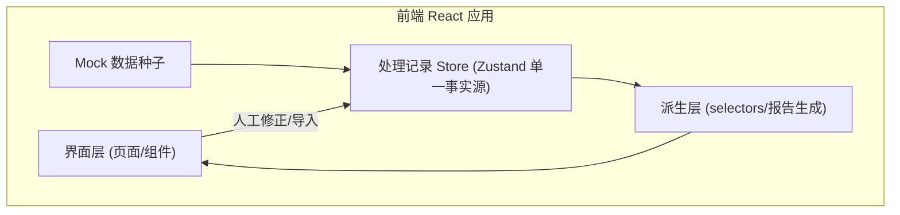
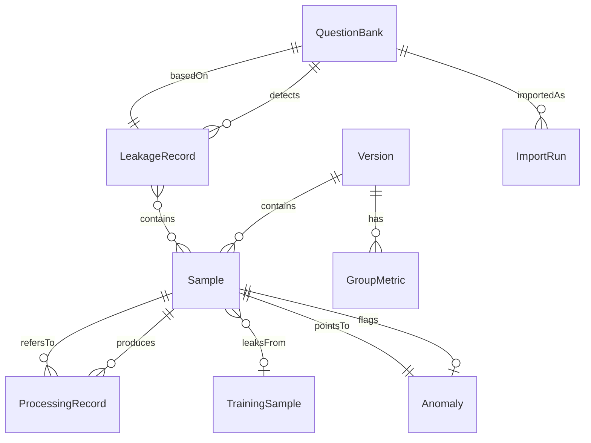

# 拒答边界样本看板 · 技术架构文档

## 1. 架构设计

纯前端单页应用。核心架构原则是**单一事实源（Single Source of Truth）**：所有"处理记录"集中在一个 Zustand store 中，安全拦截、人工修正、泄漏检测均写入同一份记录；界面展示与报告生成均**派生**自该 store，而非另行计算——确保界面与报告口径一致、可回溯。

## 2. 技术说明

- 前端：React@18 + TypeScript + Vite + Tailwind CSS@3 + react-router-dom
- 状态管理：Zustand（处理记录单一事实源 + 派生 selectors）
- 初始化工具：vite-init（react-ts 模板）
- 后端：无（遵循"最小化外部服务"，使用结构化 mock 数据模拟题库去重/泄漏检测逻辑）
- 数据：前端内 mock 数据，模拟"同一评测题库二次导入按内容哈希去重、结论统一"

## 3. 路由定义

| 路由 | 用途 |
|-------|---------|
| / | 总览看板：版本切换、关键指标、分组矩阵、趋势、异常清单 |
| /samples | 边界样本库：列表、过滤、人工修正入口 |
| /samples/:id | 样本详情 + 回溯链（异常→样本→训练数据→处理意见） |
| /leakage | 训练验证泄漏：题库去重、统一结论、普通话原因、导出 |
| /reports | 报告与导出：基于共享记录派生、普通话解释段、可读导出 |

## 4. API 定义

无后端 API。所有数据通过 Zustand store 与 mock 种子提供。报告/导出为前端纯派生函数。

## 5. 服务端架构图

不适用（纯前端）。

## 6. 数据模型

### 6.1 数据模型定义

### 6.2 数据定义（核心类型，TS 形式）

- **Version**：id, name, modelVersion, datasetVersion, questionBankHash, createdAt, sampleCount
- **Sample**：id, versionId, group, input, expectedRefusal, modelResponse, refusalDecision, refusalScore(边界分数 0~1), safetyInterception{result, rule}, correction{status, reviewer, opinion, before, after}, processingRecordId, linkedTrainingSampleId, anomalyId
- **ProcessingRecord（共享事实源）**：id, sampleId, versionId, type(interception/correction/leakage), result, reasonCode, reasonPlain(普通话), reviewer, timestamp
- **GroupMetric**：versionId, group, total, refusalRate, correctionRate, boundaryCount, leakageCount
- **Anomaly**：id, type(boundary-flip/leakage/contradiction), sampleId, versionId, description, traceChain[]
- **TrainingSample**：id, source, content, status(标注/剔除/回灌)
- **QuestionBank**：id, name, contentHash, importCount, firstImportVersionId
- **LeakageRecord**：id, questionBankId, unifiedConclusion, reasonPlain, sampleIds[], affectedTrainingSampleIds[], importRuns[]

**去重逻辑**：评测题库导入时计算 contentHash；若已存在则记为 ImportRun（复跑），**复用既有 unifiedConclusion**，不新建矛盾结论；界面以"已合并 / 复用 v1 结论"徽标呈现。
