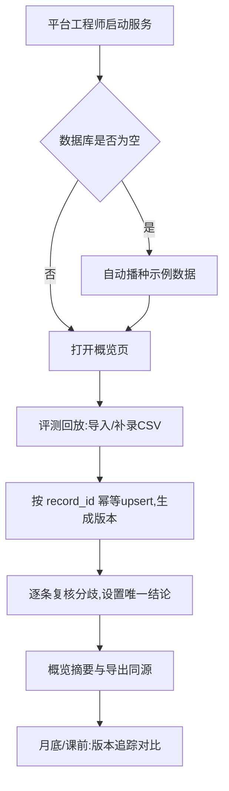

# 奖励模型偏差复核 — 产品需求文档（PRD）

## 1. 产品概述

奖励模型偏差复核（Reward Model Bias Review）是给平台工程师用的本地化复核工具。日常在「评测回放」入口整理标注记录、对奖励模型预测与人工标注的分歧逐条复核并给出唯一结论；月底或课前到「版本追踪」回看各版本结论是否能解释偏差。从空目录即可运行，首次打开自动带示例数据，导出内容与界面摘要同源，重导入/补录幂等、不会出现同一件事两份结论。

- 目标用户：平台工程师（复核人）
- 解决问题：奖励模型偏差缺乏靠谱的复核入口；标注记录散乱、重导入易重复、导出与界面结论不一致
- 价值：把偏差复核变成一条可回看、可对账、可追踪版本的稳定流程

## 2. 核心功能

### 2.1 用户角色

| 角色 | 进入方式 | 核心权限 |
|------|----------|----------|
| 平台工程师 | 本地启动后浏览器打开 | 导入/补录标注、逐条复核、导出结论、查看版本追踪 |

### 2.2 功能模块

1. **概览页**：复核摘要（总数 / 已复核 / 待复核 / 通过 / 待确认 / 驳回），与导出文件同源
2. **评测回放页（日常入口）**：导入标注 CSV、逐条复核分歧、设置/修改结论、补录新记录
3. **版本追踪页**：版本列表、跨版本结论对比、偏差趋势，用于月底/课前回看

### 2.3 页面详情

| 页面名称 | 模块名称 | 功能说明 |
|----------|----------|----------|
| 概览页 | 摘要卡片 | 总数/已复核/待复核/通过/待确认/驳回计数，与导出完全一致 |
| 概览页 | 最近版本 | 最近一次导入版本、记录数、复核进度条 |
| 评测回放页 | 导入与补录 | 上传 CSV，按 record_id 幂等 upsert；补录仅追加新记录，不重复出结论 |
| 评测回放页 | 复核列表 | 筛选（版本/状态/偏差类型）、展示 prompt 与 A/B 预测/人工标注分歧 |
| 评测回放页 | 结论面板 | 设置结论（通过/待确认/驳回）、偏差类型、严重度、复核人、反馈；保存即 upsert 单结论 |
| 版本追踪页 | 版本列表 | 每次导入生成版本，含记录数、复核进度、偏差分布 |
| 版本追踪页 | 跨版本对比 | 选两个版本对比同一 record_id 结论是否变化，解释偏差是否被修复 |

## 3. 核心流程

日常复核：导入标注 → 系统按 record_id 幂等入库并生成版本 → 在评测回放逐条看分歧 → 设置唯一结论 → 概览与导出同源展示。月底/课前到版本追踪对比版本结论变化。

## 4. 用户界面设计

### 4.1 设计风格

- 主题：深色「观测台 / 仪表盘」风格，数据密集但克制
- 主色：中性墨色底（zinc/slate），辅以琥珀色（偏差/告警）与翠绿色（通过）双强调色
- 字体：标题用特色无衬线 grotesque，数据/ID 用等宽（IBM Plex Mono），正文用精致无衬线
- 布局：左侧导航 + 右侧主内容，卡片化区块，4 的倍数间距
- 图标：lucide-react 线性图标

### 4.2 页面设计概览

| 页面名称 | 模块名称 | UI 元素 |
|----------|----------|---------|
| 概览页 | 摘要卡片 | 大号数字 + 进度条 + 微动效进入 |
| 评测回放页 | 复核列表 | 表格行 + 分歧高亮 + 筛选条 |
| 版本追踪页 | 跨版本对比 | 双列对比 + 变化标记 |

### 4.3 响应式

桌面优先（工程师主力在桌面复核），平板自适应，移动端只保证概览可读。
