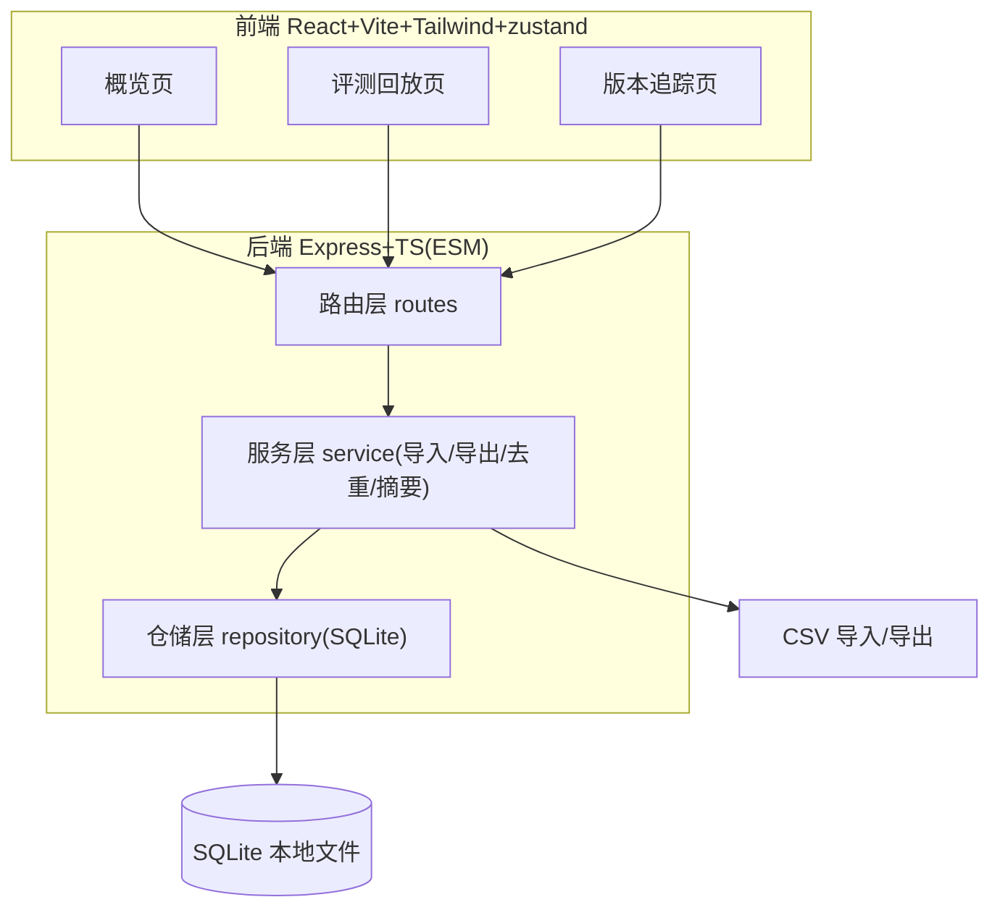
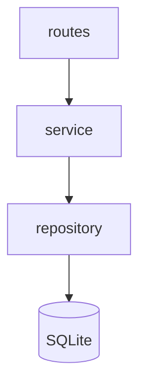
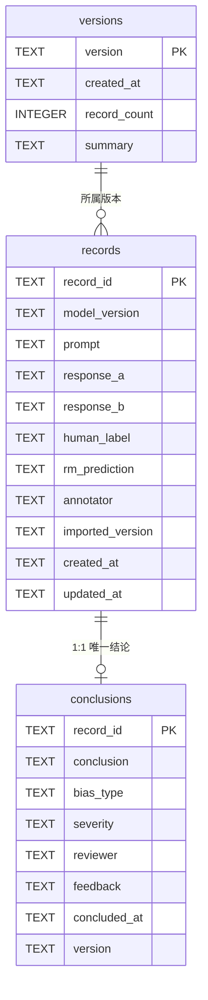

# 奖励模型偏差复核 — 技术架构文档

## 1. 架构设计



## 2. 技术描述

- 前端：React 18 + tailwindcss + vite + react-router-dom + zustand
- 初始化工具：vite-init（react-express-ts 模板）
- 后端：Express 4（ESM + TypeScript）
- 数据库：SQLite（better-sqlite3，同步、单文件）
- 图标：lucide-react
- 包管理：npm（环境未提供 pnpm）

## 3. 路由定义

| 路由 | 用途 |
|------|------|
| `/` | 概览页：复核摘要 + 最近版本 |
| `/replay` | 评测回放页（日常入口）：导入/补录 + 逐条复核 |
| `/versions` | 版本追踪页：版本列表 + 跨版本对比 |

## 4. API 定义

| 方法 | 路径 | 说明 |
|------|------|------|
| POST | `/api/import` | 上传 CSV，按 record_id 幂等 upsert，生成版本 |
| GET | `/api/records` | 列表（筛选 version/status/bias_type），含结论 |
| PATCH | `/api/records/:id/conclusion` | upsert 单条结论（通过/待确认/驳回） |
| GET | `/api/summary` | 界面摘要（与导出同源查询） |
| GET | `/api/export` | 导出结论 CSV（同 summary 查询） |
| GET | `/api/versions` | 版本列表 + 各版本摘要 |
| GET | `/api/versions/compare` | 两版本同 record_id 结论对比 |

## 5. 服务端架构图



## 6. 数据模型

### 6.1 数据模型定义



### 6.2 数据定义语言（DDL）

```sql
CREATE TABLE IF NOT EXISTS records (
  record_id TEXT PRIMARY KEY,
  model_version TEXT NOT NULL,
  prompt TEXT NOT NULL,
  response_a TEXT NOT NULL,
  response_b TEXT NOT NULL,
  human_label TEXT NOT NULL,
  rm_prediction TEXT,
  annotator TEXT,
  imported_version TEXT NOT NULL,
  created_at TEXT NOT NULL,
  updated_at TEXT NOT NULL
);

CREATE TABLE IF NOT EXISTS conclusions (
  record_id TEXT PRIMARY KEY REFERENCES records(record_id),
  conclusion TEXT NOT NULL CHECK (conclusion IN ('通过','待确认','驳回')),
  bias_type TEXT,
  severity TEXT,
  reviewer TEXT,
  feedback TEXT,
  concluded_at TEXT NOT NULL,
  version TEXT
);

CREATE TABLE IF NOT EXISTS versions (
  version TEXT PRIMARY KEY,
  created_at TEXT NOT NULL,
  record_count INTEGER NOT NULL,
  summary TEXT
);

CREATE INDEX IF NOT EXISTS idx_records_version ON records(imported_version);
CREATE INDEX IF NOT EXISTS idx_conclusions_conclusion ON conclusions(conclusion);
```

### 关键约束与去重策略

- **唯一结论**：`conclusions.record_id` 为主键，保证「同一件事不出现两份结论」，保存即 upsert
- **幂等导入**：`records` 按 `record_id` 做 `INSERT ... ON CONFLICT DO UPDATE`；重导入不新增重复行，已有结论保留不动
- **补录**：仅追加 CSV 中新的 record_id，老记录结论不受影响
- **导出=摘要同源**：`/api/summary` 与 `/api/export` 共用同一 `conclusions JOIN records` 查询，杜绝「页面说通过、文件里写待确认」
- **首次播种**：服务启动时若 `records` 为空，从 `samples/annotations.csv` 导入并生成 `sample` 版本
