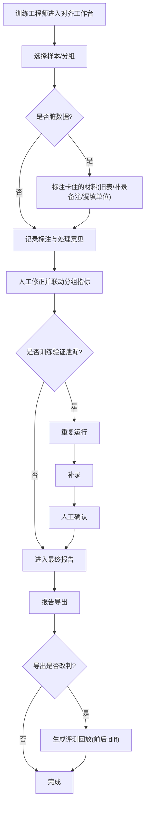

# 离线在线指标对齐工作台 — 产品需求文档（PRD）

## 1. 产品概述

面向模型训练工程师的内部 AI/ML 工作流工具，把"离线在线指标对齐"过程中原本散落在临时群、零散文档和聊天记录里的**提示词版本、标注记录、处理意见、人工修正与分组指标**收敛到同一个工作台，让"样本—版本—人工修正—分组指标"串成一条可追溯的链路。

- **解决的核心问题**：对齐过程信息分散；脏样本难溯源；训练验证泄漏处理缺标准动作；训练组只看最终报告时无法知道脏样本重复卡在哪份材料上；报告导出改判后无法回看前后差别。
- **目标用户**：模型训练工程师（主操作者）、训练组 reviewer（次，主要只读最终报告）。
- **价值**：把对齐工作流"串起来"，做到指标可对齐、脏样本可溯源、改判可回放、泄漏三件事（重复运行 / 补录 / 人工确认）必做齐。

## 2. 核心功能

### 2.1 用户角色

| 角色 | 接入方式 | 核心权限 |
|------|----------|----------|
| 训练工程师 | 内部账号 | 样本管理、版本维护、标注、处理意见、人工修正、泄漏补救、评测回放、报告导出 |
| 训练组 reviewer | 只读链接 | 查看最终报告、查看脏样本溯源（不可改） |

### 2.2 功能模块

1. **对齐工作台**：样本列表（含脏样本 / 泄漏 / 已修正状态）、提示词版本、标注记录、处理意见、人工修正、分组指标、训练验证泄漏处理。
2. **评测回放**：报告导出改判时，自动记录并对比"导出前判断 vs 导出后判断"，逐段高亮 diff。
3. **报告总览**：训练组可见的最终报告 + 脏样本溯源（重复卡在哪份材料上），支持一键导出（导出动作触发评测回放）。

### 2.3 页面详情

| 页面 | 模块 | 功能描述 |
|------|------|----------|
| 对齐工作台 | 样本列表 | 按状态 / 分组 / 材料类型筛选；显示离线指标、在线指标与对齐差距；脏样本标红并标注卡住的材料 |
| 对齐工作台 | 提示词版本 | 版本列表 + 变更说明 + 与上一版 diff；可绑定到样本 |
| 对齐工作台 | 标注记录 | 每条样本的标注时间线，含标签（如"旧表冲突""漏填单位"） |
| 对齐工作台 | 处理意见 | 处理意见与决策记录，支持绑定人工修正 |
| 对齐工作台 | 人工修正 | 记录修正前值 → 修正后值与理由，修正后自动联动分组指标 |
| 对齐工作台 | 分组指标 | 按问题分组聚合离线 / 在线 / 对齐差距 / 脏样本数 |
| 对齐工作台 | 训练验证泄漏 | 泄漏记录 + 三件事（重复运行 / 补录 / 人工确认）进度，少一件即标"未齐" |
| 评测回放 | 改判对比 | 报告导出前 vs 导出后判断，逐段高亮 diff，可跳转回样本 |
| 报告总览 | 脏样本溯源 | 按材料聚合脏样本，标注"重复卡住次数"，训练组只看报告也能定位 |
| 报告总览 | 报告导出 | 一键导出；导出改判会写入评测回放 |

## 3. 核心流程

训练工程师在工作台处理样本：若为脏数据，先标注卡住的材料类型（旧表 / 补录备注 / 漏填单位）；记录标注与处理意见后做人工修正，修正联动分组指标。若该样本命中训练验证泄漏，必须依次试"重复运行 → 补录 → 人工确认"三件事，缺一不可。完成后样本进入报告，报告导出若改变了判断，则自动生成评测回放记录前后差别。

## 4. 用户界面设计

### 4.1 设计风格

- **主题**：深色"控制台 / 科学仪表"风格——近黑底（zinc-950），锐利、精密、数据密集，体现"信号对齐"的工程感。
- **主色与点缀**：以青柠绿（lime-300）作为"对齐 / 通过"信号色；琥珀（amber-400）为脏数据警告；玫瑰红（rose-400）为泄漏 / 错误；青柠信号色仅用于关键 CTA 与激活态，克制使用。
- **字体**：标题用 Instrument Serif（编辑级衬线，赋予权威感），正文用 Hanken Grotesk，数据 / 版本号 / diff / 指标一律用 JetBrains Mono 等宽——形成"科学刊物 × 终端"的反差记忆点。
- **布局**：桌面优先，左侧固定侧栏导航 + 主区双栏（样本列表 / 详情），分组指标与泄漏处理在工作台内分区。
- **细节**：细描边分隔、栅格节奏（4 的倍数）、grain 噪点叠层增加纵深；状态用色点 + 等宽徽章。

### 4.2 页面设计概述

| 页面 | 模块 | UI 元素 |
|------|------|--------|
| 对齐工作台 | 侧栏导航 | 三页路由 + 全局对齐度仪表盘 |
| 对齐工作台 | 样本列表 | 等宽 ID、状态色点、离线/在线指标、对齐差距条 |
| 对齐工作台 | 样本详情 | 材料(旧表+补录备注+漏填单位)、提示词版本、标注时间线、处理意见、人工修正 |
| 对齐工作台 | 分组指标 | 分组聚合卡片，差距条与脏样本计数 |
| 对齐工作台 | 泄漏处理 | 三件事进度条，未齐项高亮 |
| 评测回放 | 改判对比 | 左右双栏 before/after，逐段 diff 高亮 |
| 报告总览 | 脏样本溯源 | 按材料分组卡片，重复卡住次数徽章 |
| 报告总览 | 导出 | 导出按钮，导出后回写回放 |

### 4.3 响应式

桌面优先（≥1280px 双栏），平板（≥768px）退化为单栏堆叠，移动端仅保证报告总览可读；触控优化按钮命中区。

### 4.4 3D 场景

本项目为数据工作流工具，不涉及 3D 场景。
