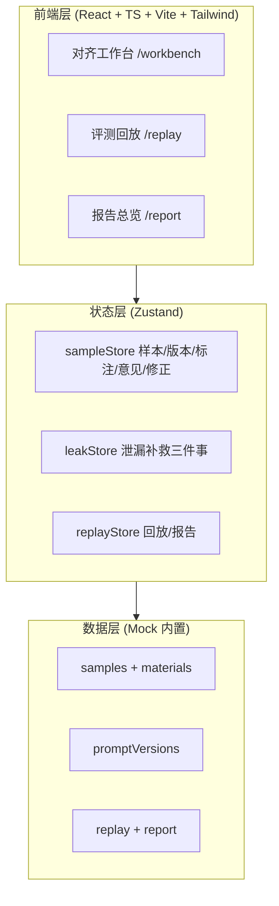
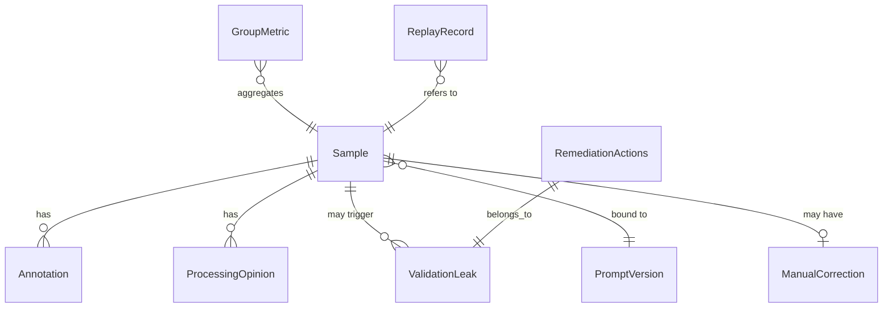

# 离线在线指标对齐工作台 — 技术架构文档

## 1. 架构设计

纯前端单页应用（React + TS + Vite），数据以 mock 形式内置于前端，状态由 Zustand 统一管理。无后端、无数据库、无外部服务（符合"最小化外部服务"原则）。



## 2. 技术选型

- **前端**：React@18 + TypeScript + Vite
- **样式**：Tailwind CSS@3
- **状态管理**：Zustand
- **路由**：react-router-dom@6
- **图标**：lucide-react
- **初始化工具**：vite-init（react-ts 模板）
- **后端**：无
- **数据库**：无（mock 数据内置于 `src/mock`）

## 3. 路由定义

| 路由 | 用途 |
|------|------|
| `/workbench` | 对齐工作台：样本 / 版本 / 标注 / 意见 / 修正 / 分组指标 / 泄漏处理 |
| `/replay` | 评测回放：报告导出改判前后逐段 diff |
| `/report` | 报告总览：脏样本溯源（重复卡在哪份材料）+ 导出 |
| `/` | 重定向到 `/workbench` |

## 4. API 定义

无后端 API。所有数据通过 Zustand store 读取 / 修改 mock 数据。

## 5. 服务端架构

无后端。

## 6. 数据模型

### 6.1 数据模型定义



### 6.2 数据定义（TypeScript 类型）

```ts
type MaterialType = 'old_table' | 'supplementary' | 'missing_unit' | 'clean';
type SampleStatus = 'clean' | 'dirty' | 'fixed' | 'leak';

interface Material {
  type: MaterialType;          // 旧表 / 补录备注 / 漏填单位 / 干净
  label: string;              // 材料名（溯源用）
  content: string;            // 材料内容
  note?: string;              // 说明（如"旧表未更新更正值"）
}

interface PromptVersion {
  id: string;                 // pv-2026-06-12-v3
  version: string;            // v3.2
  createdAt: string;
  author: string;
  changeLog: string;          // 变更说明
  diff: string;              // 与上一版 diff
  active: boolean;
}

interface Annotation {
  id: string;
  author: string;
  time: string;
  content: string;
  tag: string;                // 旧表冲突 / 漏填单位 / 补录矛盾
}

interface ProcessingOpinion {
  id: string;
  author: string;
  opinion: string;
  decision: string;           // 采纳 / 驳回 / 待定
}

interface ManualCorrection {
  from: string;
  to: string;
  reason: string;
  by: string;
}

interface RemediationAction {
  tried: boolean;             // 是否试过
  result: string;
  time: string;
}

interface ValidationLeak {
  id: string;
  sampleId: string;
  description: string;        // 训练验证泄漏描述
  rerun: RemediationAction;            // 重复运行
  supplementary: RemediationAction;     // 补录
  manualConfirm: RemediationAction;    // 人工确认
}

interface Sample {
  id: string;                 // S-0142
  question: string;
  group: string;              // 营收类 / 产能类 / ...
  materials: Material[];
  promptVersionId: string;
  groundTruth: string;
  offlinePred: string;
  onlinePred: string;
  offlineMetric: number;      // 0-1
  onlineMetric: number;       // 0-1
  status: SampleStatus;
  stuckMaterial?: string;      // 脏样本卡在哪份材料（溯源）
  annotations: Annotation[];
  opinions: ProcessingOpinion[];
  correction?: ManualCorrection;
}

interface GroupMetric {
  group: string;
  offlineScore: number;
  onlineScore: number;
  gap: number;                // 对齐差距
  dirtyCount: number;
  total: number;
}

interface DiffSegment { kind: 'equal' | 'add' | 'del'; text: string; }

interface ReplayRecord {
  id: string;
  sampleId: string;
  beforeJudgment: string;     // 报告导出前判断
  afterJudgment: string;      // 报告导出后判断
  changed: boolean;
  beforeSegments: DiffSegment[];
  afterSegments: DiffSegment[];
  time: string;
}
```
