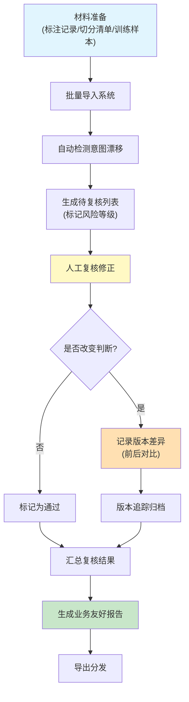

## 1. 产品概述

客服机器人意图漂移检测系统，用于监控和复核客服机器人对话意图识别的准确性。系统从标注记录、切分清单、训练样本等多源材料中发现意图漂移问题，支持人工复核、版本追踪和导出非技术友好的分析报告。

- **核心价值**：帮助业务方快速定位因材料来源复杂（旧表、补录备注、漏填单位等）导致的意图识别偏差，形成从发现、复核到修正的闭环流程
- **目标用户**：平台工程师、标注人员、业务方管理人员

## 2. 核心功能

### 2.1 用户角色

| 角色 | 说明 | 核心权限 |
|------|------|----------|
| 平台工程师 | 负责系统维护、数据导入 | 数据导入、脚本执行、全量复核、导出 |
| 标注人员 | 负责人工复核意图判断 | 逐条复核、修正意图、添加备注 |
| 业务方 | 查看报告、追踪问题 | 查看复核报告、版本差异、错误定位 |

### 2.2 功能模块

1. **材料导入页**：支持多种材料来源导入（标注记录、切分清单、训练样本）
2. **意图复核页**：逐条展示对话内容，对比AI预测与原始标注，支持人工修正
3. **版本追踪页**：展示同一条数据的多次判断历史，支持版本回滚和差异对比
4. **报告导出页**：生成面向非技术人员的可读性报告，包含截断原因、错误定位
5. **配置管理页**：管理提示词版本、检测阈值、导出模板

### 2.3 页面详情

| 页面名称 | 模块名称 | 功能描述 |
|---------|----------|----------|
| 材料导入页 | 上传区域 | 拖拽上传多类材料文件，支持 Excel、CSV、JSON 格式 |
| 材料导入页 | 数据预览 | 展示导入数据预览，标记可疑数据（缺字段、格式异常） |
| 材料导入页 | 导入日志 | 记录每次导入的批次、材料来源、处理状态 |
| 意图复核页 | 对话列表 | 分页展示待复核对话，标注漂移风险等级 |
| 意图复核页 | 对话详情 | 完整对话上下文、AI预测意图、原始标注、置信度 |
| 意图复核页 | 版本面板 | 同一轮复核内展示训练样本、提示词版本、版本回滚记录 |
| 意图复核页 | 修正操作 | 下拉选择正确意图、填写修正原因、保存或批量通过 |
| 版本追踪页 | 历史时间线 | 按时间顺序展示每次判断变更，高亮人工修正 |
| 版本追踪页 | 差异对比 | 并排展示变更前后的意图、置信度、备注信息 |
| 版本追踪页 | 回滚操作 | 一键回滚到任意历史版本，记录回滚原因 |
| 报告导出页 | 报告预览 | 可视化展示漂移统计、高频问题、材料来源分布 |
| 报告导出页 | 截断说明 | 用自然语言解释长文本截断原因，避免字段名和缩写 |
| 报告导出页 | 错误定位 | 明确标识工具调用参数错误发生在哪份具体材料上 |
| 报告导出页 | 导出选项 | 支持 PDF、Excel、Word 格式导出，可选择包含/排除技术细节 |
| 配置管理页 | 提示词版本 | 管理多轮提示词版本，记录生效时间和变更内容 |
| 配置管理页 | 检测阈值 | 配置漂移告警阈值、置信度区间、风险等级划分 |
| 配置管理页 | 导出模板 | 自定义报告模板，设置面向业务方的展示内容 |

## 3. 核心流程

**核心流程说明**：
1. 材料导入阶段：系统接收多种来源的材料，自动检测格式异常和字段缺失
2. 漂移检测阶段：对比AI当前预测与历史标注，计算意图一致性分数
3. 人工复核阶段：标注人员可逐条查看对话上下文，修正意图判断
4. 版本追踪阶段：任何人工修正都会被记录，支持查看前后差异和回滚
5. 报告生成阶段：生成面向业务方的报告，用通俗语言解释技术问题
6. 导出分发阶段：支持多种格式导出，报告中明确标注问题来源

## 4. 用户界面设计

### 4.1 设计风格

- **设计主题**：专业严谨的"数据审计"风格，强调可信度和可追溯性
- **主色调**：深蓝灰 #1e3a5f 作为主色，搭配琥珀橙 #f59e0b 作为告警色，绿色 #10b981 表示正常通过
- **按钮风格**：圆角 6px，悬停有轻微阴影和颜色加深，主按钮采用填充式，次要按钮采用描边式
- **字体选择**：标题使用 "Noto Sans SC" 粗体，正文使用 "Noto Sans SC" 常规，数据表格使用等宽字体增强可读性
- **布局风格**：三栏式布局（左侧导航 + 中间主内容 + 右侧详情/版本面板），卡片式分组，关键数据突出展示
- **图标风格**：使用 lucide-react 线性图标，保持简洁专业，告警场景使用填充图标增强视觉提示

### 4.2 页面设计概览

| 页面名称 | 模块名称 | UI 设计要点 |
|---------|----------|-------------|
| 材料导入页 | 上传区域 | 大尺寸虚线边框上传区，拖拽时背景变色，支持多文件同时上传 |
| 意图复核页 | 对话列表 | 斑马纹表格，风险等级用色块标注，置信度用进度条展示 |
| 意图复核页 | 版本面板 | 时间线式布局，不同类型记录（训练样本/提示词/回滚）用不同颜色标识 |
| 版本追踪页 | 差异对比 | 左右分栏对照，差异部分高亮显示，新增用绿色背景，删除用红色删除线 |
| 报告导出页 | 截断说明 | 卡片式展示，图标 + 自然语言描述，鼠标悬停显示技术细节 |
| 报告导出页 | 错误定位 | 表格中嵌入来源材料链接，点击可直接跳转到对应材料行 |

### 4.3 响应式设计

- **桌面端**：三栏式布局，充分利用宽屏展示上下文信息
- **平板端**：折叠左侧导航为图标模式，右侧详情面板可收起
- **移动端**：单栏流式布局，列表优先展示，详情通过弹窗呈现
- **触控优化**：按钮最小尺寸 44x44px，列表项间距 16px，便于触控操作

### 4.4 动效设计

- **页面加载**：骨架屏渐变加载，关键数据优先渲染
- **状态切换**：复核通过/驳回时，列表项有平滑的背景色过渡动画
- **版本展开**：点击查看历史版本时，面板从右侧滑入，带轻微阴影
- **告警提示**：高风险项有呼吸灯效果（缓慢的透明度变化），吸引注意力
- **报告生成**：进度条动画 + 完成时的勾号弹跳动画
