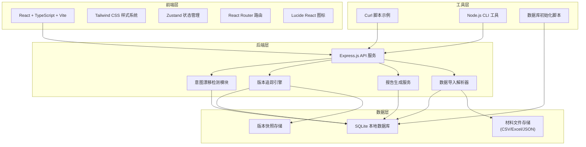
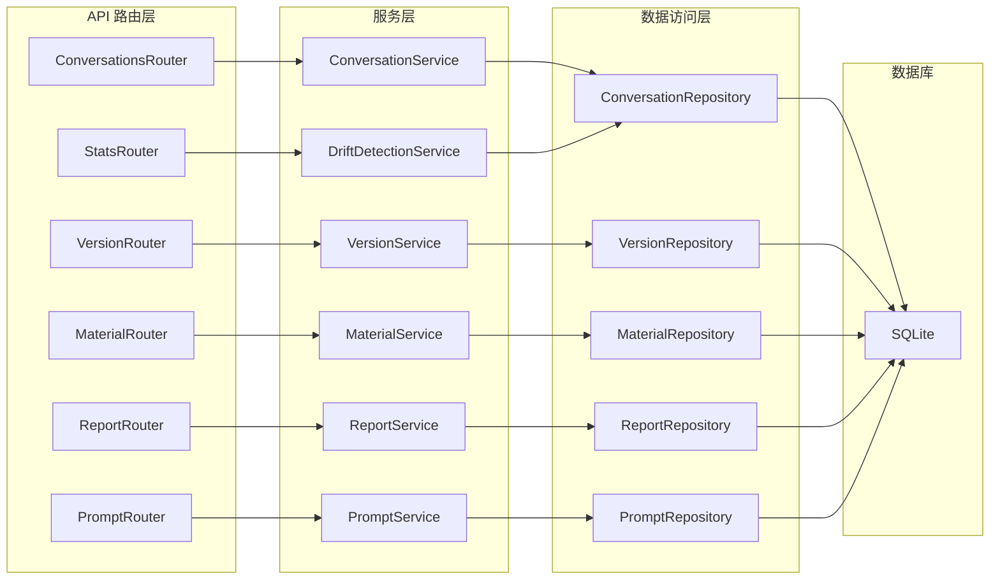
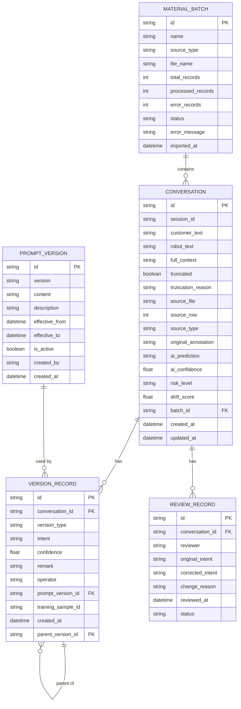

## 1. 架构设计



## 2. 技术描述

- **前端**：React@18 + TypeScript + Vite + TailwindCSS@3 + Zustand + React Router + Lucide React
- **初始化工具**：vite-init (react-express-ts 模板)
- **后端**：Express@4 + TypeScript + better-sqlite3
- **数据库**：SQLite (本地文件存储，无需额外服务)
- **文件解析**：papaparse (CSV)、xlsx (Excel)
- **报告导出**：pdfmake (PDF)、exceljs (Excel)
- **包管理器**：npm (优先使用)

## 3. 路由定义

| 路由路径 | 页面名称 | 说明 |
|----------|----------|------|
| / | 仪表盘 | 复核进度概览、漂移统计、快捷操作 |
| /import | 材料导入 | 文件上传、数据预览、导入日志 |
| /review | 意图复核 | 对话列表、详情面板、修正操作、版本面板 |
| /versions | 版本追踪 | 历史时间线、差异对比、版本回滚 |
| /report | 报告导出 | 报告预览、截断说明、错误定位、导出选项 |
| /settings | 配置管理 | 提示词版本、检测阈值、导出模板 |

## 4. API 定义

### 4.1 TypeScript 类型定义

```typescript
// 材料来源类型
type MaterialSource = 'annotation_record' | 'segmentation_list' | 'training_sample';

// 意图类型
type Intent = 'refund' | 'exchange' | 'complaint' | 'inquiry' | 'technical_support' | 'other';

// 风险等级
type RiskLevel = 'high' | 'medium' | 'low' | 'normal';

// 对话记录
interface Conversation {
  id: string;
  sessionId: string;
  customerText: string;
  robotText: string;
  fullContext: string;
  truncated: boolean;
  truncationReason?: string;
  sourceFile: string;
  sourceRow: number;
  sourceType: MaterialSource;
  originalAnnotation: Intent;
  aiPrediction: Intent;
  aiConfidence: number;
  riskLevel: RiskLevel;
  driftScore: number;
  createdAt: string;
  updatedAt: string;
}

// 版本记录
interface VersionRecord {
  id: string;
  conversationId: string;
  versionType: 'annotation' | 'prediction' | 'manual' | 'rollback';
  intent: Intent;
  confidence: number;
  remark?: string;
  operator: string;
  promptVersion?: string;
  trainingSampleId?: string;
  createdAt: string;
  parentVersionId?: string;
}

// 复核记录
interface ReviewRecord {
  id: string;
  conversationId: string;
  reviewer: string;
  originalIntent: Intent;
  correctedIntent: Intent;
  changeReason: string;
  reviewedAt: string;
  status: 'approved' | 'rejected' | 'pending';
}

// 材料批次
interface MaterialBatch {
  id: string;
  name: string;
  sourceType: MaterialSource;
  fileName: string;
  totalRecords: number;
  processedRecords: number;
  errorRecords: number;
  status: 'pending' | 'processing' | 'completed' | 'failed';
  errorMessage?: string;
  importedAt: string;
}

// 提示词版本
interface PromptVersion {
  id: string;
  version: string;
  content: string;
  description: string;
  effectiveFrom: string;
  effectiveTo?: string;
  isActive: boolean;
  createdBy: string;
  createdAt: string;
}
```

### 4.2 API 接口列表

| 方法 | 路径 | 说明 |
|------|------|------|
| GET | /api/conversations | 获取对话列表（支持分页、筛选） |
| GET | /api/conversations/:id | 获取单条对话详情 |
| PUT | /api/conversations/:id/review | 复核并修正意图 |
| GET | /api/conversations/:id/versions | 获取对话的版本历史 |
| POST | /api/conversations/:id/rollback | 回滚到指定版本 |
| GET | /api/versions/:id/compare | 对比两个版本差异 |
| POST | /api/material/import | 导入材料文件 |
| GET | /api/material/batches | 获取导入批次列表 |
| GET | /api/material/batches/:id | 获取批次详情 |
| POST | /api/report/generate | 生成复核报告 |
| GET | /api/report/download/:id | 下载报告 |
| GET | /api/prompt-versions | 获取提示词版本列表 |
| POST | /api/prompt-versions | 创建新提示词版本 |
| PUT | /api/prompt-versions/:id/activate | 激活提示词版本 |
| GET | /api/stats/dashboard | 获取仪表盘统计数据 |

### 4.3 请求/响应示例

```typescript
// 复核意图请求
interface ReviewRequest {
  correctedIntent: Intent;
  changeReason: string;
  reviewer: string;
}

// 复核意图响应
interface ReviewResponse {
  success: boolean;
  conversation: Conversation;
  newVersion: VersionRecord;
}

// 报告生成请求
interface ReportRequest {
  format: 'pdf' | 'excel' | 'word';
  includeTechnicalDetails: boolean;
  batchIds?: string[];
  dateRange?: {
    start: string;
    end: string;
  };
}

// 报告生成响应
interface ReportResponse {
  reportId: string;
  downloadUrl: string;
  fileName: string;
  fileSize: number;
  generatedAt: string;
}
```

## 5. 服务端架构图



## 6. 数据模型

### 6.1 ER 图



### 6.2 DDL 语句

```sql
-- 材料批次表
CREATE TABLE material_batches (
  id TEXT PRIMARY KEY,
  name TEXT NOT NULL,
  source_type TEXT NOT NULL CHECK (source_type IN ('annotation_record', 'segmentation_list', 'training_sample')),
  file_name TEXT NOT NULL,
  total_records INTEGER DEFAULT 0,
  processed_records INTEGER DEFAULT 0,
  error_records INTEGER DEFAULT 0,
  status TEXT NOT NULL DEFAULT 'pending' CHECK (status IN ('pending', 'processing', 'completed', 'failed')),
  error_message TEXT,
  imported_at DATETIME DEFAULT CURRENT_TIMESTAMP
);

-- 对话记录表
CREATE TABLE conversations (
  id TEXT PRIMARY KEY,
  session_id TEXT NOT NULL,
  customer_text TEXT NOT NULL,
  robot_text TEXT,
  full_context TEXT,
  truncated INTEGER DEFAULT 0,
  truncation_reason TEXT,
  source_file TEXT NOT NULL,
  source_row INTEGER NOT NULL,
  source_type TEXT NOT NULL,
  original_annotation TEXT NOT NULL,
  ai_prediction TEXT NOT NULL,
  ai_confidence REAL NOT NULL,
  risk_level TEXT NOT NULL DEFAULT 'normal' CHECK (risk_level IN ('high', 'medium', 'low', 'normal')),
  drift_score REAL DEFAULT 0,
  batch_id TEXT NOT NULL,
  created_at DATETIME DEFAULT CURRENT_TIMESTAMP,
  updated_at DATETIME DEFAULT CURRENT_TIMESTAMP,
  FOREIGN KEY (batch_id) REFERENCES material_batches(id)
);

-- 版本追踪表
CREATE TABLE version_records (
  id TEXT PRIMARY KEY,
  conversation_id TEXT NOT NULL,
  version_type TEXT NOT NULL CHECK (version_type IN ('annotation', 'prediction', 'manual', 'rollback')),
  intent TEXT NOT NULL,
  confidence REAL DEFAULT 1.0,
  remark TEXT,
  operator TEXT NOT NULL,
  prompt_version_id TEXT,
  training_sample_id TEXT,
  created_at DATETIME DEFAULT CURRENT_TIMESTAMP,
  parent_version_id TEXT,
  FOREIGN KEY (conversation_id) REFERENCES conversations(id),
  FOREIGN KEY (prompt_version_id) REFERENCES prompt_versions(id),
  FOREIGN KEY (parent_version_id) REFERENCES version_records(id)
);

-- 复核记录表
CREATE TABLE review_records (
  id TEXT PRIMARY KEY,
  conversation_id TEXT NOT NULL,
  reviewer TEXT NOT NULL,
  original_intent TEXT NOT NULL,
  corrected_intent TEXT NOT NULL,
  change_reason TEXT NOT NULL,
  reviewed_at DATETIME DEFAULT CURRENT_TIMESTAMP,
  status TEXT NOT NULL DEFAULT 'approved' CHECK (status IN ('approved', 'rejected', 'pending')),
  FOREIGN KEY (conversation_id) REFERENCES conversations(id)
);

-- 提示词版本表
CREATE TABLE prompt_versions (
  id TEXT PRIMARY KEY,
  version TEXT NOT NULL UNIQUE,
  content TEXT NOT NULL,
  description TEXT,
  effective_from DATETIME NOT NULL,
  effective_to DATETIME,
  is_active INTEGER DEFAULT 0,
  created_by TEXT NOT NULL,
  created_at DATETIME DEFAULT CURRENT_TIMESTAMP
);

-- 报告表
CREATE TABLE reports (
  id TEXT PRIMARY KEY,
  batch_ids TEXT,
  format TEXT NOT NULL,
  include_technical_details INTEGER DEFAULT 0,
  file_name TEXT NOT NULL,
  file_path TEXT NOT NULL,
  file_size INTEGER NOT NULL,
  generated_by TEXT NOT NULL,
  generated_at DATETIME DEFAULT CURRENT_TIMESTAMP
);

-- 索引
CREATE INDEX idx_conversations_batch_id ON conversations(batch_id);
CREATE INDEX idx_conversations_risk_level ON conversations(risk_level);
CREATE INDEX idx_version_records_conversation_id ON version_records(conversation_id);
CREATE INDEX idx_review_records_conversation_id ON review_records(conversation_id);
CREATE INDEX idx_material_batches_status ON material_batches(status);
```

### 6.3 初始化数据

```sql
-- 插入初始提示词版本
INSERT INTO prompt_versions (id, version, content, description, effective_from, is_active, created_by)
VALUES 
  ('pv_001', 'v1.0.0', '你是一个客服机器人，请识别用户意图...', '初始版本，基础意图分类', '2026-01-01 00:00:00', 0, 'system'),
  ('pv_002', 'v1.1.0', '你是一个客服机器人，请识别用户意图，包括退款、换货、投诉、咨询、技术支持等分类...', '优化意图分类描述，增加投诉类别', '2026-03-15 00:00:00', 0, 'engineer_li'),
  ('pv_003', 'v2.0.0', '你是一个专业的电商客服机器人，请根据对话上下文识别用户真实意图...', '大版本升级，增加上下文理解能力', '2026-06-01 00:00:00', 1, 'engineer_wang');

-- 插入样例材料批次
INSERT INTO material_batches (id, name, source_type, file_name, total_records, processed_records, status)
VALUES 
  ('batch_001', '6月上旬标注记录', 'annotation_record', 'annotations_20260601_0610.xlsx', 156, 156, 'completed'),
  ('batch_002', '临时补录切分清单', 'segmentation_list', 'segmentation_temp_20260612.csv', 89, 89, 'completed'),
  ('batch_003', '历史训练样本(带旧备注)', 'training_sample', 'training_samples_with_remarks_202605.json', 234, 234, 'completed');
```
