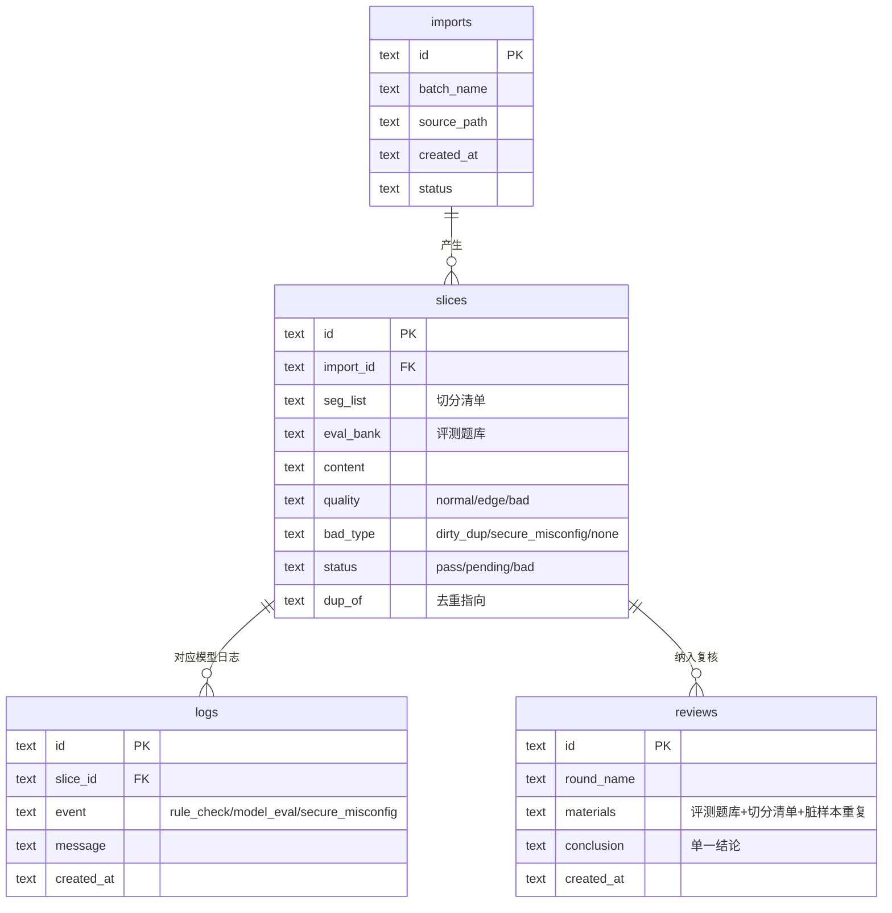

# 技术架构文档：知识库切片质量检查工具

## 1. 架构设计

```mermaid
flowchart TD
    subgraph Frontend "前端 React + Vite + Tailwind"
        "F1: 分布统计页"
        "F2: 切片质检页"
        "F3: 复核轮次页"
        "F4: 日志溯源页"
        "F5: 导入导出页"
    end
    subgraph Backend "后端 Express + TypeScript(ESM)"
        "B1: 统计API"
        "B2: 质检API"
        "B3: 复核API"
        "B4: 溯源API"
        "B5: 导入导出API"
    end
    subgraph Data "数据层 SQLite(better-sqlite3)"
        "D1: slices 切片表"
        "D2: reviews 复核轮次"
        "D3: logs 模型日志"
        "D4: imports 导入批次"
    end
    "F1" --> "B1"
    "F2" --> "B2"
    "F3" --> "B3"
    "F4" --> "B4"
    "F5" --> "B5"
    "B1" --> "D1"
    "B2" --> "D1"
    "B3" --> "D2"
    "B4" --> "D3"
    "B5" --> "D4"
```

## 2. 技术说明

- 前端：React@18 + tailwindcss@3 + vite + zustand（状态管理）+ react-router-dom。
- 初始化工具：vite-init，模板 react-express-ts。
- 后端：Express@4 + TypeScript(ESM)。
- 数据库：SQLite（better-sqlite3，文件型，空目录首跑即建库），内置种子数据。
- 图标：lucide-react。
- 字体：Fraunces / IBM Plex Sans / IBM Plex Mono（Google Fonts）。

## 3. 路由定义

| 路由 | 用途 |
|-------|------|
| / | 分布统计页（日常入口） |
| /quality | 切片质检页（坏记录拎取） |
| /reviews | 复核轮次页（同轮材料） |
| /trace | 日志溯源页（倒查链路） |
| /io | 导入导出页（首跑引导/导入/导出对账） |

## 4. API 定义

```typescript
// 统计
GET  /api/stats/overview        // 质检总览 + 坏记录分类 + 去重可解释性
// 质检
GET  /api/slices?filter=bad     // 坏记录优先，支持 normal/edge/bad 样例
GET  /api/slices/:id            // 切片详情
// 复核
GET  /api/reviews               // 复核轮次列表(含评测题库/切分清单/脏样本重复)
POST /api/reviews/:id/resolve   // 归一单一结论
// 溯源
GET  /api/trace/:recordId       // 结果->处理记录->来源切片->导入批次
// 导入导出
GET  /api/io/guide              // 空目录首跑引导(依赖/命令/样例路径)
POST /api/io/import             // 导入切片(检测重复/冲突)
GET  /api/io/export             // 导出(与界面摘要字段对齐)
GET  /api/io/reconcile          // 导出对账(页面摘要 vs 文件内容)
```

## 5. 服务端架构图

```mermaid
flowchart LR
    "Controller" --> "Service" --> "Repository" --> "SQLite"
```

- Controller：路由与参数校验。
- Service：坏记录识别、去重、溯源拼装、导出对账业务逻辑。
- Repository：better-sqlite3 直查。

## 6. 数据模型

### 6.1 数据模型定义



### 6.2 数据定义语言

```sql
CREATE TABLE IF NOT EXISTS imports (
  id TEXT PRIMARY KEY,
  batch_name TEXT NOT NULL,
  source_path TEXT NOT NULL,
  created_at TEXT NOT NULL,
  status TEXT NOT NULL DEFAULT 'ok'
);

CREATE TABLE IF NOT EXISTS slices (
  id TEXT PRIMARY KEY,
  import_id TEXT NOT NULL,
  seg_list TEXT,
  eval_bank TEXT,
  content TEXT NOT NULL,
  quality TEXT NOT NULL,
  bad_type TEXT NOT NULL DEFAULT 'none',
  status TEXT NOT NULL DEFAULT 'pending',
  dup_of TEXT,
  created_at TEXT NOT NULL,
  FOREIGN KEY (import_id) REFERENCES imports(id)
);

CREATE TABLE IF NOT EXISTS logs (
  id TEXT PRIMARY KEY,
  slice_id TEXT NOT NULL,
  event TEXT NOT NULL,
  message TEXT NOT NULL,
  created_at TEXT NOT NULL,
  FOREIGN KEY (slice_id) REFERENCES slices(id)
);

CREATE TABLE IF NOT EXISTS reviews (
  id TEXT PRIMARY KEY,
  round_name TEXT NOT NULL,
  materials TEXT NOT NULL,
  conclusion TEXT,
  created_at TEXT NOT NULL
);

CREATE INDEX IF NOT EXISTS idx_slices_quality ON slices(quality);
CREATE INDEX IF NOT EXISTS idx_slices_bad_type ON slices(bad_type);
CREATE INDEX IF NOT EXISTS idx_logs_slice ON logs(slice_id);
```
