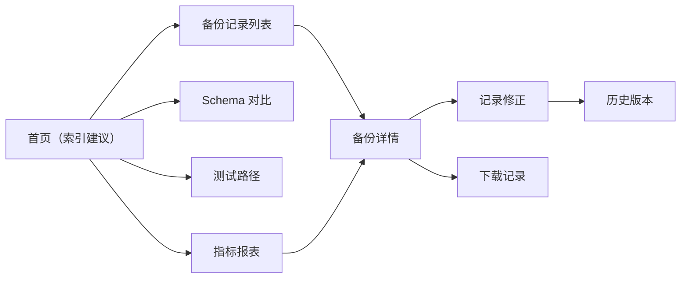

## 1. 产品概述

备份恢复演练台是面向安全审计员的本地 Web 工作台，用于管理和审计数据库备份记录，解决备份记录与慢查询日志对不上、字段类型漂移混入正常结果等问题。

- **核心用户**：安全审计员
- **主要问题**：备份记录与慢查询日志对账困难、重复导入导致数据混乱、字段类型漂移难发现
- **产品价值**：提供备份记录全生命周期管理，支持索引建议日常巡检、Schema 对比定期审计，确保备份数据一致性和可追溯性

## 2. 核心特性

### 2.1 用户角色

| 角色 | 登录方式 | 核心权限 |
|------|----------|----------|
| 安全审计员 | 本地登录 | 查看备份记录、修正记录、导出数据、运行测试场景、查看索引建议和 Schema 对比 |

### 2.2 功能模块

1. **首页（索引建议）**：日常入口，展示索引优化建议和备份概览
2. **备份记录列表**：分页列表展示备份记录，支持筛选和搜索
3. **备份详情**：单条备份完整信息，字段类型标记，慢查询关联
4. **记录修正**：修正备份记录字段，保留历史版本
5. **历史版本**：查看修正历史，支持回滚对比
6. **Schema 对比**：月底/课前使用，对比备份前后 Schema 差异
7. **测试路径**：重复导入场景测试，验证工具正确性
8. **指标报表**：备份质量指标，可跳转至最终结论

### 2.3 页面详情

| 页面名称 | 模块名称 | 功能描述 |
|----------|----------|----------|
| 首页（索引建议） | 概览卡片 | 备份总数、异常数、待修正数、字段漂移数 |
| 首页（索引建议） | 索引建议列表 | 展示索引优化建议，支持一键查看关联备份 |
| 首页（索引建议） | 快捷入口 | 快速跳转到 Schema 对比、测试路径、指标报表 |
| 备份记录列表 | 筛选栏 | 按时间、状态、表名、字段类型筛选 |
| 备份记录列表 | 数据表格 | 分页展示，支持排序，字段漂移高亮 |
| 备份详情页 | 基本信息 | 备份时间、来源、表名、记录数 |
| 备份详情页 | 字段详情 | 字段类型对比，漂移字段标记，慢查询关联 |
| 备份详情页 | 修正操作 | 修正字段类型、添加备注、保存修正 |
| 历史版本页 | 时间线 | 历次修正记录时间线展示 |
| 历史版本页 | 版本对比 | 相邻版本差异对比，支持回滚 |
| Schema 对比页 | 对比选择 | 选择两个备份版本进行对比 |
| Schema 对比页 | 差异展示 | 字段增减、类型变化、索引变化高亮展示 |
| 测试路径页 | 重复导入场景 | 模拟重复导入，验证去重逻辑 |
| 测试路径页 | 测试结果 | 展示测试通过/失败，给出结论 |
| 指标报表页 | 质量指标 | 备份完整率、字段漂移率、修正及时率 |
| 指标报表页 | 结论跳转 | 点击指标可跳转至对应备份记录详情 |

## 3. 核心流程

安全审计员日常从索引建议入口进入，查看索引优化建议和备份概览；发现异常备份记录时，进入详情页查看字段漂移情况；需要修正时进行字段修正，系统自动保留历史版本；月底使用 Schema 对比功能审计备份一致性；通过测试路径验证重复导入场景；从指标报表可一键跳转至结论对应的备份记录。

## 4. 用户界面设计

### 4.1 设计风格

- **主色调**：深海军蓝 (#0F2A4A)，代表专业、安全、可靠
- **辅助色**：琥珀橙 (#FF8A3D) 用于高亮异常和漂移字段，翠绿 (#22C55E) 用于正常状态
- **背景色**：深灰蓝 (#112240) + 微妙噪点纹理，营造审计工具的专业感
- **按钮风格**：方形微圆角，2px 边框，悬停有发光效果
- **字体**：标题使用 JetBrains Mono 等宽字体，正文使用 Inter，突出技术工具属性
- **布局风格**：左侧导航栏 + 右侧内容区，卡片式布局，信息密度高
- **图标风格**：线性细边图标，配合状态点指示

### 4.2 页面设计概览

| 页面名称 | 模块名称 | UI 元素 |
|----------|----------|---------|
| 首页 | 概览卡片 | 深色卡片、数字跳动动画、状态色标签 |
| 首页 | 索引建议列表 | 斑马纹表格、漂移字段琥珀色高亮 |
| 备份记录列表 | 数据表格 | 固定表头、悬停高亮、分页器 |
| 备份详情 | 字段详情 | 左右对比布局、差异连接线、类型标签 |
| 历史版本 | 时间线 | 垂直时间线、版本卡片、diff 展示 |
| Schema 对比 | 差异展示 | 三列布局（旧/差异/新）、增删颜色标记 |
| 测试路径 | 测试场景 | 步骤指示器、结果状态徽章 |
| 指标报表 | 图表区 | 柱状图 + 折线图、可点击数据点 |

### 4.3 响应式

- Desktop-first 设计，主内容区最小宽度 1024px
- 左侧导航栏在窄屏可折叠为图标模式
- 表格支持横向滚动，确保移动端可用

### 4.4 动效设计

- 页面加载：元素渐入 + 轻微上移动画，错开延迟
- 状态变化：数字滚动动画、进度条平滑过渡
- 悬停效果：卡片微上浮 + 阴影加深、边框发光
- 页面切换：淡入淡出过渡，保持导航栏不动
- 字段漂移标记：脉冲呼吸动画，吸引注意力
