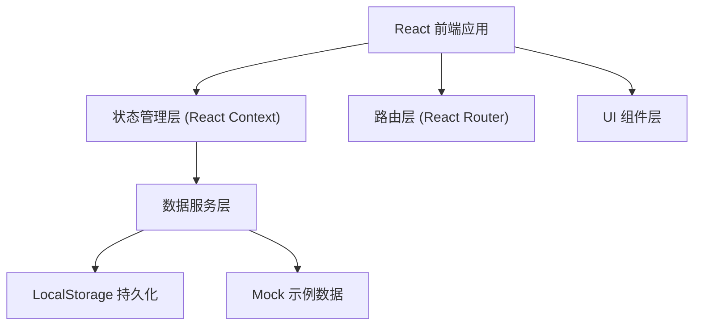
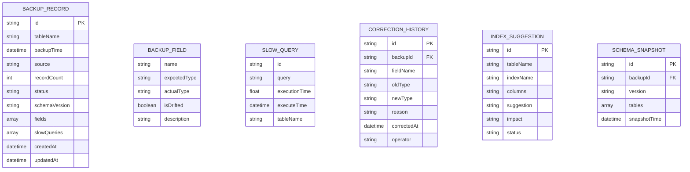

## 1. 架构设计



## 2. 技术描述

- **前端框架**：React@18 + TypeScript
- **构建工具**：Vite@5
- **样式方案**：TailwindCSS@3
- **路由管理**：react-router-dom@6
- **图表库**：recharts（用于指标报表）
- **状态管理**：React Context + useReducer
- **数据持久化**：LocalStorage（本地工作台，无需后端）
- **图标库**：lucide-react
- **初始数据**：内置 Mock 示例数据，首次打开即可使用

## 3. 路由定义

| 路由 | 页面名称 | 用途 |
|------|----------|------|
| / | 首页（索引建议） | 日常入口，展示索引建议和备份概览 |
| /backups | 备份记录列表 | 分页展示所有备份记录，支持筛选 |
| /backups/:id | 备份详情 | 查看单条备份完整信息和字段详情 |
| /backups/:id/history | 历史版本 | 查看修正历史和版本对比 |
| /schema-compare | Schema 对比 | 对比两个备份的 Schema 差异 |
| /test-suite | 测试路径 | 重复导入场景测试 |
| /reports | 指标报表 | 备份质量指标和结论跳转 |

## 4. 数据模型

### 4.1 数据模型定义



### 4.2 核心数据结构 (TypeScript)

```typescript
interface BackupField {
  name: string;
  expectedType: string;
  actualType: string;
  isDrifted: boolean;
  description: string;
}

interface SlowQuery {
  id: string;
  query: string;
  executionTime: number;
  executeTime: string;
  tableName: string;
}

interface BackupRecord {
  id: string;
  tableName: string;
  backupTime: string;
  source: string;
  recordCount: number;
  status: 'normal' | 'warning' | 'error';
  schemaVersion: string;
  fields: BackupField[];
  slowQueries: SlowQuery[];
  createdAt: string;
  updatedAt: string;
}

interface CorrectionHistory {
  id: string;
  backupId: string;
  fieldName: string;
  oldType: string;
  newType: string;
  reason: string;
  correctedAt: string;
  operator: string;
}

interface IndexSuggestion {
  id: string;
  tableName: string;
  indexName: string;
  columns: string[];
  suggestion: string;
  impact: 'high' | 'medium' | 'low';
  status: 'pending' | 'applied' | 'rejected';
  relatedBackupId?: string;
}
```

## 5. 功能模块划分

### 5.1 组件结构

```
src/
├── components/
│   ├── Layout/              # 布局组件（导航栏、侧边栏）
│   ├── common/              # 通用组件（卡片、按钮、表格、标签）
│   ├── BackupList/          # 备份列表相关组件
│   ├── BackupDetail/        # 备份详情相关组件
│   ├── HistoryTimeline/     # 历史时间线组件
│   ├── SchemaCompare/       # Schema 对比组件
│   ├── TestSuite/           # 测试套件组件
│   └── ReportCharts/        # 报表图表组件
├── pages/                   # 页面组件
├── context/                 # React Context 状态管理
├── data/                    # Mock 数据
├── types/                   # TypeScript 类型定义
├── utils/                   # 工具函数
└── hooks/                   # 自定义 Hooks
```

### 5.2 核心功能实现要点

1. **字段漂移检测**：对比 expectedType 和 actualType，标记 isDrifted
2. **重复导入去重**：基于 backupTime + tableName + source 做唯一键判断
3. **修正历史追踪**：每次修正创建 CorrectionHistory 记录，支持回滚
4. **Schema 对比**：diff 算法对比两个快照的字段、类型、索引变化
5. **指标报表**：统计漂移率、修正率、完整率等，支持点击跳转
6. **本地存储**：所有数据持久化到 localStorage，刷新不丢失
7. **示例数据**：首次加载自动注入 Mock 数据，包含正常、漂移、修正等场景
