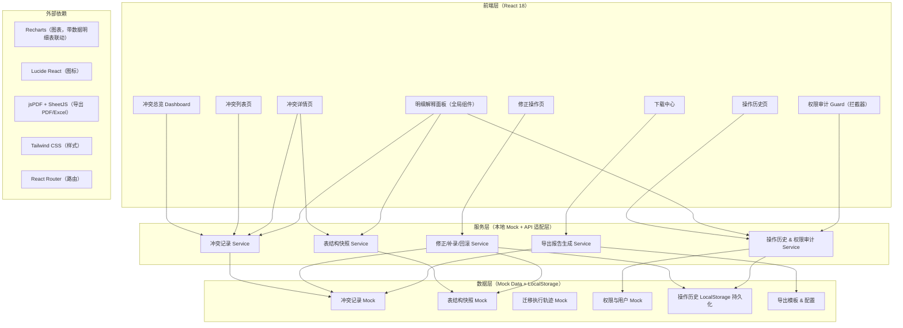
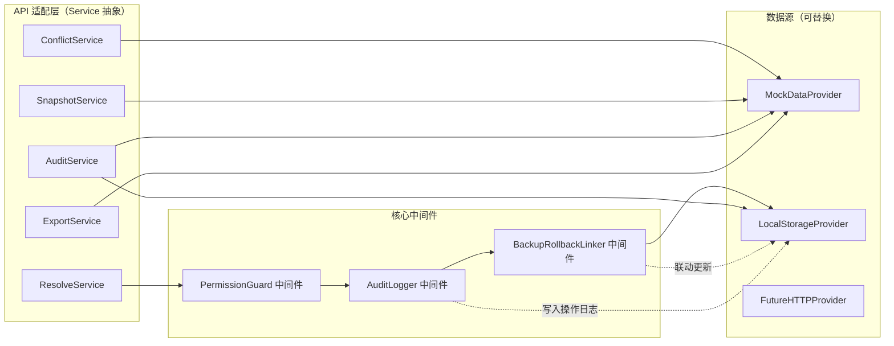
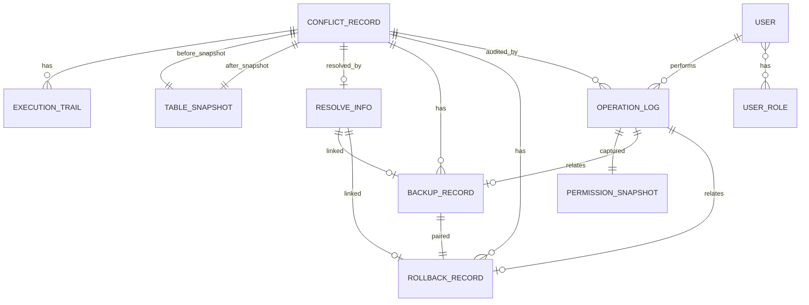

## 1. 架构设计



---

## 2. 技术说明

- **前端框架**：React@18 + TypeScript@5 + Vite@6（快速构建本地开发服务器）
- **样式方案**：Tailwind CSS@3 + CSS Variables（主题色统一管理，明细解释面板强调色动态切换）
- **初始化工具**：`npm create vite@latest idempotent-conflict-report -- --template react-ts`
- **后端适配**：无真实后端，采用 **Mock Service Layer**，通过 Service 抽象层封装，后续可无缝替换为真实 API 调用；操作历史与临时状态持久化到 LocalStorage
- **数据库**：无，全部使用 TypeScript 类型驱动的 Mock 数据 + LocalStorage
- **图表库**：Recharts（LineChart, BarChart, PieChart），每个图表组件右侧同步渲染明细解释 DataTable
- **导出库**：jsPDF（PDF，含中文支持） + SheetJS / xlsx（Excel / CSV）
- **路由**：React Router DOM@6
- **图标**：Lucide React
- **状态管理**：React Context（全局筛选条件、当前用户权限快照）+ useReducer（修正流程多步状态）

---

## 3. 路由定义

| 路由路径 | 页面组件 | 页面用途 |
|---------|---------|---------|
| `/` | `Redirect` → `/dashboard` | 根路径重定向 |
| `/dashboard` | `DashboardPage` | 冲突总览：趋势图+明细表、严重度分布、拦截原因 Top |
| `/conflicts` | `ConflictListPage` | 冲突列表：多维筛选、表格、批量操作 |
| `/conflicts/:id` | `ConflictDetailPage` | 冲突详情：主记录、表结构快照对比、迁移轨迹、幂等键分析 + 右侧明细解释 |
| `/conflicts/:id/resolve` | `ResolveConflictPage` | 修正操作：策略选择、备份补录联动、回滚预览、二次确认 |
| `/history` | `OperationHistoryPage` | 操作历史：时间线、权限审计链、补录-回滚对应关系 |
| `/downloads` | `DownloadCenterPage` | 下载中心：导出配置、预览、导出历史 |
| `/downloads/:jobId/preview` | `ExportPreviewPage` | 导出报告预览（模拟翻页） |
| `*` | `NotFoundPage` | 404 页 |

---

## 4. 类型与数据模型定义

```typescript
// ============ 核心实体 ============

type ConflictSeverity = 'critical' | 'warning' | 'info';
type ConflictStatus = 'pending' | 'in_progress' | 'resolved' | 'ignored' | 'unavailable';
type ResolveStrategy = 'skip' | 'overwrite' | 'merge' | 'manual';
type OperationType = 'view' | 'resolve' | 'backup' | 'rollback' | 'export' | 'assign' | 'permission_change';

interface ConflictRecord {
  id: string;
  migrationTaskId: string;
  migrationTaskName: string;
  orderNo: string;
  idempotentKey: string;
  idempotentKeyType: 'order_no' | 'biz_id' | 'unique_hash' | 'composite';
  conflictType: 'duplicate_execution' | 'schema_mismatch' | 'key_collision';
  severity: ConflictSeverity;
  firstExecuteTime: string;
  lastExecuteTime: string;
  duplicateAttempts: number;
  status: ConflictStatus;
  assignee?: string;
  currentOwner: string;
  snapshotBeforeId: string;
  snapshotAfterId: string;
  executionTrailIds: string[];
  resolveInfo?: ResolveInfo;
  createdAt: string;
  updatedAt: string;
  tags: string[];
  unavailableReasons?: string[];
}

interface TableSnapshot {
  id: string;
  snapshotName: string;
  tableName: string;
  capturedAt: string;
  migrationVersion: string;
  fields: SnapshotField[];
  rowCount: number;
  checksum: string;
}

interface SnapshotField {
  name: string;
  dataType: string;
  nullable: boolean;
  defaultValue?: string;
  comment?: string;
  ordinalPosition: number;
  changeType?: 'added' | 'removed' | 'modified' | 'unchanged';
  oldValue?: string;
  newValue?: string;
  impactNote?: string;
}

interface ExecutionTrail {
  id: string;
  conflictId: string;
  attemptNo: number;
  executedAt: string;
  nodeName: string;
  operator: string;
  inputSummary: Record<string, unknown>;
  result: 'blocked' | 'failed' | 'partial';
  blockReason: string;
  blockRule: string;
  fullLogPath: string;
}

interface ResolveInfo {
  strategy: ResolveStrategy;
  resolvedAt: string;
  resolvedBy: string;
  remark: string;
  backupRecordId?: string;
  rollbackRecordId?: string;
  changes: Record<string, { before: unknown; after: unknown }>;
}

interface BackupRecord {
  id: string;
  conflictId: string;
  linkedResolveInfoId: string;
  createdAt: string;
  createdBy: string;
  backupScope: 'full_row' | 'changed_fields' | 'custom';
  backupData: Record<string, unknown>;
  restored: boolean;
  restoredAt?: string;
}

interface RollbackRecord {
  id: string;
  conflictId: string;
  linkedBackupId: string;
  linkedResolveInfoId: string;
  updatedAt: string;
  updatedBy: string;
  rollbackStatus: 'pending' | 'applied' | 'verified' | 'failed';
  fieldRollbacks: Record<string, { from: unknown; to: unknown; appliedAt?: string }>;
}

// ============ 权限与审计 ============

interface UserRole {
  id: string;
  name: 'audit_readonly' | 'data_ops' | 'admin';
  displayName: string;
  permissions: PermissionKey[];
}

type PermissionKey =
  | 'conflict:view'
  | 'conflict:resolve'
  | 'conflict:assign'
  | 'backup:create'
  | 'rollback:update'
  | 'history:view'
  | 'history:audit_chain'
  | 'export:run'
  | 'user:manage';

interface User {
  id: string;
  username: string;
  displayName: string;
  roleIds: string[];
  effectivePermissions: PermissionKey[];
  lastPermissionChangeAt?: string;
}

interface PermissionSnapshot {
  id: string;
  operationId: string;
  userId: string;
  capturedAt: string;
  roleIdsAtThatTime: string[];
  permissionsAtThatTime: PermissionKey[];
  permissionSource: 'role_grant' | 'temporary_authorization' | 'inheritance';
  valid: boolean;
}

interface OperationLog {
  id: string;
  conflictId?: string;
  operationType: OperationType;
  operatorId: string;
  operatorName: string;
  operatedAt: string;
  permissionSnapshotId: string;
  detail: Record<string, unknown>;
  beforeState?: Record<string, unknown>;
  afterState?: Record<string, unknown>;
  relatedBackupId?: string;
  relatedRollbackId?: string;
  remark?: string;
}

// ============ 导出 ============

type ExportFormat = 'pdf' | 'xlsx' | 'csv';
type ExportScope = 'current_filter' | 'all' | 'single';

interface ExportJob {
  id: string;
  format: ExportFormat;
  scope: ExportScope;
  filterCriteria?: Record<string, unknown>;
  singleConflictId?: string;
  includeExplanations: boolean;
  includeCharts: boolean;
  includeSnapshots: boolean;
  includeAuditSummary: boolean;
  status: 'queued' | 'generating' | 'done' | 'failed';
  createdAt: string;
  createdBy: string;
  completedAt?: string;
  fileName: string;
  fileSizeKb?: number;
  downloadCount: number;
}
```

---

## 5. 服务层架构图



**关键中间件说明**：
- `PermissionGuard`：每次操作前读取当前权限、生成权限快照（非一次性），与历史操作时的权限对比
- `AuditLogger`：每次操作后自动写入操作日志，关联权限快照 ID
- `BackupRollbackLinker`：修正提交时，备份补录写入后自动触发回滚记录更新，并建立双向关联

---

## 6. 数据模型 ER 图



---

## 7. Mock 初始数据要点

- 生成 60–80 条冲突记录，覆盖 3 种严重度、5 种状态、近 30 天时间分布
- 每个冲突关联 2–8 条执行轨迹，模拟多次重复尝试
- 生成 40 组表结构快照（before/after 配对），包含字段新增、删除、类型变更三类差异，每条差异附 `impactNote`
- 生成 3 个用户角色、6 个示例用户，每个用户带不同权限组合
- 预填 20+ 条操作历史，含"补录 + 回滚联动"的完整审计链样例
- 预填 5 条导出历史，覆盖不同格式与范围

---

## 8. 导出报告内容结构规范（保障只读导出也能看懂）

**PDF / Excel 报告必含章节**：
1. 封面 + 导出元信息（导出人、时间、范围、筛选条件）
2. 执行摘要（总数、严重度分布、处理率、不可用记录数 Top 原因）
3. 冲突趋势图（**必附数据明细表**，不单独放图）
4. 严重度分布（**每个严重度附文字定义 + 样例记录**）
5. 拦截原因详解（**每个原因 3 段式：是什么 / 为什么被拦 / 建议处理**）
6. 不可用记录清单（**每条附"不可用原因明细"和"建议后续动作"**，月底转交重点）
7. 表结构快照差异集（**每条差异附"影响说明"字段**，而非只高亮颜色）
8. 迁移重复执行被拦样例详解（**选取 3 条典型记录，完整展示拦截逻辑 + 判定链**）
9. 附录：权限审计摘要（操作人 + 权限快照 + 操作统计）
