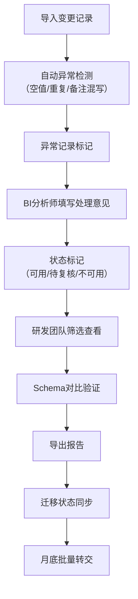

## 1. 产品概述
数据字典变更提醒系统，用于管理BI数据字典的变更流程，解决变更记录丢失、前后差异难追溯、异常数据难发现的问题。目标用户为BI分析师和研发团队，核心价值是确保数据迁移的准确性和可追溯性。

## 2. 核心特性

### 2.1 用户角色
| 角色 | 注册方式 | 核心权限 |
|------|----------|----------|
| BI分析师 | 内部账号 | 导入变更记录、标记异常、填写处理意见、导出报告、执行Schema对比 |
| 研发团队 | 内部账号 | 查看变更列表、查看详情、筛选不可用记录、查看状态标记 |
| 管理员 | 内部账号 | 权限管理、系统配置、查看所有操作日志 |

### 2.2 功能模块
1. **变更记录列表页**：导入、筛选、状态展示、批量操作、导出
2. **变更详情页**：来源信息、前后差异、异常标记、处理意见、迁移状态
3. **Schema对比页**：版本选择、字段对比、差异高亮、导出对比报告
4. **权限管理页**：角色分配、权限清单、操作日志

### 2.3 页面详情
| 页面名称 | 模块名称 | 功能描述 |
|---------|----------|----------|
| 变更记录列表 | 导入模块 | 支持Excel/CSV导入，自动检测重复、空值、备注混写等异常 |
| 变更记录列表 | 筛选模块 | 按状态（可用/待复核/不可用）、异常类型、时间范围、责任人筛选 |
| 变更记录列表 | 列表展示 | 显示记录ID、表名、字段名、变更类型、状态、异常标签、更新时间 |
| 变更记录列表 | 批量操作 | 批量标记状态、批量导出、月底转交功能 |
| 变更详情页 | 来源信息 | 显示工单编号、业务描述、原始材料链接 |
| 变更详情页 | 前后对比 | 变更前schema、变更后schema、差异高亮显示 |
| 变更详情页 | 异常处理 | 异常类型说明、处理意见输入框、状态流转按钮 |
| 变更详情页 | 迁移状态 | 同步状态、最后同步时间、来源材料回写记录 |
| Schema对比页 | 版本选择 | 选择两个版本进行对比 |
| Schema对比页 | 对比结果 | 新增字段、删除字段、类型变更、注释变更，按类别分组 |
| Schema对比页 | 导出报告 | 导出PDF/Excel格式的对比报告 |
| 权限管理页 | 角色管理 | 查看和分配用户角色 |
| 权限管理页 | 权限清单 | 各角色权限明细、权限版本历史 |

## 3. 核心流程

BI分析师导入变更记录 → 系统自动检测异常 → BI分析师标记处理意见和状态 → 研发团队查看筛选不可用记录 → Schema对比确认差异 → 导出报告 → 迁移状态同步回来源材料 → 月底批量转交。

## 4. 用户界面设计

### 4.1 设计风格
- **主色调**：深灰蓝（#1E3A5F）作为主色，体现专业和可靠
- **辅助色**：
  - 绿色（#10B981）：可用状态
  - 橙色（#F59E0B）：待复核状态
  - 红色（#EF4444）：不可用/异常状态
  - 蓝色（#3B82F6）：操作按钮
- **按钮风格**：方角矩形，2px边框，悬停时背景色加深
- **字体**：
  - 标题：JetBrains Mono 等宽字体，体现技术感
  - 正文：Noto Sans SC，清晰易读
- **布局风格**：顶部导航+左侧筛选+右侧内容区，典型的后台管理系统布局
- **图标风格**：线性简约图标，使用Lucide图标库

### 4.2 页面设计概述
| 页面名称 | 模块名称 | UI元素 |
|---------|----------|--------|
| 变更记录列表 | 顶部操作区 | 导入按钮、导出按钮、Schema对比入口、月底转交按钮、搜索框 |
| 变更记录列表 | 左侧筛选区 | 状态筛选、异常类型筛选、时间范围、责任人筛选、重置按钮 |
| 变更记录列表 | 数据表格 | 斑马纹行、状态色标、异常标签、悬停高亮、点击进入详情 |
| 变更详情页 | 头部区域 | 记录ID、状态徽章、快速操作按钮 |
| 变更详情页 | 信息卡片 | 三栏布局：来源信息、变更信息、处理信息 |
| 变更详情页 | 对比区域 | 左右分栏对比，差异行背景高亮 |
| 变更详情页 | 操作区 | 处理意见文本框、状态切换按钮组、保存按钮 |
| Schema对比页 | 版本选择 | 下拉选择两个版本，对比按钮 |
| Schema对比页 | 对比结果 | 分类标签页（新增/删除/修改）、差异统计表 |
| 权限管理页 | 角色列表 | 卡片式展示各角色权限、编辑按钮 |

### 4.3 响应性
- 桌面端（1200px+）：完整三栏布局
- 平板端（768px-1199px）：筛选区可折叠，表格横向滚动
- 移动端（<768px）：卡片式列表展示，筛选转为底部弹出层

### 4.4 微交互
- 表格行悬停：背景色微变+右侧浮现操作按钮
- 状态切换：平滑过渡动画+状态标签滑入效果
- 异常标记：图标轻微抖动提示
- 导入进度：顶部进度条+实时统计更新
- 页面加载：骨架屏占位
