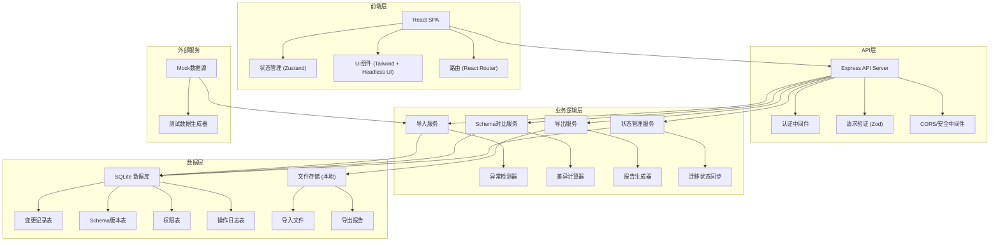
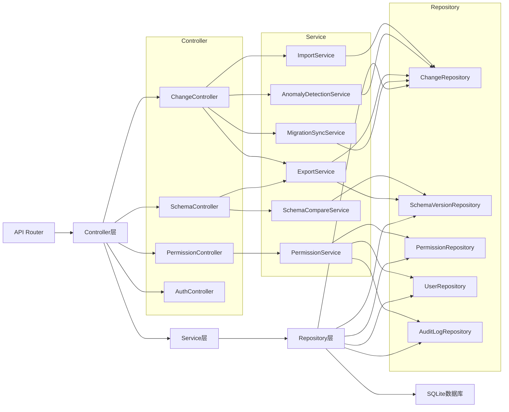
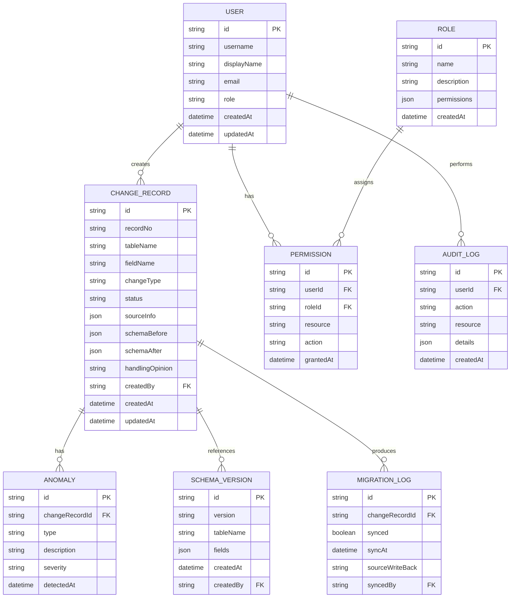

## 1. 架构设计



## 2. 技术描述

- **前端**：React@18 + TypeScript + tailwindcss@3 + vite@5
- **状态管理**：Zustand（轻量级，适合后台系统）
- **UI组件**：Headless UI + Lucide React 图标
- **后端**：Express@4 + TypeScript
- **数据库**：SQLite（使用better-sqlite3，单文件部署方便）
- **ORM**：Prisma
- **验证**：Zod
- **文件处理**：xlsx（Excel处理）、papaparse（CSV处理）
- **导出**：exceljs（Excel导出）、jspdf（PDF导出）
- **初始化工具**：npm create vite@latest

## 3. 路由定义

| 路由 | 用途 |
|------|------|
| / | 重定向到 /changes |
| /changes | 变更记录列表页 |
| /changes/:id | 变更记录详情页 |
| /schema/compare | Schema对比页 |
| /permissions | 权限管理页 |
| /test/reimport | 重复导入测试场景页 |
| /login | 登录页 |

## 4. API 定义

```typescript
// 变更记录类型
interface ChangeRecord {
  id: string;
  recordNo: string;
  tableName: string;
  fieldName: string;
  changeType: 'ADD' | 'MODIFY' | 'DELETE' | 'RENAME';
  status: 'AVAILABLE' | 'PENDING_REVIEW' | 'UNAVAILABLE';
  anomalies: Anomaly[];
  sourceInfo: SourceInfo;
  schemaBefore: SchemaField;
  schemaAfter: SchemaField;
  handlingOpinion: string;
  migrationStatus: MigrationStatus;
  createdBy: string;
  createdAt: string;
  updatedAt: string;
}

interface Anomaly {
  type: 'NULL_VALUE' | 'DUPLICATE' | 'MIXED_NOTES' | 'BACKUP_GAP' | 'OTHER';
  description: string;
  severity: 'LOW' | 'MEDIUM' | 'HIGH';
}

interface SourceInfo {
  ticketNo: string;
  businessDesc: string;
  materialLink: string;
  requester: string;
}

interface SchemaField {
  name: string;
  type: string;
  nullable: boolean;
  defaultValue: string;
  comment: string;
  length?: number;
  precision?: number;
}

interface MigrationStatus {
  synced: boolean;
  lastSyncAt: string;
  sourceWriteBack: string[];
}

// API 接口
// GET /api/changes - 获取变更记录列表（支持筛选）
// POST /api/changes/import - 导入变更记录
// GET /api/changes/:id - 获取单条变更记录详情
// PUT /api/changes/:id - 更新变更记录（状态、处理意见）
// POST /api/changes/export - 导出变更记录
// POST /api/changes/transfer - 月底批量转交
// POST /api/schema/compare - Schema对比
// GET /api/schema/versions - 获取Schema版本列表
// POST /api/schema/export-report - 导出对比报告
// GET /api/permissions - 获取权限列表
// PUT /api/permissions/:userId - 更新用户权限
// GET /api/permissions/audit-log - 权限操作日志
```

## 5. 服务器架构图



## 6. 数据模型

### 6.1 数据模型定义



### 6.2 数据定义语言

```sql
-- 用户表
CREATE TABLE user (
  id TEXT PRIMARY KEY,
  username TEXT UNIQUE NOT NULL,
  display_name TEXT NOT NULL,
  email TEXT UNIQUE NOT NULL,
  role TEXT NOT NULL DEFAULT 'viewer',
  created_at DATETIME DEFAULT CURRENT_TIMESTAMP,
  updated_at DATETIME DEFAULT CURRENT_TIMESTAMP
);

-- 角色表
CREATE TABLE role (
  id TEXT PRIMARY KEY,
  name TEXT UNIQUE NOT NULL,
  description TEXT,
  permissions TEXT NOT NULL,
  created_at DATETIME DEFAULT CURRENT_TIMESTAMP
);

-- 权限表
CREATE TABLE permission (
  id TEXT PRIMARY KEY,
  user_id TEXT NOT NULL,
  role_id TEXT,
  resource TEXT NOT NULL,
  action TEXT NOT NULL,
  granted_at DATETIME DEFAULT CURRENT_TIMESTAMP,
  FOREIGN KEY (user_id) REFERENCES user(id),
  FOREIGN KEY (role_id) REFERENCES role(id)
);

-- 变更记录表
CREATE TABLE change_record (
  id TEXT PRIMARY KEY,
  record_no TEXT UNIQUE NOT NULL,
  table_name TEXT NOT NULL,
  field_name TEXT NOT NULL,
  change_type TEXT NOT NULL,
  status TEXT NOT NULL DEFAULT 'PENDING_REVIEW',
  source_info TEXT NOT NULL,
  schema_before TEXT NOT NULL,
  schema_after TEXT NOT NULL,
  handling_opinion TEXT,
  created_by TEXT NOT NULL,
  created_at DATETIME DEFAULT CURRENT_TIMESTAMP,
  updated_at DATETIME DEFAULT CURRENT_TIMESTAMP,
  FOREIGN KEY (created_by) REFERENCES user(id)
);

-- 异常表
CREATE TABLE anomaly (
  id TEXT PRIMARY KEY,
  change_record_id TEXT NOT NULL,
  type TEXT NOT NULL,
  description TEXT NOT NULL,
  severity TEXT NOT NULL DEFAULT 'MEDIUM',
  detected_at DATETIME DEFAULT CURRENT_TIMESTAMP,
  FOREIGN KEY (change_record_id) REFERENCES change_record(id)
);

-- Schema版本表
CREATE TABLE schema_version (
  id TEXT PRIMARY KEY,
  version TEXT NOT NULL,
  table_name TEXT NOT NULL,
  fields TEXT NOT NULL,
  created_at DATETIME DEFAULT CURRENT_TIMESTAMP,
  created_by TEXT NOT NULL,
  FOREIGN KEY (created_by) REFERENCES user(id)
);

-- 迁移日志表
CREATE TABLE migration_log (
  id TEXT PRIMARY KEY,
  change_record_id TEXT NOT NULL,
  synced BOOLEAN DEFAULT FALSE,
  sync_at DATETIME,
  source_write_back TEXT,
  synced_by TEXT,
  FOREIGN KEY (change_record_id) REFERENCES change_record(id),
  FOREIGN KEY (synced_by) REFERENCES user(id)
);

-- 审计日志表
CREATE TABLE audit_log (
  id TEXT PRIMARY KEY,
  user_id TEXT NOT NULL,
  action TEXT NOT NULL,
  resource TEXT NOT NULL,
  details TEXT,
  created_at DATETIME DEFAULT CURRENT_TIMESTAMP,
  FOREIGN KEY (user_id) REFERENCES user(id)
);

-- 索引
CREATE INDEX idx_change_record_status ON change_record(status);
CREATE INDEX idx_change_record_table ON change_record(table_name);
CREATE INDEX idx_change_record_created ON change_record(created_at);
CREATE INDEX idx_anomaly_record ON anomaly(change_record_id);
CREATE INDEX idx_migration_record ON migration_log(change_record_id);
CREATE INDEX idx_audit_user ON audit_log(user_id);
CREATE INDEX idx_audit_action ON audit_log(action);

-- 初始数据
INSERT INTO role (id, name, description, permissions) VALUES
('role_admin', '管理员', '系统管理员，拥有所有权限', '["*"]'),
('role_bi_analyst', 'BI分析师', '可导入、处理变更记录', '["change:import", "change:edit", "change:export", "schema:compare", "schema:export"]'),
('role_dev', '研发团队', '仅查看权限，可筛选不可用记录', '["change:view", "change:export", "schema:view"]');

INSERT INTO user (id, username, display_name, email, role) VALUES
('user_1', 'admin', '系统管理员', 'admin@example.com', 'admin'),
('user_2', 'bi_analyst', '张分析师', 'zhang@example.com', 'bi_analyst'),
('user_3', 'dev_user', '李开发', 'li@example.com', 'dev');
```
