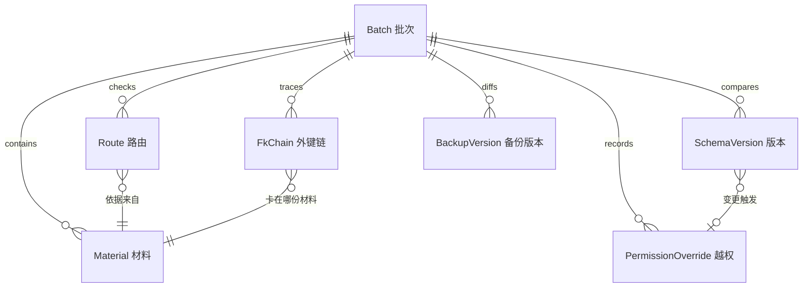

# 分库分表路由检查看板 — 技术架构文档

## 1. 架构设计

纯前端单页应用，无后端服务。Mock 数据层模拟"同一批材料"，全局 zustand store 持有当前批次，所有页面与下载均从同一 store 读取，保证图表/明细/下载同源。

```mermaid
flowchart TD
    "Mock 数据层 单一批次材料" --> "Zustand Store 当前批次"
    "Zustand Store 当前批次" --> "总览看板 图表/KPI/下载"
    "Zustand Store 当前批次" --> "路由明细 表/筛选"
    "Zustand Store 当前批次" --> "Schema 对比 前后diff"
    "Zustand Store 当前批次" --> "审计追踪 越权/断链"
    "Zustand Store 当前批次" --> "备份记录对比 新旧并排"
    "Zustand Store 当前批次" --> "下载 CSV/JSON 同源导出"
```

## 2. 技术说明

- 前端：React@18 + TypeScript + tailwindcss@3 + vite
- 初始化工具：vite-init（react-ts 模板）
- 状态管理：zustand
- 路由：react-router-dom
- 图表：recharts
- 图标：lucide-react
- 后端：无（纯前端，Mock 数据）
- 数据：前端内置 Mock 数据，模拟备份记录/数据字典/慢查询日志三类材料同批次

## 3. 路由定义

| 路由 | 页面 | 用途 |
|------|------|------|
| / | 总览看板页 | 批次指示器、KPI、图表、下载 |
| /routes | 路由明细页 | 路由规则明细与筛选下钻 |
| /schema | Schema 对比页 | 前后版本列级 diff |
| /audit | 审计追踪页 | 越权复核历史 + 外键断链卡点 |
| /backup | 备份记录对比页 | 新旧结论并排 + 坏数据样例 |

## 4. API 定义

无后端，无 API。所有数据来自前端 Mock 数据层，经 zustand store 暴露。

## 5. 服务端架构

无后端。

## 6. 数据模型

### 6.1 数据模型定义



### 6.2 数据定义（关键 Mock 结构）

```ts
type MaterialKind = 'backup' | 'dict' | 'slowlog'

interface Material {
  id: string
  kind: MaterialKind
  name: string          // 材料名（文件名/来源）
  caliber: string       // 口径说明（时间格式/字段口径）
  coverage: 'ok' | 'partial' | 'missing'
}

interface Route {
  id: string
  logicTable: string    // 逻辑表
  shardKey: string      // 分片键
  rule: string          // 路由规则（hash/mod）
  targetDb: string      // 目标库
  targetTable: string   // 目标表
  status: 'pass' | 'warn' | 'fail'
  severity: 'info' | 'warn' | 'critical'
  materialId: string    // 检查依据来自哪份材料
  issue?: string
}

interface SchemaColumnDiff {
  column: string
  type: 'added' | 'modified' | 'removed'
  before?: string
  after?: string
  triggeredByOverrideId?: string  // 由权限审计变更触发
}

interface PermissionOverride {
  id: string
  who: string           // 谁改
  when: string          // 何时改
  why: string           // 为什么改
  change: string        // 变更内容
  status: 'approved' | 'pending' | 'rejected'
}

interface FkChain {
  id: string
  from: string          // 子表.列
  to: string            // 父表.列
  fromDb: string
  toDb: string
  broken: boolean
  stuckMaterialId: string  // 卡在哪份材料上
}

interface BackupVersion {
  id: string
  label: 'old' | 'new'
  conclusion: string
  severity: 'info' | 'warn' | 'critical'
  changedAt: string
  changedBy: string
  badData: BadDataSample
}

interface BadDataSample {
  field: string
  value: string
  expected: string
  actual: string
  reason: string        // 为何像平时混进来的小麻烦
}
```
