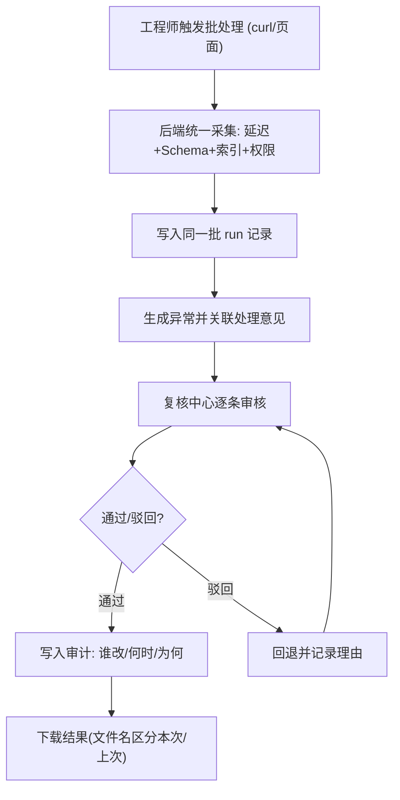

# 读写分离延迟看板 PRD

## 1. 产品概述

读写分离延迟看板是面向数据平台工程师与业务复核人员的数据库运维复核工具，用于把「读写分离复制延迟、锁等待、Schema 对比、索引失效」等巡检结果沉淀为可追溯的批处理记录，并提供从异常单点回溯到权限清单与处理意见的完整链路。

- 解决的问题：上一版锁等待过长在报告里只剩一句模糊提醒，业务追问到很晚也无法定位；schema 对比与索引建议各算各的，界面与报告数据不一致；首次打开要造半天表才看懂工具。
- 目标用户：数据平台工程师（复核/验收）、业务复核人员（追问根因）。
- 价值：让一次巡检的每个异常都能顺链查到「谁改的、什么时候改的、为什么改」，下载结果能区分本次与上次运行。

## 2. 核心功能

### 2.1 用户角色

| 角色 | 接入方式 | 核心权限 |
|------|----------|----------|
| 数据平台工程师 | 本地启动 / curl 调用 | 触发巡检批处理、复核异常、下载结果、查看审计历史 |
| 业务复核人员 | 浏览器查看 | 查看延迟看板、顺着异常回溯权限与处理意见、下载结果 |

### 2.2 功能模块

1. **延迟看板总览页**：复制延迟趋势、各实例健康状态、本次运行与上次运行对比、异常分类汇总卡片。
2. **复核中心页**：异常清单（锁等待过长 / Schema 差异 / 索引失效）+ 单条全链路追溯详情面板（异常 → Schema 对比 → 索引建议 → 权限清单 → 处理意见 → 复核历史）。
3. **批处理与下载页**：批处理记录列表（schema 对比与索引建议共用同一批记录）、运行详情、下载结果（文件名与内容可区分本次/上次运行）、curl/脚本示例。

### 2.3 页面详情

| 页面名称 | 模块名称 | 功能描述 |
|----------|----------|----------|
| 延迟看板总览 | 运行切换器 | 下拉切换本次/上次运行，顶部展示 run_id 与时间戳 |
| 延迟看板总览 | 延迟趋势 | 主从复制延迟秒数趋势条形图，标注超阈值实例 |
| 延迟看板总览 | 异常汇总卡片 | 按类型统计待复核/已通过/已驳回数量 |
| 复核中心 | 异常清单 | 按类型、严重度、状态筛选；高亮锁等待过长类 |
| 复核中心 | 全链路追溯面板 | 点击一条异常，右侧逐级展开追溯链路至权限清单与处理意见 |
| 复核中心 | 复核操作 | 通过/驳回需填写复核人与理由，写入审计历史 |
| 批处理与下载 | 批处理记录 | 展示每批 run 的延迟、schema 对比、索引建议共享记录数 |
| 批处理与下载 | 下载结果 | 生成纯文本报告，文件名含 run_id 与时间戳可区分运行 |
| 批处理与下载 | curl 示例 | 内置从空目录跑通流程的 curl/脚本片段 |

## 3. 核心流程

**触发一次巡检并复核异常**：工程师通过 curl 或页面触发新批处理 → 后端在同一批 run 中统一采集延迟、Schema 对比、索引分析、权限清单 → 生成异常记录并关联处理意见 → 工程师在复核中心逐条审核 → 通过/驳回写入审计历史 → 下载本次结果，文件名可区分上次运行。

**异常回溯链路**：业务顺着一条索引失效异常 → 查到所属批处理 run → 关联的 Schema 对比与索引建议（同一批记录）→ 该对象涉及的权限清单 → 对应处理意见 → 复核历史。

## 4. 用户界面设计

### 4.1 设计风格

- **基调**：工业控制台风格（industrial / utilitarian），深色底，数据密集但层级清晰，像专业数据库运维控制台。
- **主色**：深石墨/板岩底（zinc-950 / slate-900）；强调色琥珀（amber-400 警告）、红（rose-500 严重）、翠绿（emerald-400 健康）、天蓝（sky-400 信息）。
- **字体**：数据/指标用 IBM Plex Mono 等宽字体；界面文字用 IBM Plex Sans；标题用粗号字重强化层级。
- **布局**：左侧固定导航 + 右侧主内容区；卡片式模块，4 的倍数间距；表格采用斑马纹与紧凑行高。
- **状态标识**：彩色徽标 + 图标，锁等待过长类用醒目琥珀边框高亮。

### 4.2 页面设计概览

| 页面名称 | 模块名称 | UI 元素 |
|----------|----------|----------|
| 延迟看板总览 | 运行切换器 | 下拉框 + run_id 标签 + 时间戳 + 「本次/上次」徽标 |
| 延迟看板总览 | 延迟趋势 | 横向条形图，超阈值实例标红 |
| 延迟看板总览 | 异常汇总卡片 | 4 张统计卡（锁等待/Schema/索引/延迟），含通过率 |
| 复核中心 | 异常清单 | 可筛选表格，锁等待过长行左侧琥珀色条 |
| 复核中心 | 追溯面板 | 逐级折叠面板，箭头连接追溯链路 |
| 复核中心 | 复核操作 | 通过/驳回按钮 + 复核人/理由输入 |
| 批处理与下载 | 记录列表 | 表格含 run_id、时间、共享记录数、下载按钮 |
| 批处理与下载 | curl 示例 | 代码块，一键复制 |

### 4.3 响应式

桌面优先设计（工程师主要在桌面复核）；平板/小屏时主内容区单列堆叠，表格横向滚动；触摸优化按钮尺寸。

### 4.4 首次打开示例数据

首次启动若数据库为空，自动注入一组示例批处理 run（含锁等待过长、索引失效、Schema 差异各一条异常及对应权限清单与处理意见），让工程师无需造表即可看懂工具。
