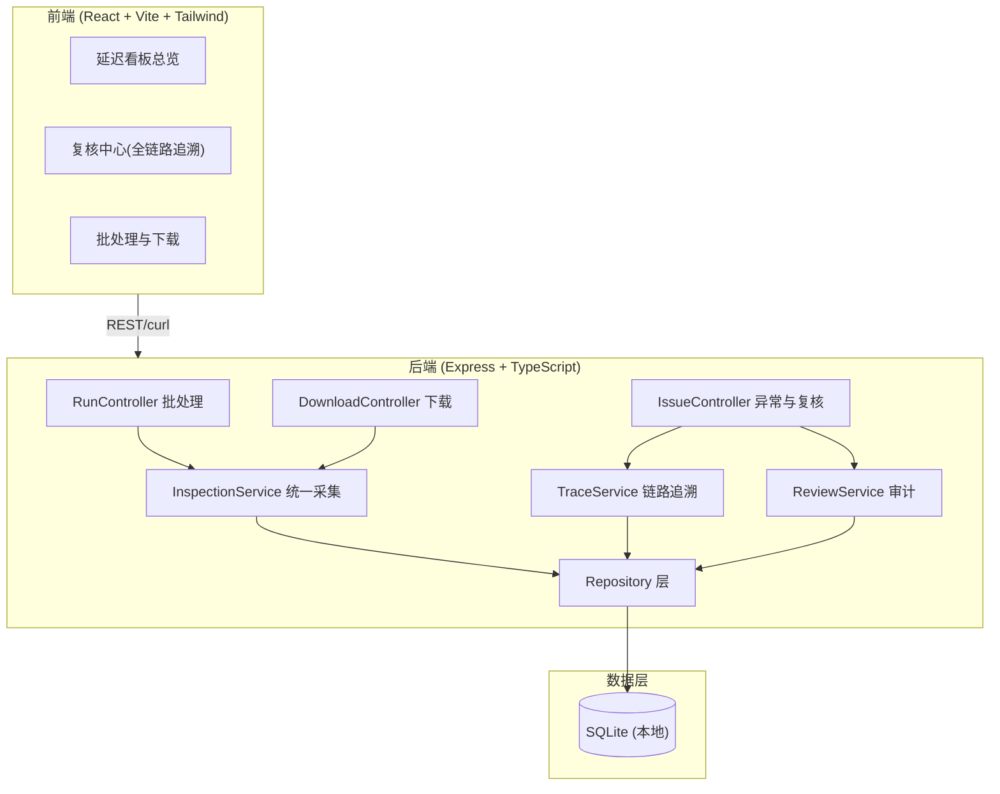
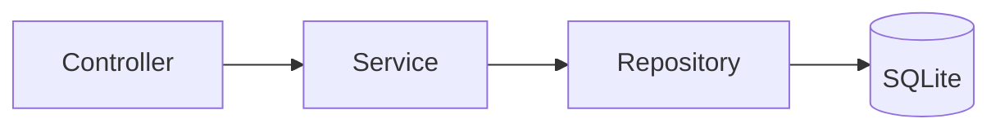
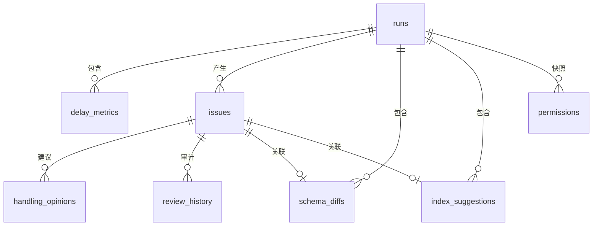

# 读写分离延迟看板 技术架构

## 1. 架构设计



## 2. 技术说明

- 前端：React@18 + react-router-dom + tailwindcss@3 + zustand + vite
- 初始化工具：vite-init（react-express-ts 模板）
- 后端：Express@4 + TypeScript（ESM）
- 数据库：SQLite（本地文件 `data/rwsplit.db`），无需外部服务
- 图示与统计：纯 CSS/SVG 绘制，不引入重型图表库

## 3. 路由定义

| 路由 | 用途 |
|------|------|
| `/` | 延迟看板总览（运行切换、延迟趋势、异常汇总） |
| `/review` | 复核中心（异常清单 + 全链路追溯 + 复核操作） |
| `/runs` | 批处理与下载（批记录、下载结果、curl 示例） |

## 4. API 定义

| 方法 | 路径 | 说明 |
|------|------|------|
| POST | `/api/runs` | 触发新批处理，统一采集延迟/Schema/索引/权限，返回 run |
| GET | `/api/runs` | 批处理记录列表 |
| GET | `/api/runs/:runId` | 单批详情（含共享的 schema 与索引记录数） |
| GET | `/api/runs/:runId/issues` | 该批异常清单 |
| GET | `/api/issues/:issueId` | 异常全链路详情（追溯至权限与处理意见） |
| POST | `/api/issues/:issueId/review` | 复核（通过/驳回 + 复核人 + 理由），写审计 |
| GET | `/api/issues/:issueId/history` | 复核审计历史（谁/何时/为何） |
| GET | `/api/runs/:runId/download` | 下载纯文本报告，文件名含 run_id + 时间戳 |
| GET | `/api/demo/seed` | 首次为空时注入示例数据 |

### 关键响应结构（追溯链路）

```typescript
interface IssueTrace {
  issue: {
    id: number; runId: string; type: 'lock_wait'|'schema_diff'|'index_invalid';
    severity: 'critical'|'warning'|'info'; status: 'pending'|'approved'|'rejected';
    dbInstance: string; schemaName: string; tableName: string;
    detail: string; detectedAt: string;
  };
  run: { runId: string; startedAt: string; status: string };
  schemaDiff?: { objectType: string; objectName: string; masterDef: string; replicaDef: string; diffSummary: string };
  indexSuggestion?: { table: string; columns: string; adviceType: 'add'|'drop'|'invalid'; reason: string; impact: string };
  permissions: { dbUser: string; host: string; privileges: string; grantedBy: string; grantedAt: string }[];
  handlingOpinions: { opinionText: string; recommendedAction: string; priority: string; createdBy: string }[];
  reviewHistory: { reviewer: string; action: string; reason: string; changedAt: string; previousStatus: string }[];
}
```

## 5. 服务端架构图



- Controller 仅做参数校验与响应组装；Service 承载采集/追溯/审计业务逻辑；Repository 封装 SQL。
- InspectionService 在同一事务批次内写入延迟、Schema 对比、索引建议、权限清单，确保界面与报告共用同一批处理记录。

## 6. 数据模型

### 6.1 数据模型定义



### 6.2 数据定义语言（DDL）

```sql
CREATE TABLE IF NOT EXISTS runs (
  id INTEGER PRIMARY KEY AUTOINCREMENT,
  run_id TEXT NOT NULL UNIQUE,            -- 区分本次/上次运行
  source_db TEXT NOT NULL,
  started_at TEXT NOT NULL,
  completed_at TEXT,
  status TEXT NOT NULL DEFAULT 'running',
  delay_count INTEGER DEFAULT 0,
  schema_diff_count INTEGER DEFAULT 0,
  index_suggestion_count INTEGER DEFAULT 0,
  issue_count INTEGER DEFAULT 0
);

CREATE TABLE IF NOT EXISTS delay_metrics (
  id INTEGER PRIMARY KEY AUTOINCREMENT,
  run_id TEXT NOT NULL,
  db_instance TEXT NOT NULL,
  master_lsn TEXT,
  replica_lsn TEXT,
  delay_seconds REAL NOT NULL,
  threshold_seconds REAL DEFAULT 1.0,
  captured_at TEXT NOT NULL,
  FOREIGN KEY (run_id) REFERENCES runs(run_id)
);

CREATE TABLE IF NOT EXISTS issues (
  id INTEGER PRIMARY KEY AUTOINCREMENT,
  run_id TEXT NOT NULL,
  type TEXT NOT NULL,                     -- lock_wait / schema_diff / index_invalid
  severity TEXT NOT NULL,                 -- critical / warning / info
  status TEXT NOT NULL DEFAULT 'pending', -- pending / approved / rejected
  db_instance TEXT NOT NULL,
  schema_name TEXT,
  table_name TEXT,
  detail TEXT NOT NULL,
  detected_at TEXT NOT NULL,
  FOREIGN KEY (run_id) REFERENCES runs(run_id)
);

CREATE TABLE IF NOT EXISTS schema_diffs (
  id INTEGER PRIMARY KEY AUTOINCREMENT,
  run_id TEXT NOT NULL,
  issue_id INTEGER,
  object_type TEXT NOT NULL,
  object_name TEXT NOT NULL,
  master_def TEXT,
  replica_def TEXT,
  diff_summary TEXT,
  FOREIGN KEY (run_id) REFERENCES runs(run_id),
  FOREIGN KEY (issue_id) REFERENCES issues(id)
);

CREATE TABLE IF NOT EXISTS index_suggestions (
  id INTEGER PRIMARY KEY AUTOINCREMENT,
  run_id TEXT NOT NULL,
  issue_id INTEGER,
  table_name TEXT NOT NULL,
  columns TEXT NOT NULL,
  advice_type TEXT NOT NULL,              -- add / drop / invalid
  reason TEXT,
  impact TEXT,
  FOREIGN KEY (run_id) REFERENCES runs(run_id),
  FOREIGN KEY (issue_id) REFERENCES issues(id)
);

CREATE TABLE IF NOT EXISTS permissions (
  id INTEGER PRIMARY KEY AUTOINCREMENT,
  run_id TEXT NOT NULL,
  db_user TEXT NOT NULL,
  host TEXT NOT NULL,
  privileges TEXT NOT NULL,
  granted_by TEXT,
  granted_at TEXT,
  FOREIGN KEY (run_id) REFERENCES runs(run_id)
);

CREATE TABLE IF NOT EXISTS handling_opinions (
  id INTEGER PRIMARY KEY AUTOINCREMENT,
  issue_id INTEGER NOT NULL,
  opinion_text TEXT NOT NULL,
  recommended_action TEXT NOT NULL,
  priority TEXT NOT NULL,
  created_by TEXT,
  created_at TEXT NOT NULL,
  FOREIGN KEY (issue_id) REFERENCES issues(id)
);

CREATE TABLE IF NOT EXISTS review_history (
  id INTEGER PRIMARY KEY AUTOINCREMENT,
  issue_id INTEGER NOT NULL,
  reviewer TEXT NOT NULL,
  action TEXT NOT NULL,                   -- approve / reject / comment
  reason TEXT,
  previous_status TEXT,
  changed_at TEXT NOT NULL,
  FOREIGN KEY (issue_id) REFERENCES issues(id)
);
```

### 初始示例数据策略

- 启动时检测 `runs` 表是否为空；为空则执行 `seed.ts` 注入两批示例 run：上一批含已复核记录，本批含待复核的锁等待过长、索引失效、Schema 差异各一条，并关联权限清单与处理意见，保证首次打开即可看懂。
