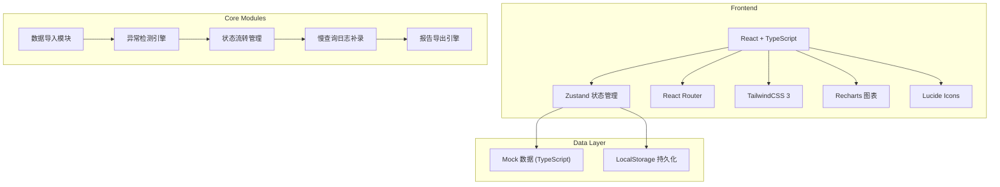
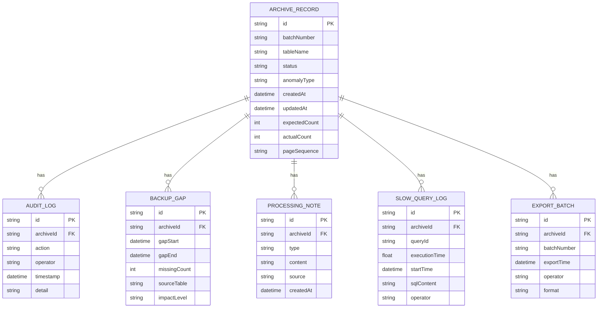

## 1. 架构设计



## 2. 技术描述

- **Frontend**: React@18 + TypeScript + Vite
- **初始化工具**: vite-init
- **状态管理**: zustand
- **路由**: react-router-dom
- **样式**: tailwindcss@3
- **图表**: recharts
- **图标**: lucide-react
- **后端**: 无 (纯前端，Mock数据)
- **数据持久化**: LocalStorage
- **导出**: 原生 Blob API 生成 CSV/JSON

## 3. 路由定义

| 路由 | 页面 | 目的 |
|-------|------|------|
| / | ArchiveList | 归档记录列表页，导入、筛选、状态展示 |
| /archive/:id | ArchiveDetail | 归档详情页，来源追溯、图表明细、处理意见 |

## 4. 数据模型

### 4.1 数据模型定义



### 4.2 TypeScript 类型定义

```typescript
type ArchiveStatus = 'success' | 'pending' | 'error';
type AnomalyType = 'backup_gap' | 'page_sequence' | 'slow_query' | 'none';

interface ArchiveRecord {
  id: string;
  batchNumber: string;
  runTimestamp: string;
  tableName: string;
  status: ArchiveStatus;
  anomalyType: AnomalyType;
  expectedCount: number;
  actualCount: number;
  pageSequence: number[];
  pageSequenceValid: boolean;
  createdAt: string;
  updatedAt: string;
  source: DataSource[];
  backupGaps: BackupGap[];
  processingNotes: ProcessingNote[];
  slowQueryLogs: SlowQueryLog[];
  auditLogs: AuditLog[];
  exportBatches: ExportBatch[];
}

interface DataSource {
  id: string;
  sourceType: 'full_backup' | 'incremental_backup' | 'binlog' | 'manual';
  sourcePath: string;
  recordCount: number;
  timestamp: string;
  pageNumber: number;
}

interface BackupGap {
  id: string;
  gapStart: string;
  gapEnd: string;
  missingCount: number;
  sourceTable: string;
  impactLevel: 'high' | 'medium' | 'low';
  expectedCount: number;
  actualCount: number;
  detailRecords: GapDetail[];
}

interface GapDetail {
  id: string;
  timeSlot: string;
  expected: number;
  actual: number;
  delta: number;
  explanation: string;
}

interface ProcessingNote {
  id: string;
  type: 'system' | 'manual';
  content: string;
  source: string;
  createdAt: string;
}

interface SlowQueryLog {
  id: string;
  queryId: string;
  executionTime: number;
  startTime: string;
  sqlContent: string;
  operator: string;
  recordedAt: string;
}

interface AuditLog {
  id: string;
  action: string;
  operator: string;
  timestamp: string;
  detail: string;
}

interface ExportBatch {
  id: string;
  batchNumber: string;
  exportTime: string;
  operator: string;
  format: 'csv' | 'json';
}
```

### 4.3 Mock 样例数据

```typescript
// 样例1：顺利记录
const successRecord: ArchiveRecord = {
  id: 'rec_001',
  batchNumber: 'BATCH-2026-0618-001',
  runTimestamp: '2026-06-18T08:00:00Z',
  tableName: 'order_backup_2026_001',
  status: 'success',
  anomalyType: 'none',
  expectedCount: 150000,
  actualCount: 150000,
  pageSequence: [1, 2, 3, 4, 5],
  pageSequenceValid: true,
  // ... 其余字段
};

// 样例2：待确认记录
const pendingRecord: ArchiveRecord = {
  id: 'rec_002',
  batchNumber: 'BATCH-2026-0618-002',
  runTimestamp: '2026-06-18T09:30:00Z',
  tableName: 'user_log_2026_002',
  status: 'pending',
  anomalyType: 'page_sequence',
  expectedCount: 85000,
  actualCount: 84987,
  pageSequence: [1, 2, 4, 5],
  pageSequenceValid: false,
  // ... 其余字段
};

// 样例3：异常记录(备份缺口)
const errorRecord: ArchiveRecord = {
  id: 'rec_003',
  batchNumber: 'BATCH-2026-0618-003',
  runTimestamp: '2026-06-18T10:15:00Z',
  tableName: 'payments_2026_003',
  status: 'error',
  anomalyType: 'backup_gap',
  expectedCount: 98000,
  actualCount: 97853,
  pageSequence: [1, 2, 3],
  pageSequenceValid: true,
  backupGaps: [{
    id: 'gap_001',
    gapStart: '2026-06-15T02:00:00Z',
    gapEnd: '2026-06-15T04:00:00Z',
    missingCount: 147,
    sourceTable: 'payments',
    impactLevel: 'high',
    expectedCount: 500,
    actualCount: 353,
    detailRecords: [
      { id: 'd1', timeSlot: '02:00-02:30', expected: 150, actual: 150, delta: 0, explanation: '正常' },
      { id: 'd2', timeSlot: '02:30-03:00', expected: 150, actual: 87, delta: -63, explanation: '存在63条记录缺口' },
      { id: 'd3', timeSlot: '03:00-03:30', expected: 100, actual: 16, delta: -84, explanation: '存在84条记录缺口' },
      { id: 'd4', timeSlot: '03:30-04:00', expected: 100, actual: 100, delta: 0, explanation: '正常' },
    ]
  }],
  // ... 其余字段
};
```

## 5. 核心模块设计

### 5.1 状态管理 (Zustand Store)
- `useArchiveStore`: 管理归档记录列表、筛选条件、当前选中记录
- `useDetailStore`: 管理详情页数据、日志补录、状态流转

### 5.2 异常检测引擎
- 备份缺口检测：对比各时间段预期与实际记录数
- 分页顺序检测：校验分页序号连续性
- 慢查询检测：分析执行时间阈值

### 5.3 报告导出引擎
- 文件名规则：`{tableName}_{status}_{batchNumber}_{timestamp}.{format}`
- 内容包含：完整来源链、处理意见、审计日志、运行批次号
- 支持 CSV 和 JSON 格式

### 5.4 状态流转机制
- 状态不是一次性判断，慢查询日志补录后重新计算
- 每次状态变更记录审计日志
- 导出报告包含所有状态流转历史
