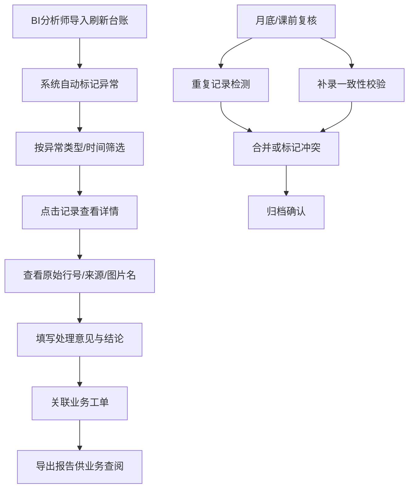

## 1. 产品概述

物化视图刷新台账是面向BI分析师和业务同事的数据质量管理工具，用于追踪物化视图刷新过程中的异常记录（如备份缺口），确保数据结论可追溯、可复核、可解释。

- 核心问题：BI团队频繁被追问物化视图刷新异常的影响范围，但缺乏系统化工具记录异常来源、处理结论与追溯路径
- 目标用户：BI分析师（主要使用者、复核者）、业务同事（查阅结论者）
- 产品价值：将散落的异常记录集中管理，实现"异常→来源→处理→结论→追溯"全链路闭环

## 2. 核心功能

### 2.1 用户角色

| 角色 | 注册方式 | 核心权限 |
|------|----------|----------|
| BI分析师 | 系统接入 | 导入数据、标记异常、填写处理意见、复核去重、导出报告 |
| 业务同事 | 只读访问 | 查看台账、筛选异常、查看详情与结论、跳转来源工单 |

### 2.2 功能模块

1. **台账列表页**：数据导入、多维度筛选、异常标识、状态总览、报告导出入口
2. **详情页**：来源追溯（原始行号/图片名/备注）、处理意见、关联工单跳转、慢查询归因入口
3. **复核面板**：重复记录检测、补录一致性校验、结论冲突预警

### 2.3 页面详情

| 页面名称 | 模块名称 | 功能描述 |
|-----------|-------------|---------------------|
| 台账列表页 | 顶部操作区 | 导入CSV/Excel、首次打开提示加载示例数据、搜索框、筛选条件 |
| 台账列表页 | 数据表格 | 展示刷新记录、异常状态高亮、影响结论列、跳转到详情 |
| 台账列表页 | 筛选侧边栏 | 按异常类型/日期范围/视图名称/处理状态筛选 |
| 台账列表页 | 底部工具栏 | 批量标记、报告导出、慢查询归因入口 |
| 详情页 | 基础信息卡 | 视图名称、刷新时间、异常类型、严重程度 |
| 详情页 | 来源追溯区 | 原始行号、来源表名、图片名、备注信息、一键复制追溯信息 |
| 详情页 | 处理意见区 | BI分析师填写的结论说明、处理时间、处理人 |
| 详情页 | 关联工单区 | 业务工单编号、可点击跳转、最终结论反向链接 |
| 详情页 | 慢查询入口 | 月底/课前使用的慢查询归因分析跳转 |
| 复核面板 | 重复检测 | 检测同一件事的多份记录、展示相似度、合并建议 |
| 复核面板 | 补录校验 | 检查补录记录与原始记录的一致性、标记冲突字段 |

## 3. 核心流程

BI分析师日常处理流程：登录→导入刷新台账→系统自动标记异常→筛选异常记录→点击详情查看来源→填写处理意见→关联业务工单→导出报告。

业务同事查阅流程：打开台账→筛选关心的视图/日期→查看异常详情→阅读处理结论→点击工单编号跳转回溯。

复核流程（月底/课前）：进入复核面板→运行重复检测→处理合并建议→检查补录一致性→确认无误后归档。

## 4. 用户界面设计

### 4.1 设计风格

- **主色调**：深灰蓝 #1e293b（专业、稳重），辅助色：琥珀橙 #f59e0b（异常警示）、翠绿 #10b981（已处理）、赤红 #ef4444（严重异常）
- **按钮风格**：直角、细边框、点击有微下沉反馈，强调信息密度而非花哨动效
- **字体**：中文使用思源宋体（标题）+ JetBrains Mono（行号/编号等等宽数据），正文使用系统无衬线
- **布局风格**：顶部导航+左侧筛选+主表格区，信息密度优先，行高紧凑
- **图标风格**：Lucide线性图标，仅用于功能性标识，不做装饰

### 4.2 页面设计概述

| 页面名称 | 模块名称 | UI元素 |
|-----------|-------------|-------------|
| 台账列表页 | 顶部操作区 | 白底卡片、输入框灰色边框、主操作按钮深灰蓝填充 |
| 台账列表页 | 数据表格 | 斑马纹行、异常行左侧琥珀色竖条标识、悬停高亮 |
| 台账列表页 | 筛选侧边栏 | 浅灰背景、分组折叠、已选条件以标签形式展示 |
| 详情页 | 分区卡片 | 卡片标题加粗、内容区左侧对齐、等宽字体显示编号类数据 |
| 详情页 | 来源追溯区 | 可复制代码块样式展示原始行号、来源备注引用样式 |
| 复核面板 | 对比视图 | 左右分栏展示疑似重复记录、差异字段高亮 |

### 4.3 响应性

桌面端优先设计（最小宽度1280px），表格横向滚动适配；移动端不做强制适配，保留基础可读性即可。

### 4.4 数据展示细节

- 备份缺口类记录首次打开时自动加载示例数据，展示标准格式
- 原始行号使用等宽字体+背景色块突出，一键复制按钮
- 工单编号为可点击链接，悬浮展示工单单行摘要
- 重复记录以橙色边框标记，旁边显示"重复N条"徽标
