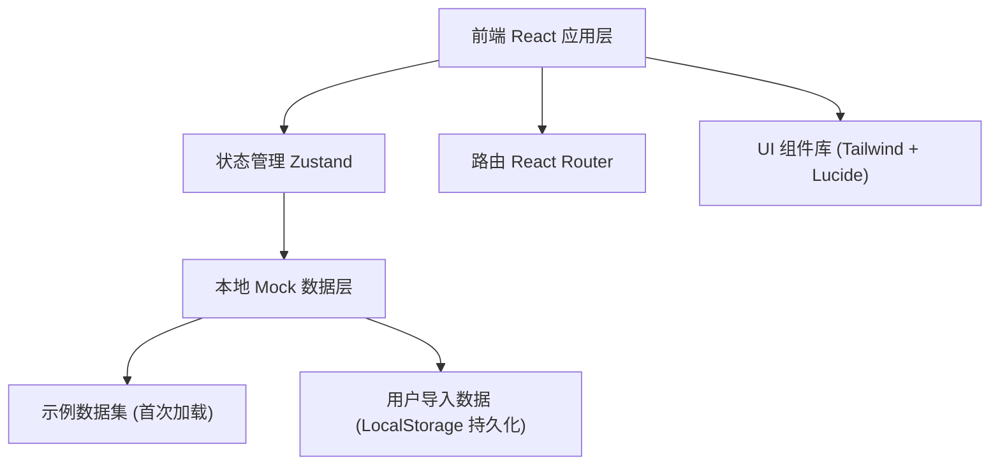
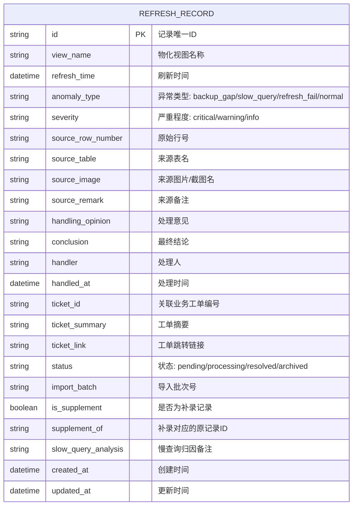

## 1. 架构设计



## 2. 技术描述

- **前端**：React@18 + TypeScript + Vite
- **样式方案**：Tailwind CSS 3
- **状态管理**：Zustand（轻量、适合本项目规模）
- **路由**：React Router DOM
- **图标**：lucide-react
- **后端**：无（纯前端应用，数据通过 LocalStorage 持久化，导入文件在浏览器端解析）
- **数据格式**：支持 CSV / Excel（前端使用 SheetJS 解析），导入后存储于 LocalStorage

## 3. 路由定义

| 路由 | 用途 |
|-------|---------|
| / | 台账列表页（默认首页） |
| /record/:id | 单条记录详情页 |
| /review | 复核面板（重复检测 + 补录校验） |
| /export | 报告导出页（同时放置慢查询归因入口） |

## 4. 数据模型

### 4.1 数据模型定义



### 4.2 TypeScript 类型定义

```typescript
type AnomalyType = 'backup_gap' | 'slow_query' | 'refresh_fail' | 'normal';
type Severity = 'critical' | 'warning' | 'info';
type RecordStatus = 'pending' | 'processing' | 'resolved' | 'archived';

interface RefreshRecord {
  id: string;
  view_name: string;
  refresh_time: string;
  anomaly_type: AnomalyType;
  severity: Severity;
  source_row_number: string;
  source_table: string;
  source_image?: string;
  source_remark?: string;
  handling_opinion?: string;
  conclusion?: string;
  handler?: string;
  handled_at?: string;
  ticket_id?: string;
  ticket_summary?: string;
  ticket_link?: string;
  status: RecordStatus;
  import_batch: string;
  is_supplement: boolean;
  supplement_of?: string;
  slow_query_analysis?: string;
  created_at: string;
  updated_at: string;
}

interface DuplicateGroup {
  group_id: string;
  records: RefreshRecord[];
  similarity: number;
  conflicting_fields: string[];
  suggestion: 'merge' | 'review' | 'keep_both';
}
```

### 4.3 示例数据

首次加载时自动注入以下示例记录（特别包含备份缺口类型）：

```typescript
const SAMPLE_RECORDS: RefreshRecord[] = [
  {
    id: 'sample-001',
    view_name: 'dws_user_behavior_daily',
    refresh_time: '2026-06-15 03:20:00',
    anomaly_type: 'backup_gap',
    severity: 'warning',
    source_row_number: 'L245-L248',
    source_table: 'ods_kafka_log_20260615',
    source_image: 'backup_gap_0615.png',
    source_remark: '凌晨2:15-2:30期间Kafka消费中断，约15分钟数据缺失',
    handling_opinion: '已通过上游binlog回补，影响用户行为漏斗转化环比指标约-2.3%',
    conclusion: '数据已修复，6月15日日活指标不受影响，留存指标建议标记说明',
    handler: 'zhangwei',
    handled_at: '2026-06-15 10:30:00',
    ticket_id: 'BI-2026-0615-003',
    ticket_summary: '6月15日用户行为报表数据缺口确认',
    ticket_link: 'https://ticket.company.com/BI-2026-0615-003',
    status: 'resolved',
    import_batch: 'batch-20260615-01',
    is_supplement: false,
    slow_query_analysis: '',
    created_at: '2026-06-15 09:00:00',
    updated_at: '2026-06-15 10:30:00',
  },
  {
    id: 'sample-002',
    view_name: 'ads_sales_region_daily',
    refresh_time: '2026-06-14 04:05:00',
    anomaly_type: 'slow_query',
    severity: 'info',
    source_row_number: 'L892',
    source_table: 'dwd_sales_order_detail',
    source_remark: '区域聚合查询耗时12分40秒，超过5分钟阈值',
    handling_opinion: '已为dwd_sales_order_detail增加dt+region联合索引，下次刷新预计耗时<2分钟',
    conclusion: '数据完整无缺失，仅刷新延迟，报表10点后发布',
    handler: 'liming',
    handled_at: '2026-06-14 09:15:00',
    ticket_id: 'BI-2026-0614-001',
    ticket_summary: '销售日报刷新延迟问题',
    ticket_link: 'https://ticket.company.com/BI-2026-0614-001',
    status: 'resolved',
    import_batch: 'batch-20260614-01',
    is_supplement: false,
    slow_query_analysis: '慢查询根因：全表扫描未命中分区索引，SQL执行计划显示type=ALL',
    created_at: '2026-06-14 08:00:00',
    updated_at: '2026-06-14 09:15:00',
  },
  {
    id: 'sample-003',
    view_name: 'dws_user_behavior_daily',
    refresh_time: '2026-06-15 03:20:00',
    anomaly_type: 'backup_gap',
    severity: 'warning',
    source_row_number: 'L245-L248',
    source_table: 'ods_kafka_log_20260615',
    source_remark: '重复导入记录，请与sample-001合并复核',
    status: 'pending',
    import_batch: 'batch-20260615-02',
    is_supplement: true,
    supplement_of: 'sample-001',
    created_at: '2026-06-15 14:00:00',
    updated_at: '2026-06-15 14:00:00',
  },
];
```

## 5. 核心模块设计

### 5.1 状态管理 Store

```
src/store/ledgerStore.ts
- records: RefreshRecord[]          // 所有台账记录
- selectedIds: string[]             // 列表页批量选中
- filters: FilterState              // 当前筛选条件
- isFirstVisit: boolean             // 是否首次访问（用于加载示例数据）
- actions:
  - loadSampleData()                // 加载示例数据
  - importRecords(parsedData)       // 导入解析后的数据
  - updateRecord(id, patch)         // 更新单条记录
  - deleteRecords(ids)              // 删除记录
  - setFilters(filters)             // 设置筛选条件
  - detectDuplicates()              // 检测重复记录
  - validateSupplements()           // 校验补录一致性
  - exportReport(format)            // 导出报告
```

### 5.2 关键组件

```
src/components/
├── DataTable/              // 台账主表格（含异常高亮、批量选择）
├── FilterSidebar/          // 筛选侧边栏
├── ImportDialog/           // 数据导入弹窗（CSV/Excel解析）
├── RecordDetail/           // 详情页完整组件
├── SourceTraceSection/     // 来源追溯区块
├── TicketLink/             // 工单可点击链接（含悬浮摘要）
├── ReviewPanel/            // 复核面板
├── DuplicateCompare/       // 重复记录对比视图
└── ReportExport/           // 报告导出组件
```

### 5.3 重复检测算法

基于以下字段组合计算相似度：
- view_name + refresh_time（完全匹配视为强信号）
- source_row_number + source_table（完全匹配视为强信号）
- anomaly_type（匹配加分）
- handling_opinion / conclusion 文本相似度（可选，编辑距离）

相似度 ≥ 0.8 的记录组输出为疑似重复，供BI分析师复核。
